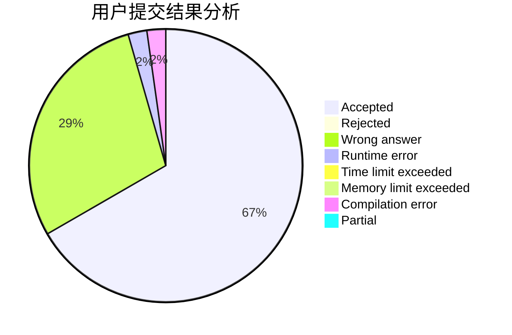
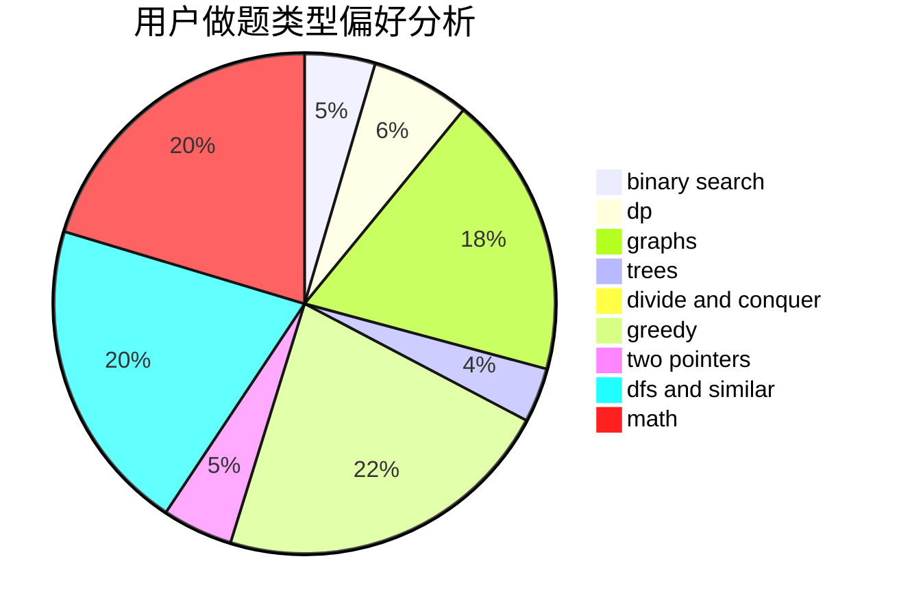

# Yorukiri

<!-- tabs:start -->

#### **用户提交结果分析**

#### **用户做题类型偏好分析**

<!-- tabs:end -->
# 推荐题目
[1157G](https://codeforces.com/contest/1157/problem/G)
[912C](https://codeforces.com/contest/912/problem/C)
[1182C](https://codeforces.com/contest/1182/problem/C)
[81C](https://codeforces.com/contest/81/problem/C)
[746C](https://codeforces.com/contest/746/problem/C)
[1342F](https://codeforces.com/contest/1342/problem/F)
[586F](https://codeforces.com/contest/586/problem/F)
[2A](https://codeforces.com/contest/2/problem/A)
[103A](https://codeforces.com/contest/103/problem/A)
[1492A](https://codeforces.com/contest/1492/problem/A)
