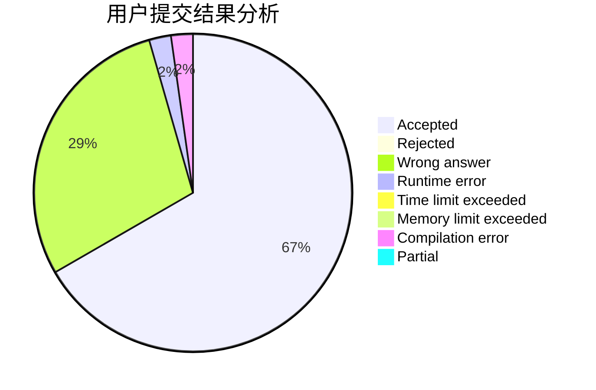
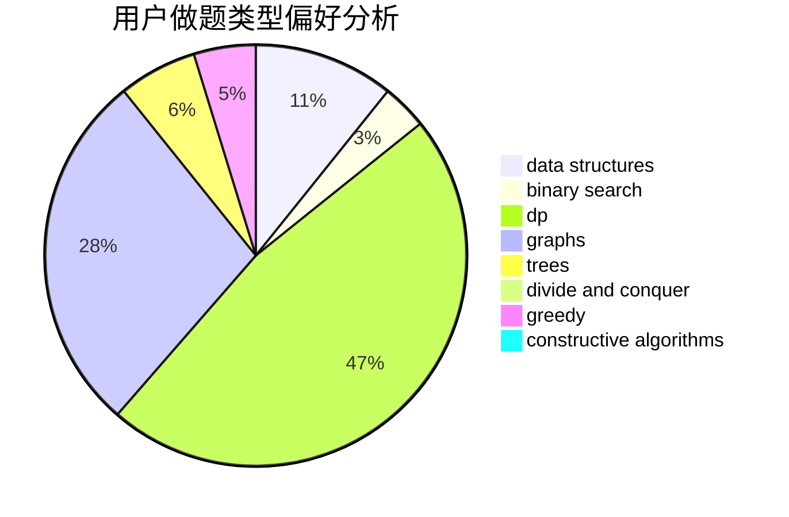

# Yorukiri

<!-- tabs:start -->

#### **用户提交结果分析**

#### **用户做题类型偏好分析**

#### **用户错题知识点分析**

<!-- tabs:end -->
# 推荐题目
[1156B](https://codeforces.com/contest/1156/problem/B)		dfs and similar,
                        greedy,
                        implementation,
                        sortings,
                        strings		  
[894D](https://codeforces.com/contest/894/problem/D)		brute force,
                        data structures,
                        trees		  
[1179D](https://codeforces.com/contest/1179/problem/D)		data structures,
                        dp,
                        trees		  
[803G](https://codeforces.com/contest/803/problem/G)		data structures		  
[729C](https://codeforces.com/contest/729/problem/C)		binary search,
                        greedy,
                        sortings		  
[1335E2](https://codeforces.com/contest/1335E/problem/2)		brute force,
                        data structures,
                        dp,
                        two pointers		  
[567B](https://codeforces.com/contest/567/problem/B)		implementation		  
[284B](https://codeforces.com/contest/284/problem/B)		brute force,
                        implementation		  
[1039C](https://codeforces.com/contest/1039/problem/C)		dfs and similar,
                        dsu,
                        graphs,
                        math,
                        sortings		  
[1484F](https://codeforces.com/contest/1484/problem/F)		dsu,graphs,sortings,trees		  
