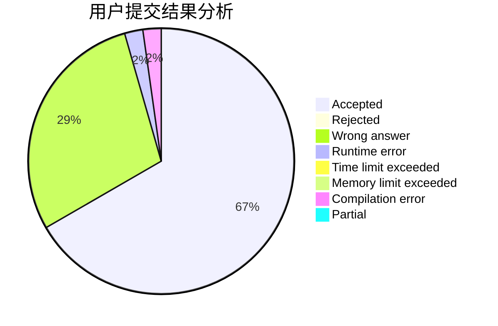
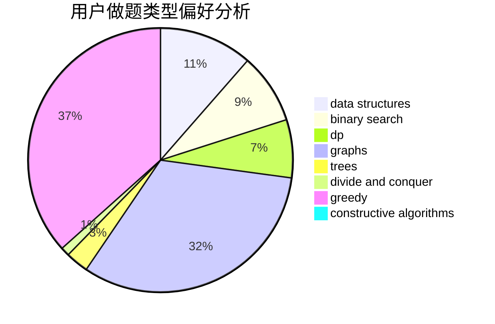

# Yorukiri

<!-- tabs:start -->

#### **用户提交结果分析**

#### **用户做题类型偏好分析**

#### **用户错题知识点分析**

<!-- tabs:end -->
# 推荐题目
[1157G](https://codeforces.com/contest/1157/problem/G)		brute force,
                        constructive algorithms		  
[912C](https://codeforces.com/contest/912/problem/C)		brute force,
                        greedy,
                        sortings		  
[1182C](https://codeforces.com/contest/1182/problem/C)		data structures,
                        greedy,
                        strings		  
[81C](https://codeforces.com/contest/81/problem/C)		greedy,
                        math,
                        sortings		  
[746C](https://codeforces.com/contest/746/problem/C)		constructive algorithms,
                        implementation,
                        math		  
[1342F](https://codeforces.com/contest/1342/problem/F)		bitmasks,
                        brute force,
                        dp		  
[586F](https://codeforces.com/contest/586/problem/F)		dsu,graphs,sortings,trees		  
[2A](https://codeforces.com/contest/2/problem/A)		hashing,
                        implementation		  
[103A](https://codeforces.com/contest/103/problem/A)		greedy,
                        implementation,
                        math		  
[1492A](https://codeforces.com/contest/1492/problem/A)		math		  
