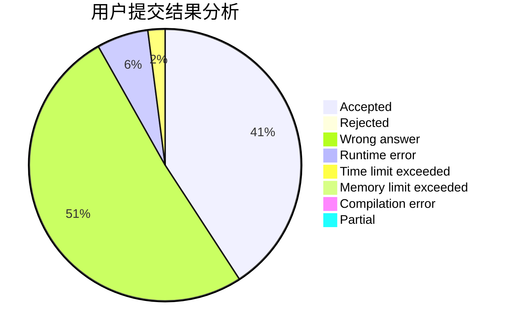
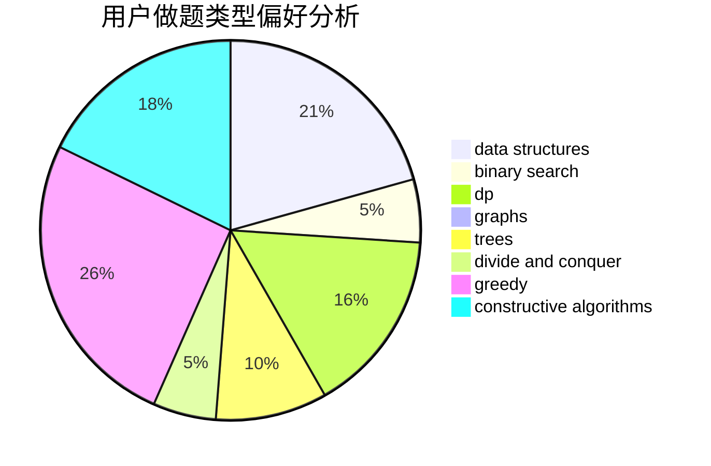
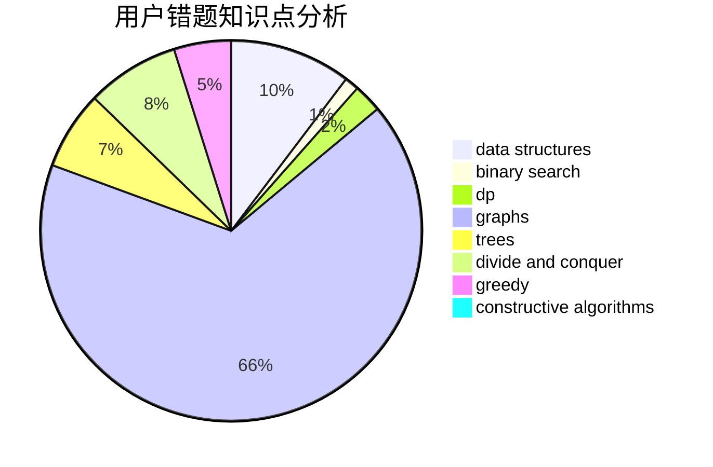

# Young.FQ

<!-- tabs:start -->

#### **用户提交结果分析**

#### **用户做题类型偏好分析**

#### **用户错题知识点分析**

<!-- tabs:end -->
# 推荐题目
[1132C](https://codeforces.com/contest/1132/problem/C)		brute force		  
[699A](https://codeforces.com/contest/699/problem/A)		implementation		  
[95A](https://codeforces.com/contest/95/problem/A)		implementation,
                        strings		  
[1061F](https://codeforces.com/contest/1061/problem/F)		interactive,
                        probabilities		  
[1280A](https://codeforces.com/contest/1280/problem/A)		implementation,
                        math		  
[1230F](https://codeforces.com/contest/1230/problem/F)		dsu,graphs,sortings,trees		  
[1510F](https://codeforces.com/contest/1510/problem/F)		nan		  
[1043A](https://codeforces.com/contest/1043/problem/A)		implementation,
                        math		  
[13A](https://codeforces.com/contest/13/problem/A)		implementation,
                        math		  
[1140F](https://codeforces.com/contest/1140/problem/F)		data structures,
                        divide and conquer,
                        dsu		  
