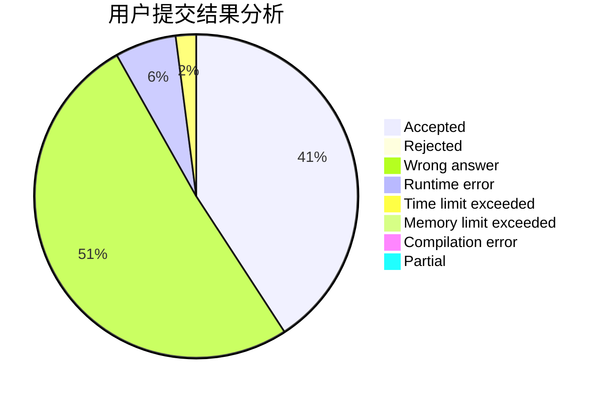
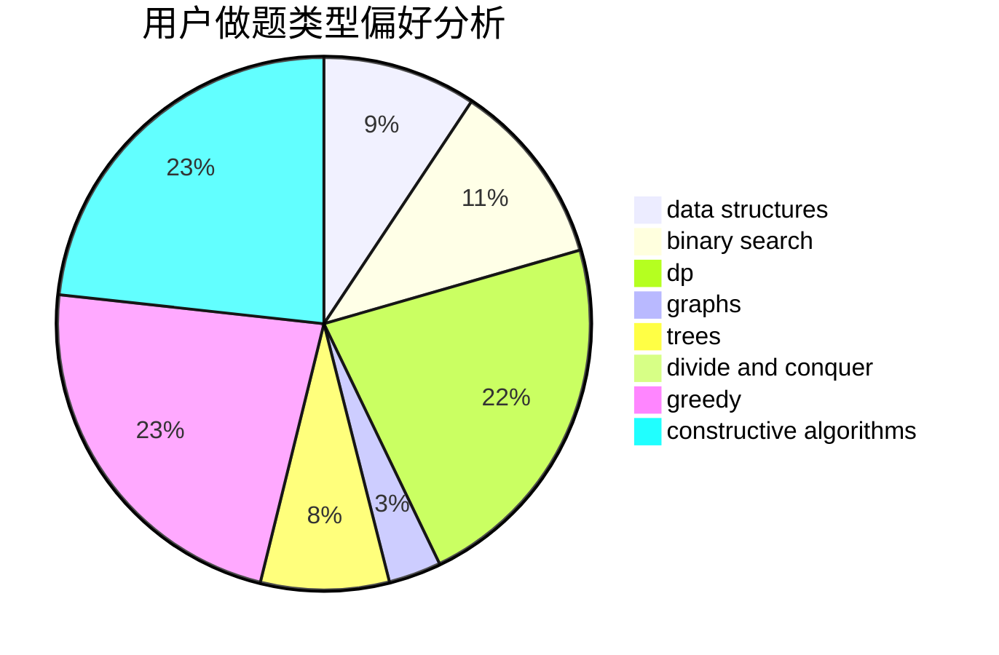
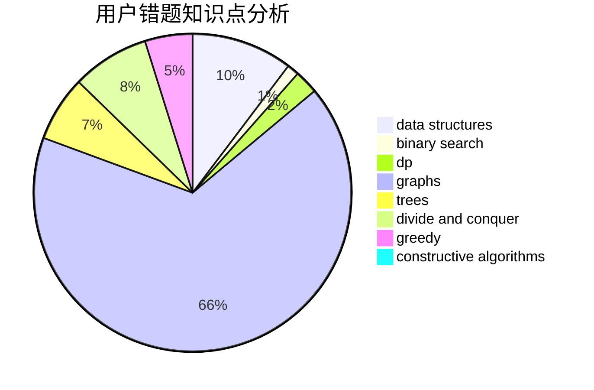

# Young.FQ

<!-- tabs:start -->

#### **用户提交结果分析**

#### **用户做题类型偏好分析**

#### **用户错题知识点分析**

<!-- tabs:end -->
# 推荐题目
[1130C](https://codeforces.com/contest/1130/problem/C)		brute force,
                        dfs and similar,
                        dsu		  
[673B](https://codeforces.com/contest/673/problem/B)		greedy,
                        implementation		  
[938B](https://codeforces.com/contest/938/problem/B)		brute force,
                        greedy		  
[1061B](https://codeforces.com/contest/1061/problem/B)		greedy,
                        implementation,
                        sortings		  
[1270H](https://codeforces.com/contest/1270/problem/H)		data structures		  
[1223G](https://codeforces.com/contest/1223/problem/G)		binary search,
                        math,
                        number theory		  
[14E](https://codeforces.com/contest/14/problem/E)		dp		  
[1042D](https://codeforces.com/contest/1042/problem/D)		data structures,
                        divide and conquer,
                        two pointers		  
[1391D](https://codeforces.com/contest/1391/problem/D)		bitmasks,
                        brute force,
                        constructive algorithms,
                        dp,
                        greedy,
                        implementation		  
[1139B](https://codeforces.com/contest/1139/problem/B)		greedy,
                        implementation		  
