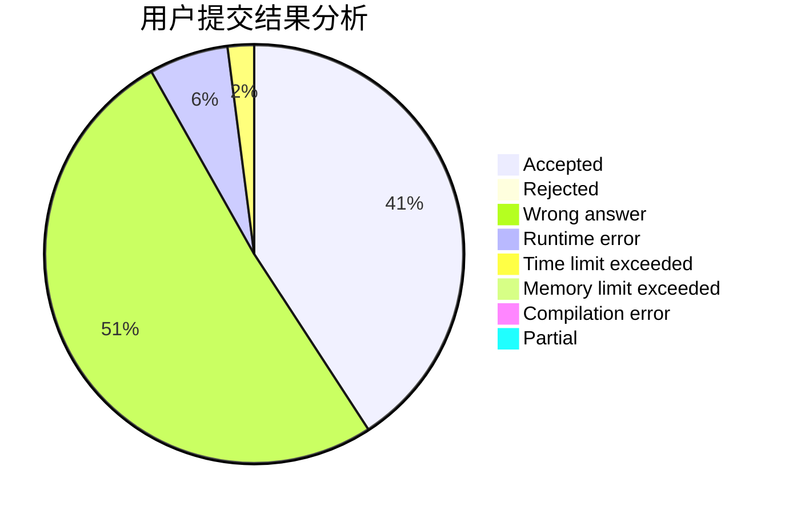
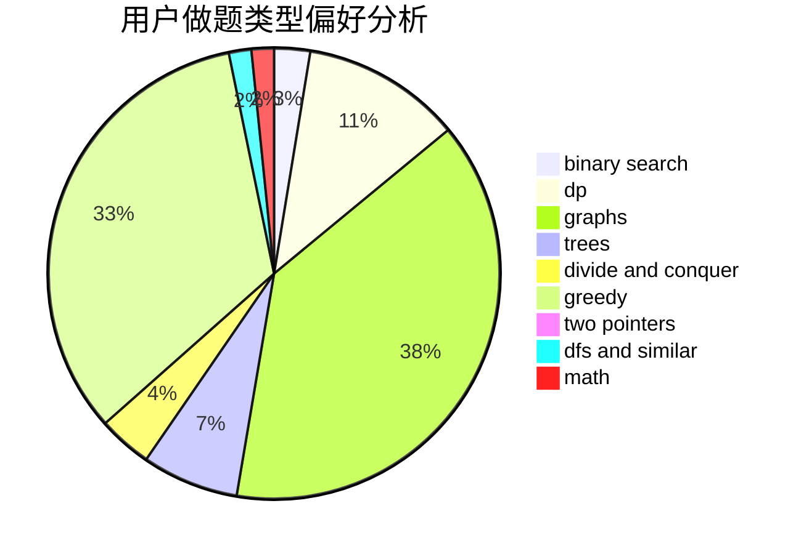

# Young.FQ

<!-- tabs:start -->

#### **用户提交结果分析**

#### **用户做题类型偏好分析**

<!-- tabs:end -->
# 推荐题目
[1132C](https://codeforces.com/contest/1132/problem/C)
[699A](https://codeforces.com/contest/699/problem/A)
[95A](https://codeforces.com/contest/95/problem/A)
[1061F](https://codeforces.com/contest/1061/problem/F)
[1280A](https://codeforces.com/contest/1280/problem/A)
[1230F](https://codeforces.com/contest/1230/problem/F)
[1510F](https://codeforces.com/contest/1510/problem/F)
[1043A](https://codeforces.com/contest/1043/problem/A)
[13A](https://codeforces.com/contest/13/problem/A)
[1140F](https://codeforces.com/contest/1140/problem/F)
