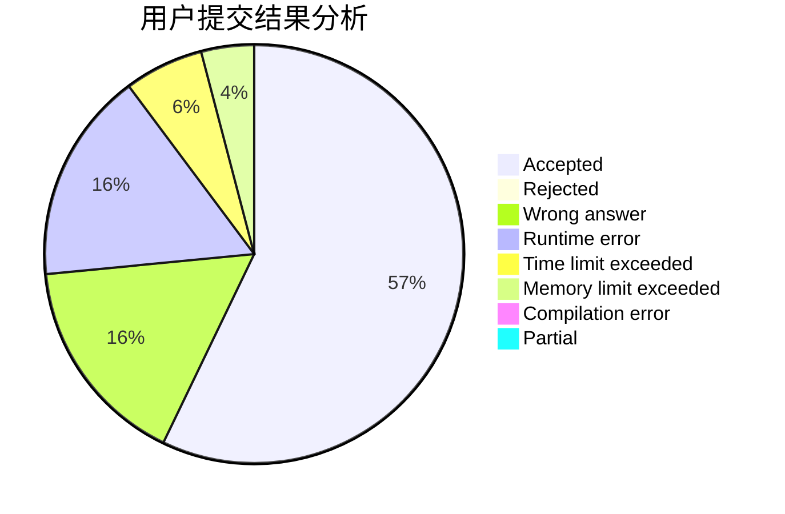
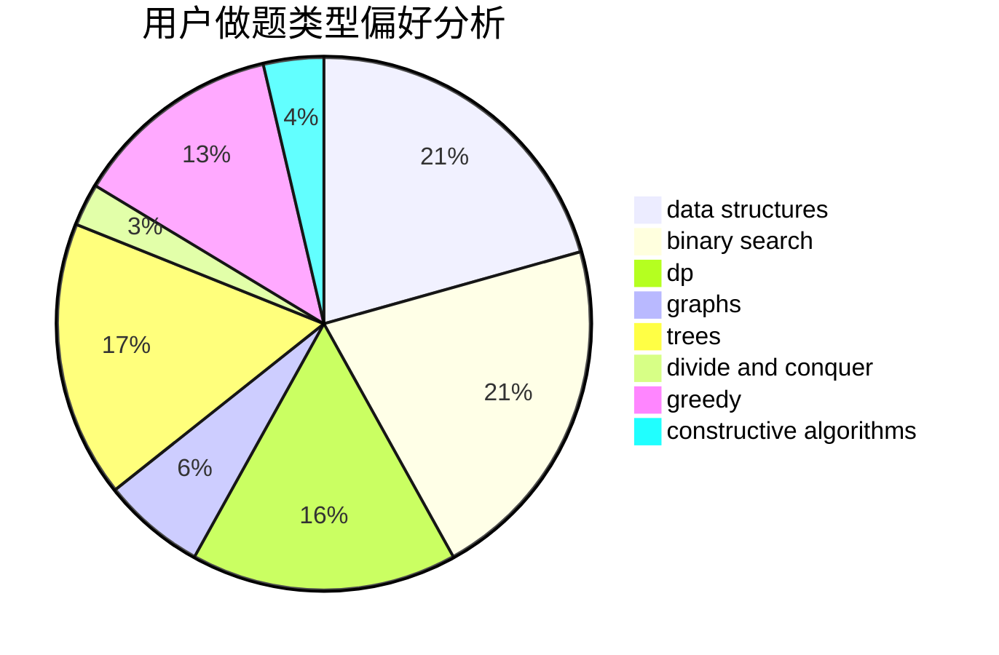
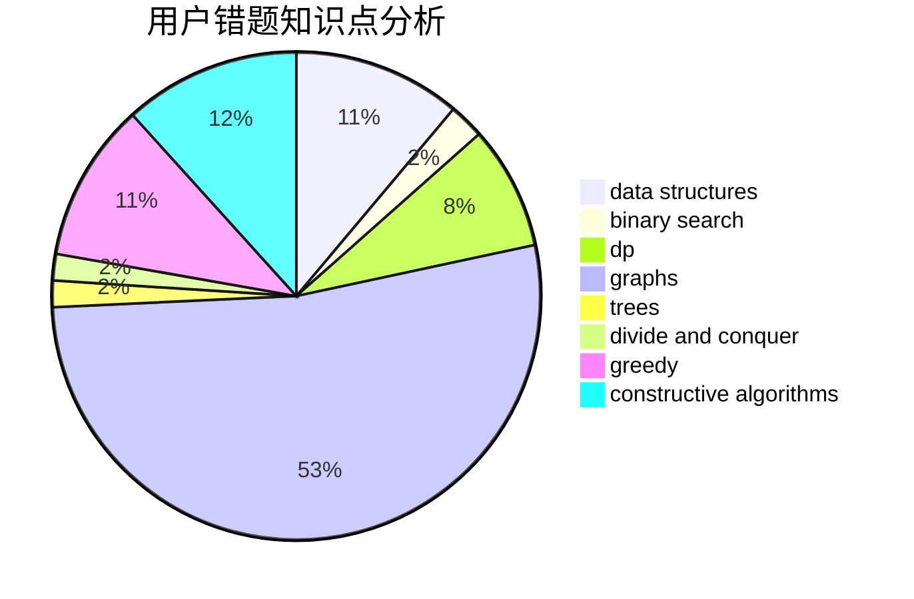

# Young.IQ

<!-- tabs:start -->

#### **用户提交结果分析**

#### **用户做题类型偏好分析**

#### **用户错题知识点分析**

<!-- tabs:end -->
# 推荐题目
[1478A](https://codeforces.com/contest/1478/problem/A)		brute force,
                        greedy		  
[316E1](https://codeforces.com/contest/316E/problem/1)		brute force,
                        data structures		  
[979B](https://codeforces.com/contest/979/problem/B)		greedy		  
[485D](https://codeforces.com/contest/485/problem/D)		dsu,graphs,sortings,trees		  
[1148F](https://codeforces.com/contest/1148/problem/F)		bitmasks,
                        constructive algorithms		  
[1215C](https://codeforces.com/contest/1215/problem/C)		constructive algorithms,
                        greedy		  
[947A](https://codeforces.com/contest/947/problem/A)		dsu,graphs,sortings,trees		  
[834D](https://codeforces.com/contest/834/problem/D)		dsu,graphs,sortings,trees		  
[1283F](https://codeforces.com/contest/1283/problem/F)		constructive algorithms,
                        greedy,
                        trees		  
[297D](https://codeforces.com/contest/297/problem/D)		constructive algorithms		  
