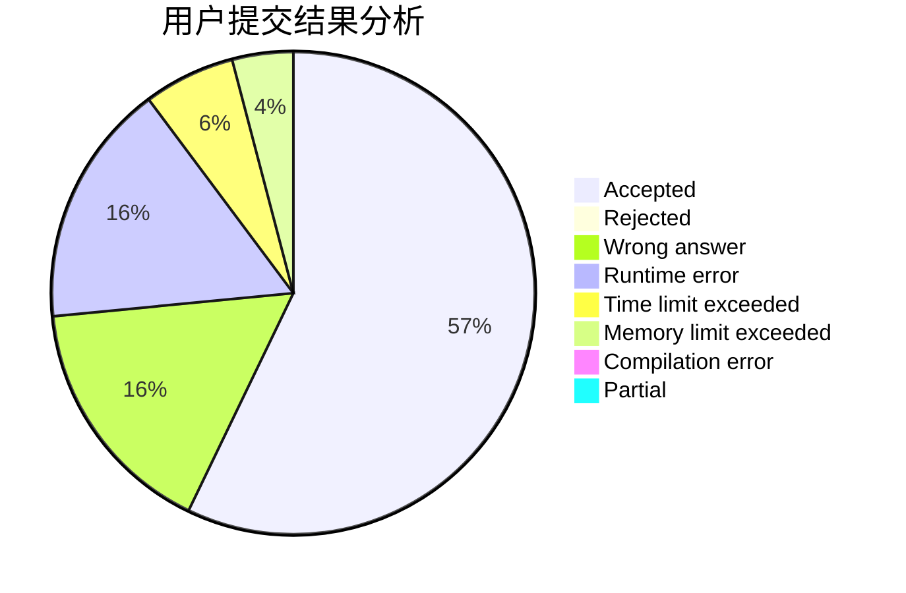
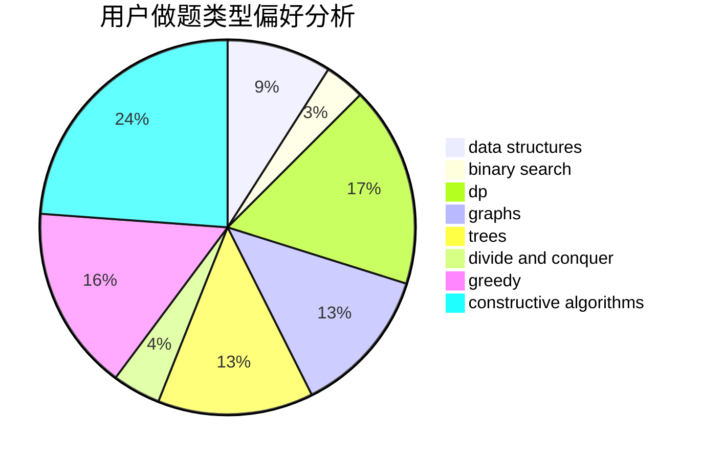
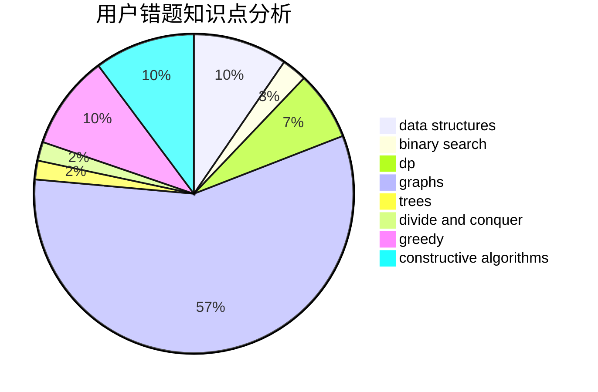

# Young.IQ

<!-- tabs:start -->

#### **用户提交结果分析**

#### **用户做题类型偏好分析**

#### **用户错题知识点分析**

<!-- tabs:end -->
# 推荐题目
[1486E](https://codeforces.com/contest/1486/problem/E)		binary search,
                        brute force,
                        constructive algorithms,
                        dp,
                        flows,
                        graphs,
                        shortest paths		  
[342E](https://codeforces.com/contest/342/problem/E)		data structures,
                        divide and conquer,
                        trees		  
[993B](https://codeforces.com/contest/993/problem/B)		bitmasks,
                        brute force		  
[506C](https://codeforces.com/contest/506/problem/C)		dsu,graphs,sortings,trees		  
[1150A](https://codeforces.com/contest/1150/problem/A)		greedy,
                        implementation		  
[1221A](https://codeforces.com/contest/1221/problem/A)		brute force,
                        greedy,
                        math		  
[963E](https://codeforces.com/contest/963/problem/E)		math		  
[852E](https://codeforces.com/contest/852/problem/E)		dp		  
[1290F](https://codeforces.com/contest/1290/problem/F)		dp		  
[314C](https://codeforces.com/contest/314/problem/C)		data structures,
                        dp		  
