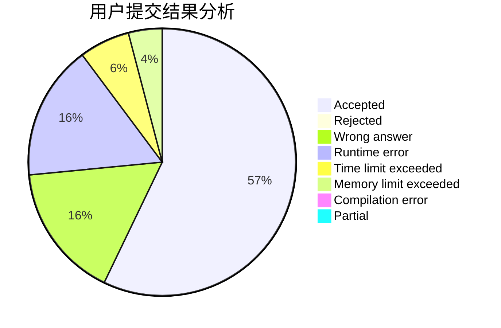
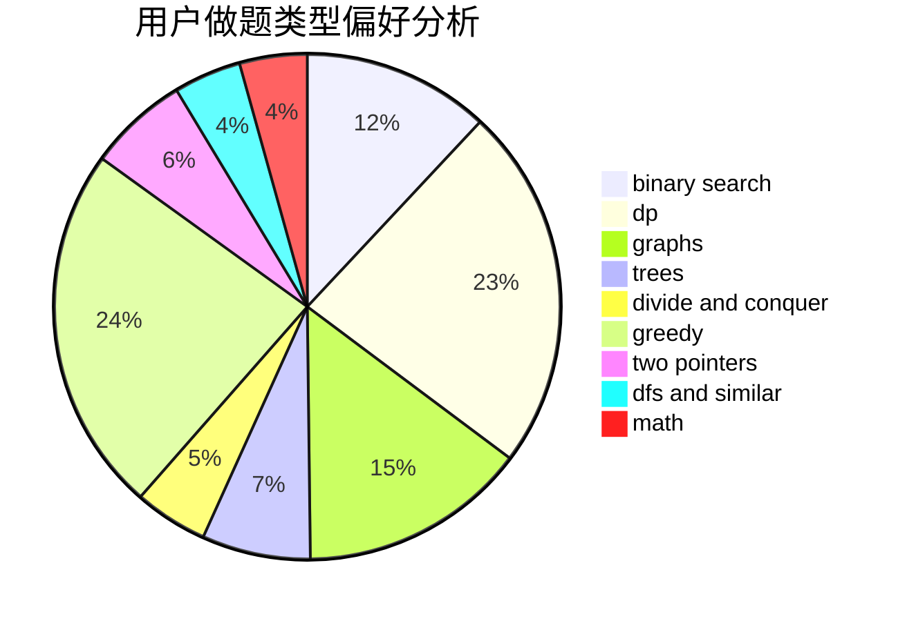

# Young.IQ

<!-- tabs:start -->

#### **用户提交结果分析**

#### **用户做题类型偏好分析**

<!-- tabs:end -->
# 推荐题目
[1486E](https://codeforces.com/contest/1486/problem/E)
[342E](https://codeforces.com/contest/342/problem/E)
[993B](https://codeforces.com/contest/993/problem/B)
[506C](https://codeforces.com/contest/506/problem/C)
[1150A](https://codeforces.com/contest/1150/problem/A)
[1221A](https://codeforces.com/contest/1221/problem/A)
[963E](https://codeforces.com/contest/963/problem/E)
[852E](https://codeforces.com/contest/852/problem/E)
[1290F](https://codeforces.com/contest/1290/problem/F)
[314C](https://codeforces.com/contest/314/problem/C)
