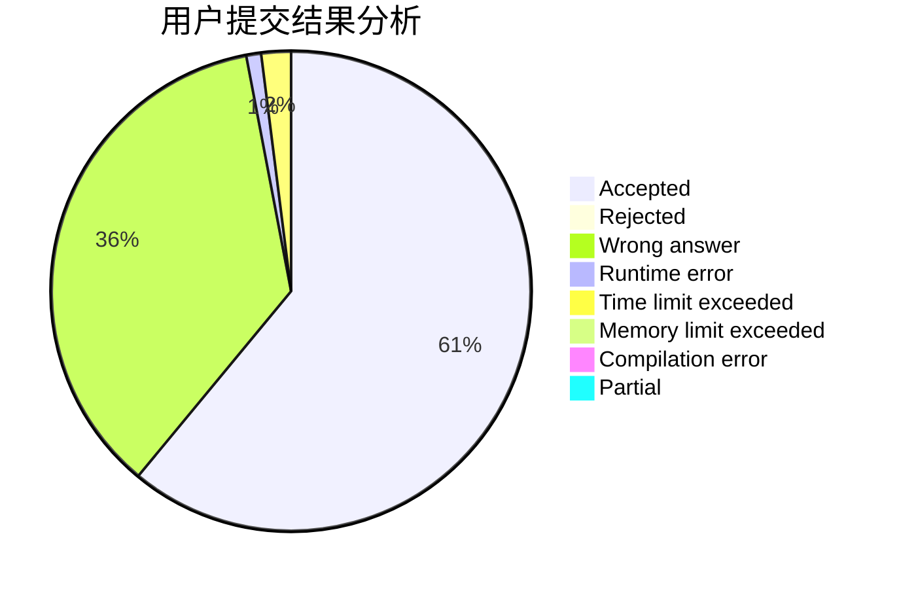
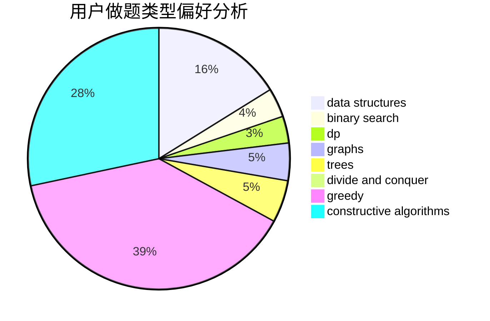
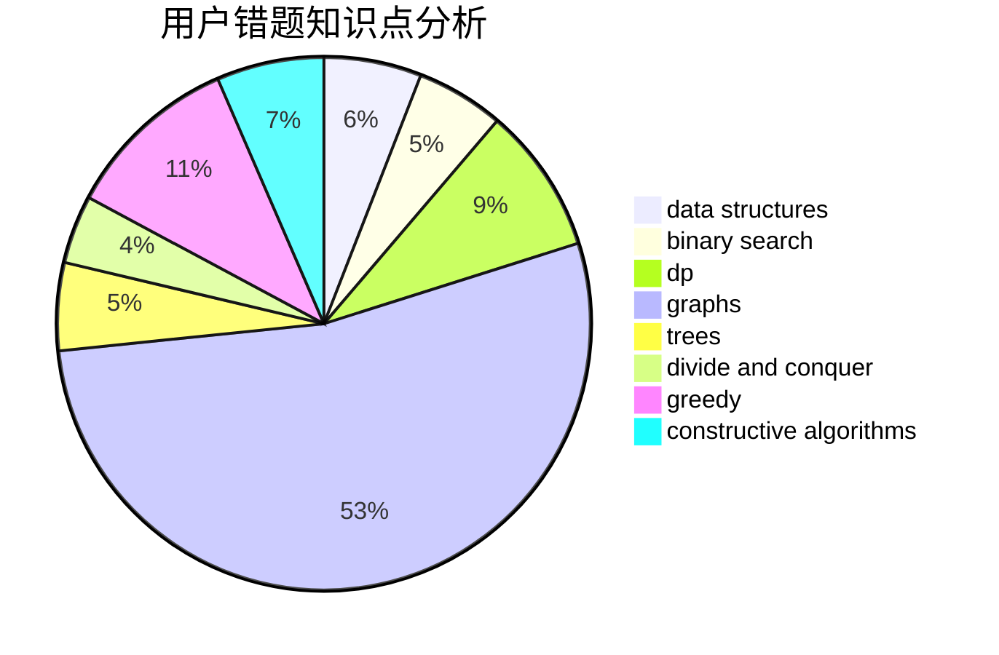

# YourDearest

<!-- tabs:start -->

#### **用户提交结果分析**

#### **用户做题类型偏好分析**

#### **用户错题知识点分析**

<!-- tabs:end -->
# 推荐题目
[908H](https://codeforces.com/contest/908/problem/H)		nan		  
[1028A](https://codeforces.com/contest/1028/problem/A)		implementation		  
[1117B](https://codeforces.com/contest/1117/problem/B)		greedy,
                        math,
                        sortings		  
[1198E](https://codeforces.com/contest/1198/problem/E)		flows,
                        graph matchings,
                        graphs		  
[956F](https://codeforces.com/contest/956/problem/F)		dsu,graphs,sortings,trees		  
[260D](https://codeforces.com/contest/260/problem/D)		constructive algorithms,
                        dsu,
                        graphs,
                        greedy,
                        trees		  
[1398F](https://codeforces.com/contest/1398/problem/F)		binary search,
                        data structures,
                        dp,
                        greedy,
                        two pointers		  
[1013B](https://codeforces.com/contest/1013/problem/B)		greedy		  
[1505D](https://codeforces.com/contest/1505/problem/D)		number theory		  
[1118A](https://codeforces.com/contest/1118/problem/A)		math		  
