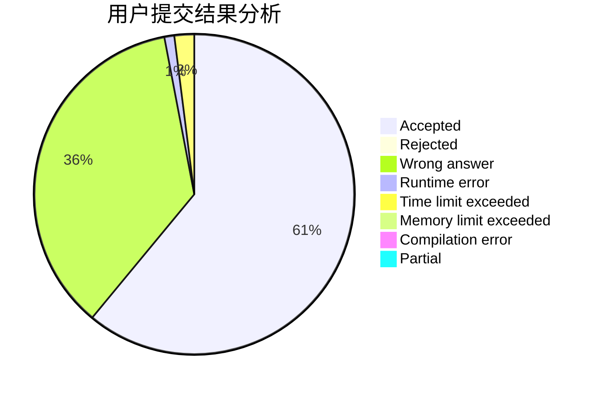
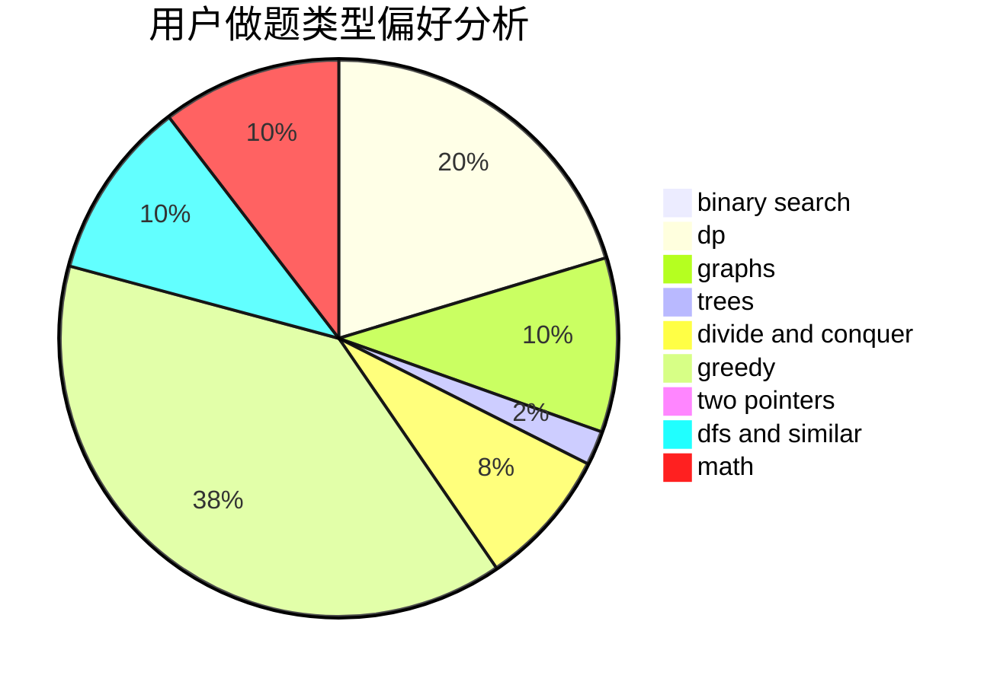

# YourDearest

<!-- tabs:start -->

#### **用户提交结果分析**

#### **用户做题类型偏好分析**

<!-- tabs:end -->
# 推荐题目
[923C](https://codeforces.com/contest/923/problem/C)
[1028D](https://codeforces.com/contest/1028/problem/D)
[1119A](https://codeforces.com/contest/1119/problem/A)
[1202C](https://codeforces.com/contest/1202/problem/C)
[978C](https://codeforces.com/contest/978/problem/C)
[279B](https://codeforces.com/contest/279/problem/B)
[1407E](https://codeforces.com/contest/1407/problem/E)
[1013E](https://codeforces.com/contest/1013/problem/E)
[152E](https://codeforces.com/contest/152/problem/E)
[1119F](https://codeforces.com/contest/1119/problem/F)
