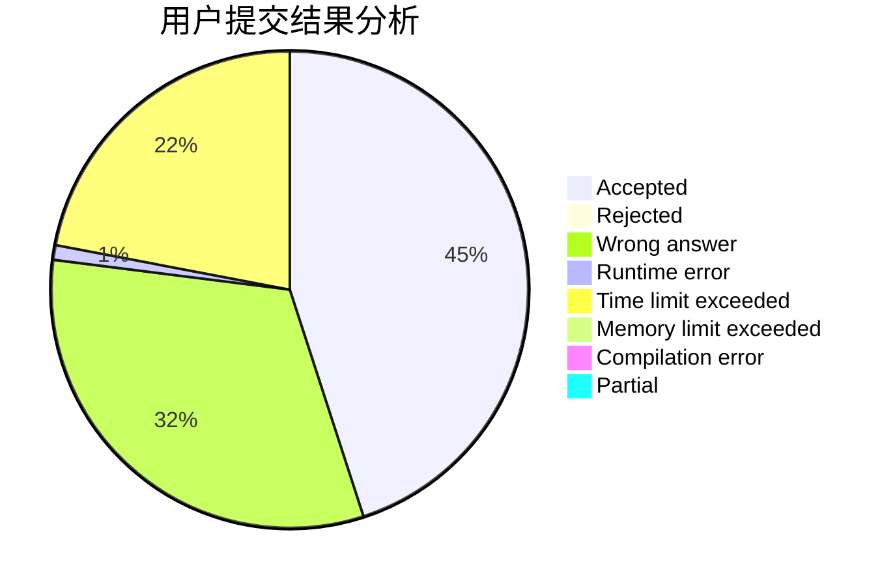
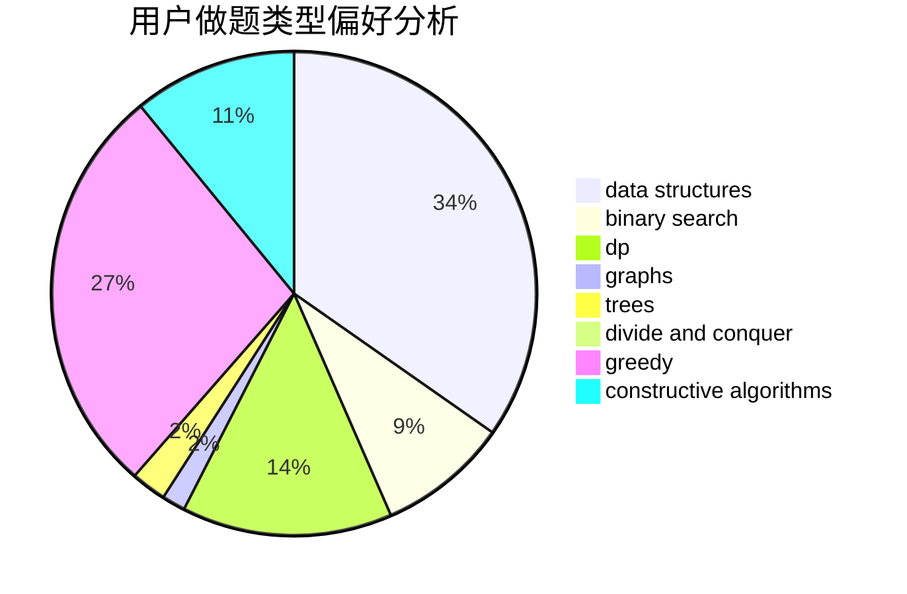

# 1092515503
<!-- tabs:start -->
#### **用户提交结果分析**

#### **用户做题类型偏好分析**

#### **用户错题知识点分析**

<!-- tabs:end -->
# 推荐题目
[Minegraphed](http://codeforces.com/problemset/problem/1089/M)		constructive algorithms,
                        graphs		  
[Minimum Diameter Tree](https://codeforces.com/contest/1087/problem/D)		constructive algorithms,
                        implementation,
                        trees		  
[Beautiful Matrix](http://codeforces.com/problemset/problem/1085/G)		combinatorics,
                        data structures,
                        dp		  
[Right-Left Cipher](https://codeforces.com/contest/1087/problem/A)		implementation,
                        strings		  
[Vasya and Templates](https://codeforces.com/contest/1087/problem/E)		greedy,
                        implementation,
                        strings		  
[Similar Arrays](http://codeforces.com/problemset/problem/1090/D)		constructive algorithms		  
[Ehab and subtraction](http://codeforces.com/problemset/problem/1088/B)		implementation,
                        sortings		  
[New Year and the Factorisation Collaboration](http://codeforces.com/problemset/problem/1091/G)		interactive,
                        math,
                        number theory		  
[How to Learn You Score](http://codeforces.com/problemset/problem/1090/F)		constructive algorithms,
                        interactive		  
[Ehab and a component choosing problem](http://codeforces.com/problemset/problem/1088/E)		dp,
                        greedy,
                        math,
                        trees		  
<!-- tabs:start -->
#### **data structures**
[Minegraphed](http://codeforces.com/problemset/problem/1085/G)		combinatorics,
                        data structures,
                        dp		  
[Minimum Diameter Tree](http://codeforces.com/problemset/problem/1091/E)		binary search,
                        data structures,
                        graphs,
                        greedy,
                        implementation,
                        math,
                        sortings		  
[Beautiful Matrix](https://codeforces.com/contest/1086/problem/E)		combinatorics,
                        data structures,
                        dp		  
[Right-Left Cipher](https://codeforces.com/contest/1084/problem/D)		data structures,
                        dp,
                        trees		  
[Vasya and Templates](http://codeforces.com/problemset/problem/1088/F)		data structures,
                        trees		  
[Similar Arrays](http://codeforces.com/problemset/problem/1089/K)		data structures		  
[Ehab and subtraction](http://codeforces.com/problemset/problem/1492/C)		binary search,
                        data structures,
                        dp,
                        greedy,
                        two pointers		  
[New Year and the Factorisation Collaboration](http://codeforces.com/problemset/problem/1490/G)		binary search,
                        data structures,
                        math		  
[How to Learn You Score](http://codeforces.com/problemset/problem/1479/D)		binary search,
                        bitmasks,
                        brute force,
                        data structures,
                        probabilities,
                        trees		  
[Ehab and a component choosing problem](http://codeforces.com/problemset/problem/1497/A)		brute force,
                        data structures,
                        greedy,
                        sortings		  
#### **binary search**
[Minegraphed](http://codeforces.com/problemset/problem/1091/E)		binary search,
                        data structures,
                        graphs,
                        greedy,
                        implementation,
                        math,
                        sortings		  
[Minimum Diameter Tree](http://codeforces.com/problemset/problem/1492/C)		binary search,
                        data structures,
                        dp,
                        greedy,
                        two pointers		  
[Beautiful Matrix](http://codeforces.com/problemset/problem/1463/D)		binary search,
                        constructive algorithms,
                        greedy,
                        two pointers		  
[Right-Left Cipher](http://codeforces.com/problemset/problem/1490/G)		binary search,
                        data structures,
                        math		  
[Vasya and Templates](http://codeforces.com/problemset/problem/1479/D)		binary search,
                        bitmasks,
                        brute force,
                        data structures,
                        probabilities,
                        trees		  
[Similar Arrays](http://codeforces.com/problemset/problem/1436/E)		binary search,
                        data structures,
                        two pointers		  
[Ehab and subtraction](http://codeforces.com/problemset/problem/1461/D)		binary search,
                        brute force,
                        data structures,
                        divide and conquer,
                        implementation,
                        sortings		  
[New Year and the Factorisation Collaboration](http://codeforces.com/problemset/problem/1493/C)		binary search,
                        brute force,
                        constructive algorithms,
                        greedy,
                        strings		  
[How to Learn You Score](http://codeforces.com/problemset/problem/1487/D)		binary search,
                        brute force,
                        math,
                        number theory		  
[Ehab and a component choosing problem](http://codeforces.com/problemset/problem/1486/B)		binary search,
                        geometry,
                        shortest paths,
                        sortings		  
#### **dp**
[Minegraphed](http://codeforces.com/problemset/problem/1085/G)		combinatorics,
                        data structures,
                        dp		  
[Minimum Diameter Tree](http://codeforces.com/problemset/problem/1088/E)		dp,
                        greedy,
                        math,
                        trees		  
[Beautiful Matrix](http://codeforces.com/problemset/problem/1084/C)		combinatorics,
                        dp,
                        implementation		  
[Right-Left Cipher](https://codeforces.com/contest/1086/problem/E)		combinatorics,
                        data structures,
                        dp		  
[Vasya and Templates](http://codeforces.com/problemset/problem/1089/A)		dp		  
[Similar Arrays](https://codeforces.com/contest/1084/problem/D)		data structures,
                        dp,
                        trees		  
[Ehab and subtraction](http://codeforces.com/problemset/problem/1091/D)		combinatorics,
                        dp,
                        math		  
[New Year and the Factorisation Collaboration](http://codeforces.com/problemset/problem/1034/E)		bitmasks,
                        dp,
                        math		  
[How to Learn You Score](http://codeforces.com/problemset/problem/1492/C)		binary search,
                        data structures,
                        dp,
                        greedy,
                        two pointers		  
[Ehab and a component choosing problem](https://codeforces.com/contest/1457/problem/C)		brute force,
                        dp,
                        implementation		  
#### **graph**
[Minegraphed](http://codeforces.com/problemset/problem/1089/M)		constructive algorithms,
                        graphs		  
[Minimum Diameter Tree](http://codeforces.com/problemset/problem/1091/E)		binary search,
                        data structures,
                        graphs,
                        greedy,
                        implementation,
                        math,
                        sortings		  
[Beautiful Matrix](http://codeforces.com/problemset/problem/1089/D)		graphs		  
[Right-Left Cipher](https://codeforces.com/contest/108/problem/C)		dfs and similar,
                        graphs		  
[Vasya and Templates](http://codeforces.com/problemset/problem/1487/C)		brute force,
                        constructive algorithms,
                        dfs and similar,
                        graphs,
                        greedy,
                        implementation,
                        math		  
[Similar Arrays](http://codeforces.com/problemset/problem/1437/C)		dp,
                        flows,
                        graph matchings,
                        greedy,
                        math,
                        sortings		  
[Ehab and subtraction](http://codeforces.com/problemset/problem/1470/D)		constructive algorithms,
                        dfs and similar,
                        graph matchings,
                        graphs,
                        greedy		  
[New Year and the Factorisation Collaboration](http://codeforces.com/problemset/problem/1476/C)		dp,
                        graphs,
                        greedy		  
[How to Learn You Score](http://codeforces.com/problemset/problem/1304/D)		constructive algorithms,
                        graphs,
                        greedy,
                        two pointers		  
[Ehab and a component choosing problem](http://codeforces.com/problemset/problem/1475/C)		combinatorics,
                        graphs,
                        math		  
#### **trees**
[Minegraphed](https://codeforces.com/contest/1087/problem/D)		constructive algorithms,
                        implementation,
                        trees		  
[Minimum Diameter Tree](http://codeforces.com/problemset/problem/1088/E)		dp,
                        greedy,
                        math,
                        trees		  
[Beautiful Matrix](https://codeforces.com/contest/1086/problem/B)		constructive algorithms,
                        implementation,
                        trees		  
[Right-Left Cipher](https://codeforces.com/contest/1084/problem/D)		data structures,
                        dp,
                        trees		  
[Vasya and Templates](http://codeforces.com/problemset/problem/1088/F)		data structures,
                        trees		  
[Similar Arrays](http://codeforces.com/problemset/problem/1085/D)		constructive algorithms,
                        implementation,
                        trees		  
[Ehab and subtraction](http://codeforces.com/problemset/problem/1479/D)		binary search,
                        bitmasks,
                        brute force,
                        data structures,
                        probabilities,
                        trees		  
[New Year and the Factorisation Collaboration](http://codeforces.com/problemset/problem/1511/C)		brute force,
                        data structures,
                        implementation,
                        trees		  
[How to Learn You Score](http://codeforces.com/problemset/problem/1499/F)		combinatorics,
                        dfs and similar,
                        dp,
                        trees		  
[Ehab and a component choosing problem](http://codeforces.com/problemset/problem/1491/E)		brute force,
                        dfs and similar,
                        divide and conquer,
                        number theory,
                        trees		  
#### **divide and conquer**
[Minegraphed](http://codeforces.com/problemset/problem/1461/D)		binary search,
                        brute force,
                        data structures,
                        divide and conquer,
                        implementation,
                        sortings		  
[Minimum Diameter Tree](http://codeforces.com/problemset/problem/1466/G)		combinatorics,
                        divide and conquer,
                        hashing,
                        math,
                        string suffix structures,
                        strings		  
[Beautiful Matrix](http://codeforces.com/problemset/problem/1490/D)		dfs and similar,
                        divide and conquer,
                        implementation		  
[Right-Left Cipher](https://codeforces.com/contest/1483/problem/C)		data structures,
                        divide and conquer,
                        dp		  
[Vasya and Templates](http://codeforces.com/problemset/problem/1491/E)		brute force,
                        dfs and similar,
                        divide and conquer,
                        number theory,
                        trees		  
[Similar Arrays](http://codeforces.com/problemset/problem/1303/G)		data structures,
                        divide and conquer,
                        geometry,
                        trees		  
[Ehab and subtraction](http://codeforces.com/problemset/problem/1494/D)		constructive algorithms,
                        data structures,
                        dfs and similar,
                        divide and conquer,
                        dsu,
                        greedy,
                        sortings,
                        trees		  
[New Year and the Factorisation Collaboration](http://codeforces.com/problemset/problem/1482/E)		data structures,
                        divide and conquer,
                        dp		  
[How to Learn You Score](http://codeforces.com/problemset/problem/566/C)		dfs and similar,
                        divide and conquer,
                        trees		  
[Ehab and a component choosing problem](http://codeforces.com/problemset/problem/1428/F)		binary search,
                        data structures,
                        divide and conquer,
                        dp,
                        two pointers		  
#### **greedy**
[Minegraphed](https://codeforces.com/contest/1087/problem/E)		greedy,
                        implementation,
                        strings		  
[Minimum Diameter Tree](http://codeforces.com/problemset/problem/1088/E)		dp,
                        greedy,
                        math,
                        trees		  
[Beautiful Matrix](http://codeforces.com/problemset/problem/1091/E)		binary search,
                        data structures,
                        graphs,
                        greedy,
                        implementation,
                        math,
                        sortings		  
[Right-Left Cipher](http://codeforces.com/problemset/problem/1090/A)		greedy		  
[Vasya and Templates](http://codeforces.com/problemset/problem/1084/B)		greedy,
                        implementation		  
[Similar Arrays](https://codeforces.com/contest/1086/problem/C)		greedy,
                        implementation,
                        strings		  
[Ehab and subtraction](http://codeforces.com/problemset/problem/1023/C)		greedy		  
[New Year and the Factorisation Collaboration](http://codeforces.com/problemset/problem/1088/C)		constructive algorithms,
                        greedy,
                        math		  
[How to Learn You Score](http://codeforces.com/problemset/problem/1091/B)		brute force,
                        constructive algorithms,
                        greedy,
                        implementation		  
[Ehab and a component choosing problem](http://codeforces.com/problemset/problem/1091/F)		constructive algorithms,
                        greedy		  
#### **constructive algorithms**
[Minegraphed](http://codeforces.com/problemset/problem/1089/M)		constructive algorithms,
                        graphs		  
[Minimum Diameter Tree](https://codeforces.com/contest/1087/problem/D)		constructive algorithms,
                        implementation,
                        trees		  
[Beautiful Matrix](http://codeforces.com/problemset/problem/1090/D)		constructive algorithms		  
[Right-Left Cipher](http://codeforces.com/problemset/problem/1090/F)		constructive algorithms,
                        interactive		  
[Vasya and Templates](https://codeforces.com/contest/1086/problem/B)		constructive algorithms,
                        implementation,
                        trees		  
[Similar Arrays](http://codeforces.com/problemset/problem/1088/D)		bitmasks,
                        constructive algorithms,
                        implementation,
                        interactive		  
[Ehab and subtraction](http://codeforces.com/problemset/problem/1088/C)		constructive algorithms,
                        greedy,
                        math		  
[New Year and the Factorisation Collaboration](http://codeforces.com/problemset/problem/1089/E)		constructive algorithms		  
[How to Learn You Score](http://codeforces.com/problemset/problem/1091/B)		brute force,
                        constructive algorithms,
                        greedy,
                        implementation		  
[Ehab and a component choosing problem](http://codeforces.com/problemset/problem/1091/F)		constructive algorithms,
                        greedy		  
#### **sortings**
[Minegraphed](http://codeforces.com/problemset/problem/1088/B)		implementation,
                        sortings		  
[Minimum Diameter Tree](http://codeforces.com/problemset/problem/1091/E)		binary search,
                        data structures,
                        graphs,
                        greedy,
                        implementation,
                        math,
                        sortings		  
[Beautiful Matrix](https://codeforces.com/contest/1496/problem/C)		geometry,
                        greedy,
                        math,
                        sortings		  
[Right-Left Cipher](http://codeforces.com/problemset/problem/1495/A)		geometry,
                        greedy,
                        math,
                        sortings		  
[Vasya and Templates](http://codeforces.com/problemset/problem/1497/A)		brute force,
                        data structures,
                        greedy,
                        sortings		  
[Similar Arrays](http://codeforces.com/problemset/problem/1427/A)		math,
                        sortings		  
[Ehab and subtraction](http://codeforces.com/problemset/problem/1461/D)		binary search,
                        brute force,
                        data structures,
                        divide and conquer,
                        implementation,
                        sortings		  
[New Year and the Factorisation Collaboration](http://codeforces.com/problemset/problem/1437/C)		dp,
                        flows,
                        graph matchings,
                        greedy,
                        math,
                        sortings		  
[How to Learn You Score](http://codeforces.com/problemset/problem/1473/A)		greedy,
                        implementation,
                        math,
                        sortings		  
[Ehab and a component choosing problem](http://codeforces.com/problemset/problem/1486/B)		binary search,
                        geometry,
                        shortest paths,
                        sortings		  
<!-- tabs:end -->
