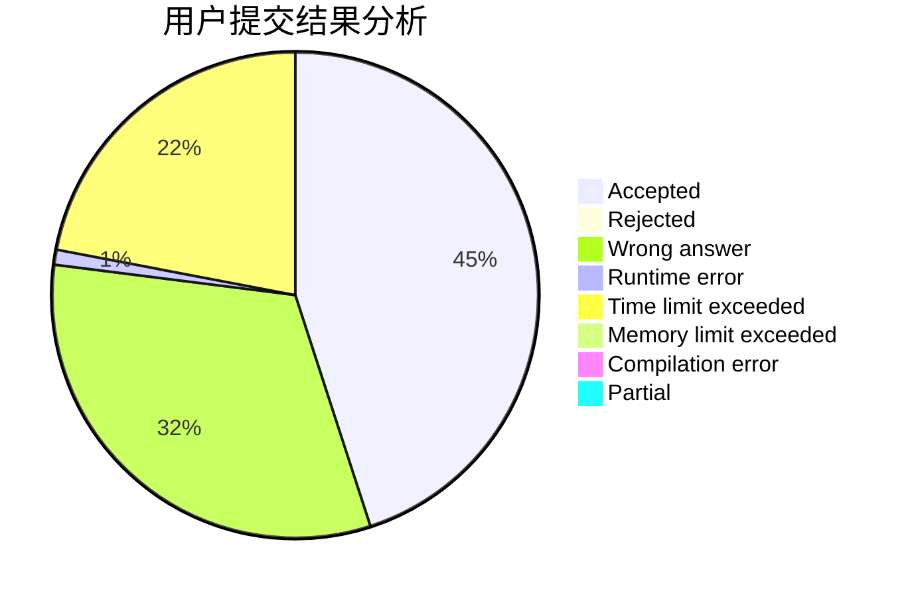
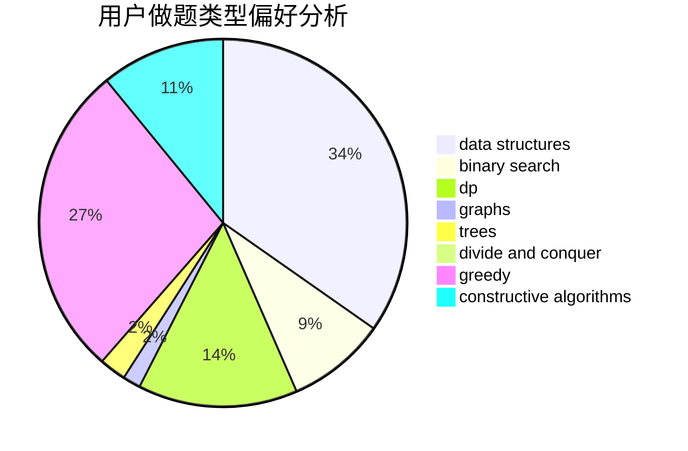

# 1092515503

<!-- tabs:start -->

#### **用户提交结果分析**

#### **用户做题类型偏好分析**

#### **用户错题知识点分析**

<!-- tabs:end -->
# 推荐题目
[1087A](https://codeforces.com/contest/1087/problem/A)		dsu,graphs,sortings,trees		  
[1089E](https://codeforces.com/contest/1089/problem/E)		constructive algorithms		  
[1088A](https://codeforces.com/contest/1088/problem/A)		brute force,
                        constructive algorithms		  
[1089G](https://codeforces.com/contest/1089/problem/G)		math		  
[1085G](https://codeforces.com/contest/1085/problem/G)		combinatorics,
                        data structures,
                        dp		  
[1086B](https://codeforces.com/contest/1086/problem/B)		dsu,graphs,sortings,trees		  
[1087E](https://codeforces.com/contest/1087/problem/E)		dsu,graphs,sortings,trees		  
[1089I](https://codeforces.com/contest/1089/problem/I)		nan		  
[1090B](https://codeforces.com/contest/1090/problem/B)		nan		  
[1091E](https://codeforces.com/contest/1091/problem/E)		binary search,
                        data structures,
                        graphs,
                        greedy,
                        implementation,
                        math,
                        sortings		  
