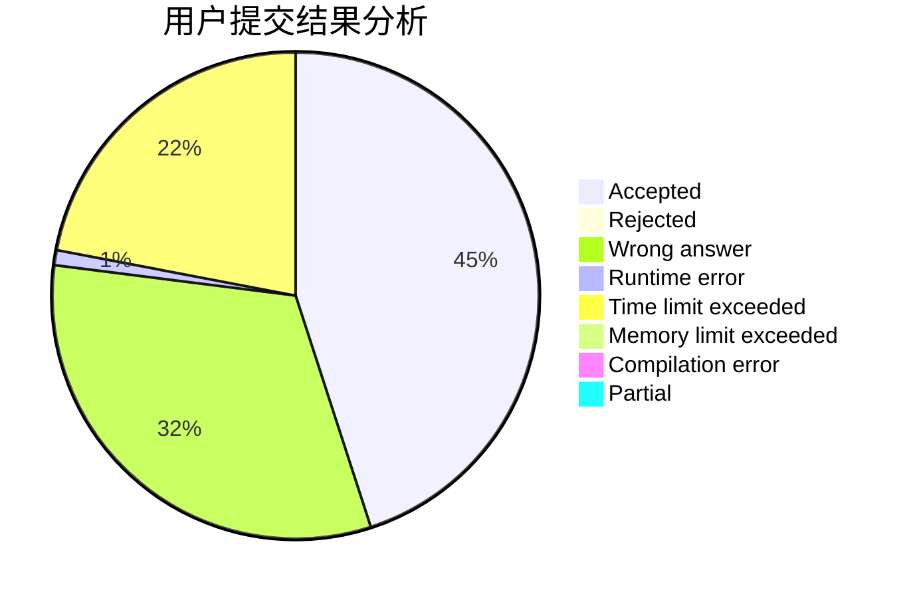
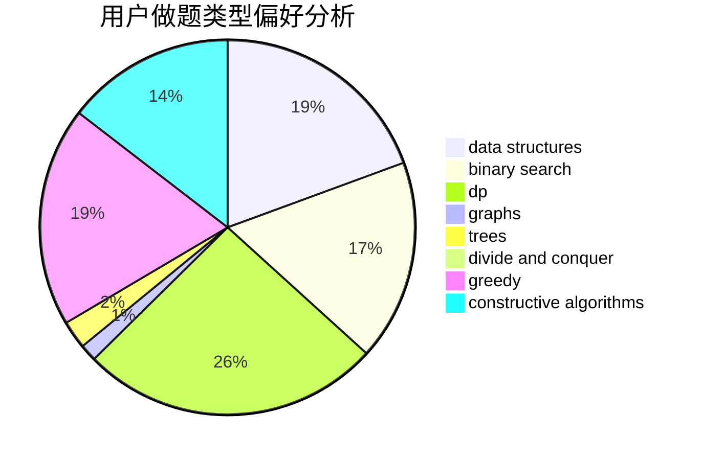
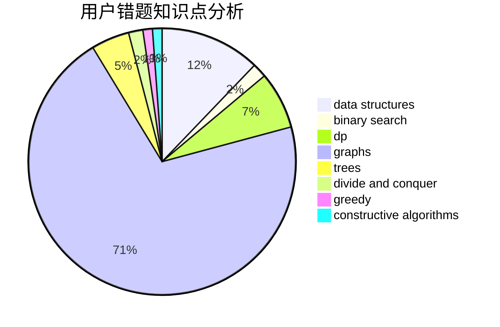

# 1092515503

<!-- tabs:start -->

#### **用户提交结果分析**

#### **用户做题类型偏好分析**

#### **用户错题知识点分析**

<!-- tabs:end -->
# 推荐题目
[1087D](https://codeforces.com/contest/1087/problem/D)		dsu,graphs,sortings,trees		  
[1089I](https://codeforces.com/contest/1089/problem/I)		nan		  
[1088D](https://codeforces.com/contest/1088/problem/D)		bitmasks,
                        constructive algorithms,
                        implementation,
                        interactive		  
[1089L](https://codeforces.com/contest/1089/problem/L)		nan		  
[1086C](https://codeforces.com/contest/1086/problem/C)		dsu,graphs,sortings,trees		  
[1086E](https://codeforces.com/contest/1086/problem/E)		dsu,graphs,sortings,trees		  
[1088B](https://codeforces.com/contest/1088/problem/B)		implementation,
                        sortings		  
[1089M](https://codeforces.com/contest/1089/problem/M)		constructive algorithms,
                        graphs		  
[1090M](https://codeforces.com/contest/1090/problem/M)		implementation		  
[1091H](https://codeforces.com/contest/1091/problem/H)		games		  
