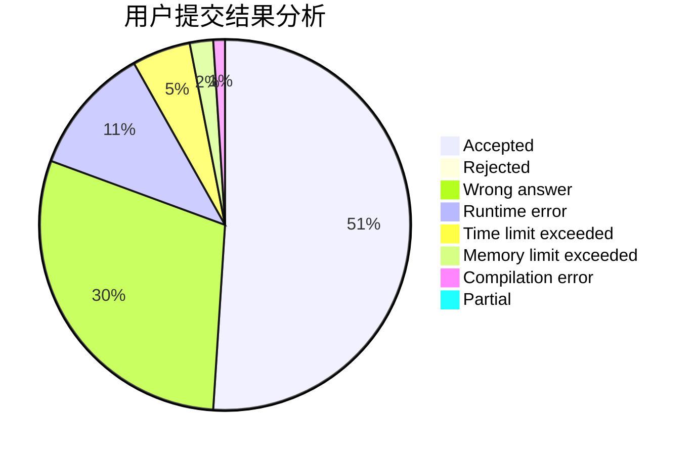
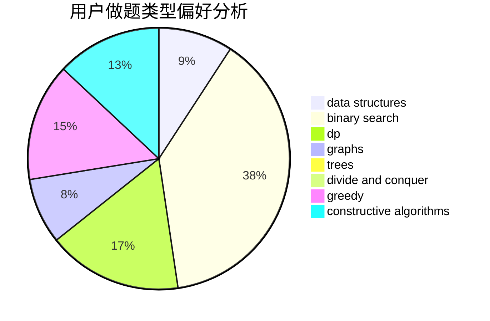
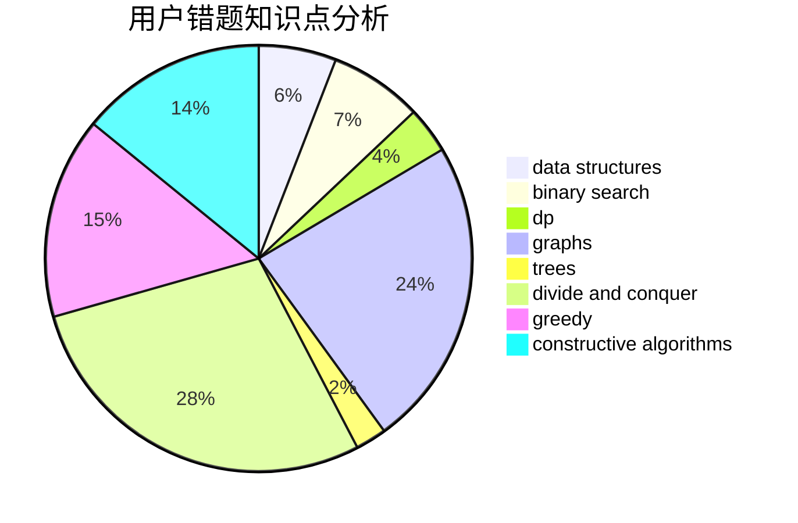

# Alex_Wei

<!-- tabs:start -->

#### **用户提交结果分析**

#### **用户做题类型偏好分析**

#### **用户错题知识点分析**

<!-- tabs:end -->
# 推荐题目
[1385D](https://codeforces.com/contest/1385/problem/D)		bitmasks,
                        brute force,
                        divide and conquer,
                        dp,
                        implementation		  
[257D](https://codeforces.com/contest/257/problem/D)		greedy,
                        math		  
[1278F](https://codeforces.com/contest/1278/problem/F)		combinatorics,
                        dp,
                        math,
                        number theory,
                        probabilities		  
[1195B](https://codeforces.com/contest/1195/problem/B)		binary search,
                        brute force,
                        math		  
[25D](https://codeforces.com/contest/25/problem/D)		dsu,
                        graphs,
                        trees		  
[1473E](https://codeforces.com/contest/1473/problem/E)		graphs,
                        shortest paths		  
[254D](https://codeforces.com/contest/254/problem/D)		brute force,
                        dfs and similar,
                        graphs,
                        implementation,
                        shortest paths		  
[1261B2](https://codeforces.com/contest/1261B/problem/2)		dsu,graphs,sortings,trees		  
[1423E](https://codeforces.com/contest/1423/problem/E)		geometry		  
[258C](https://codeforces.com/contest/258/problem/C)		binary search,
                        combinatorics,
                        dp,
                        math		  
