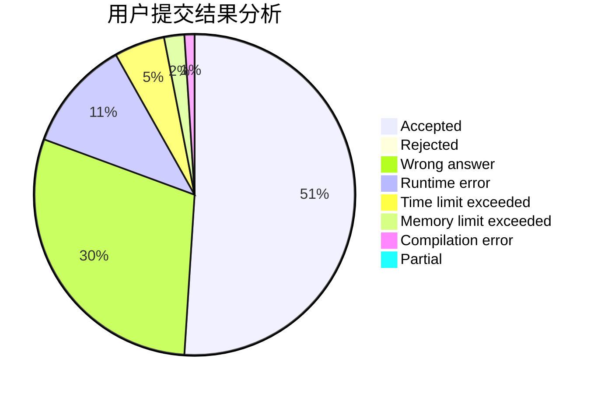
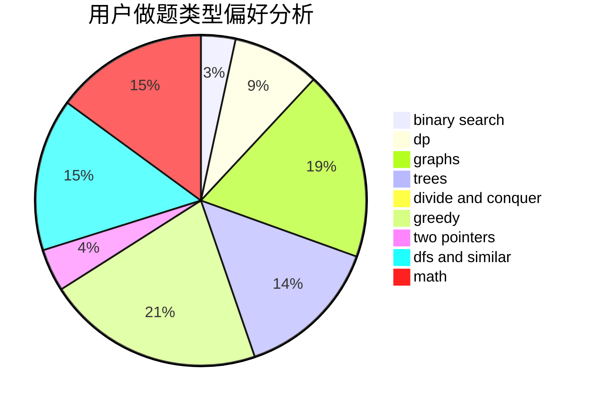

# Alex_Wei

<!-- tabs:start -->

#### **用户提交结果分析**

#### **用户做题类型偏好分析**

<!-- tabs:end -->
# 推荐题目
[1395D](https://codeforces.com/contest/1395/problem/D)
[274D](https://codeforces.com/contest/274/problem/D)
[1285A](https://codeforces.com/contest/1285/problem/A)
[1199D](https://codeforces.com/contest/1199/problem/D)
[277D](https://codeforces.com/contest/277/problem/D)
[1482B](https://codeforces.com/contest/1482/problem/B)
[273D](https://codeforces.com/contest/273/problem/D)
[1267A](https://codeforces.com/contest/1267/problem/A)
[1430G](https://codeforces.com/contest/1430/problem/G)
[275B](https://codeforces.com/contest/275/problem/B)
