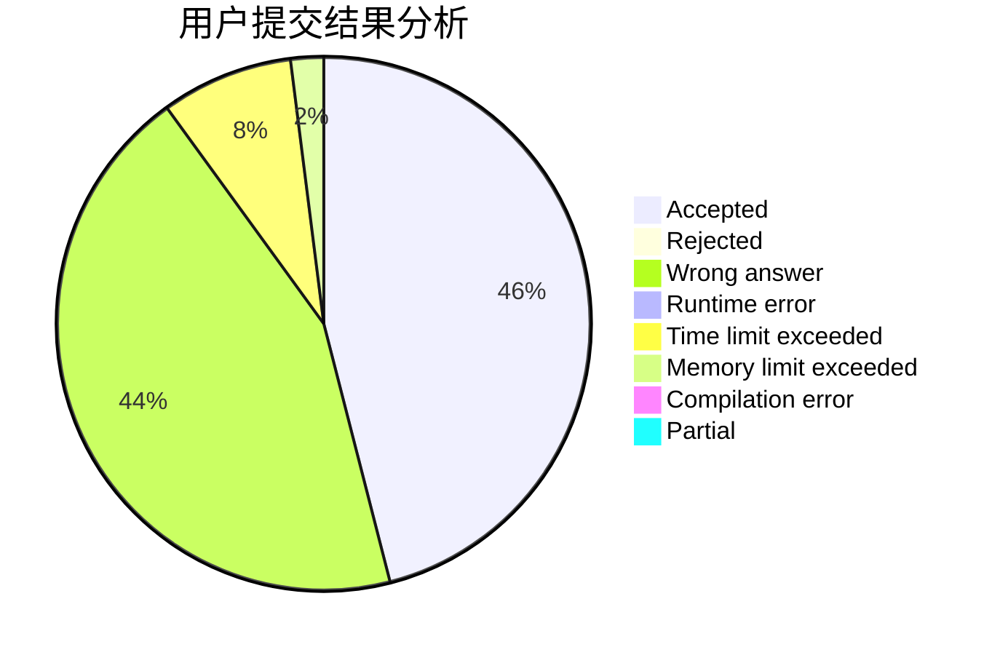
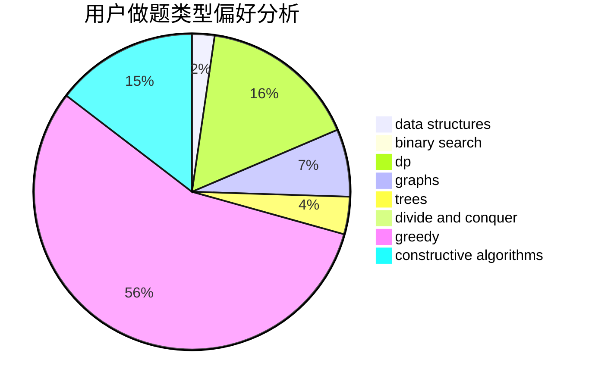

# Youth518

<!-- tabs:start -->

#### **用户提交结果分析**

#### **用户做题类型偏好分析**

#### **用户错题知识点分析**

<!-- tabs:end -->
# 推荐题目
[839A](https://codeforces.com/contest/839/problem/A)		implementation		  
[352E](https://codeforces.com/contest/352/problem/E)		dsu,graphs,sortings,trees		  
[295C](https://codeforces.com/contest/295/problem/C)		combinatorics,
                        dp,
                        graphs,
                        shortest paths		  
[1373B](https://codeforces.com/contest/1373/problem/B)		games		  
[165D](https://codeforces.com/contest/165/problem/D)		data structures,
                        dsu,
                        trees		  
[338D](https://codeforces.com/contest/338/problem/D)		chinese remainder theorem,
                        math,
                        number theory		  
[913B](https://codeforces.com/contest/913/problem/B)		implementation,
                        trees		  
[958A2](https://codeforces.com/contest/958A/problem/2)		hashing,
                        strings		  
[981B](https://codeforces.com/contest/981/problem/B)		sortings		  
[1120D](https://codeforces.com/contest/1120/problem/D)		dfs and similar,
                        dp,
                        dsu,
                        graphs,
                        greedy,
                        trees		  
