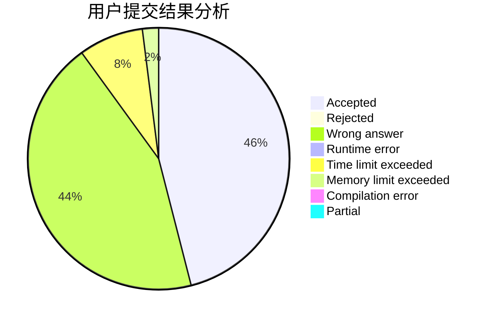
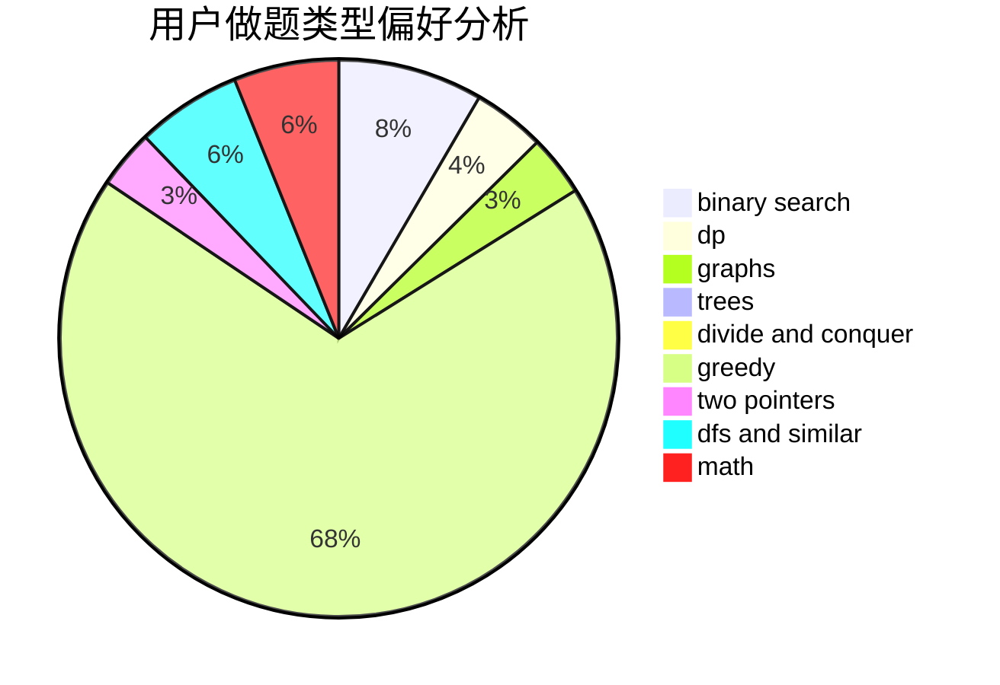

# Youth518

<!-- tabs:start -->

#### **用户提交结果分析**

#### **用户做题类型偏好分析**

<!-- tabs:end -->
# 推荐题目
[858A](https://codeforces.com/contest/858/problem/A)
[379D](https://codeforces.com/contest/379/problem/D)
[312A](https://codeforces.com/contest/312/problem/A)
[1381E](https://codeforces.com/contest/1381/problem/E)
[190C](https://codeforces.com/contest/190/problem/C)
[364C](https://codeforces.com/contest/364/problem/C)
[931F](https://codeforces.com/contest/931/problem/F)
[979C](https://codeforces.com/contest/979/problem/C)
[996C](https://codeforces.com/contest/996/problem/C)
[11301](https://codeforces.com/contest/1130/problem/1)
