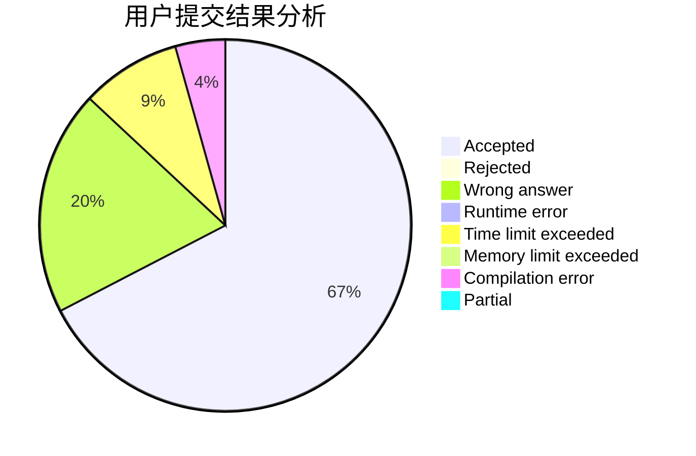
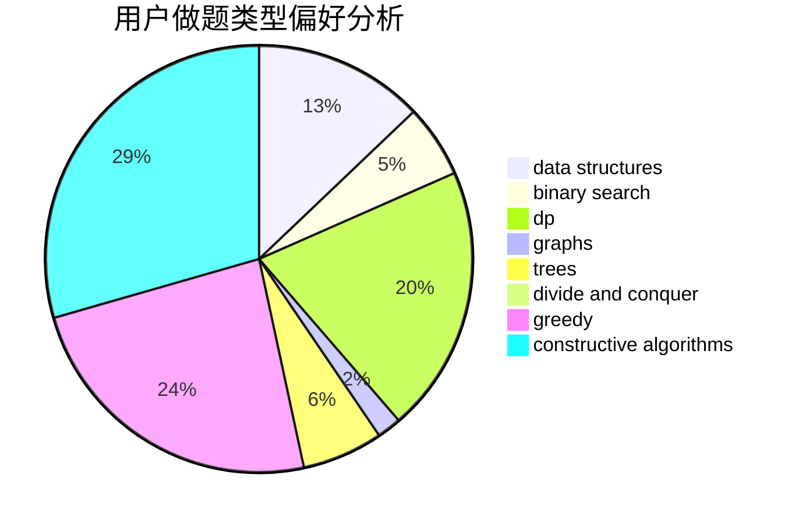
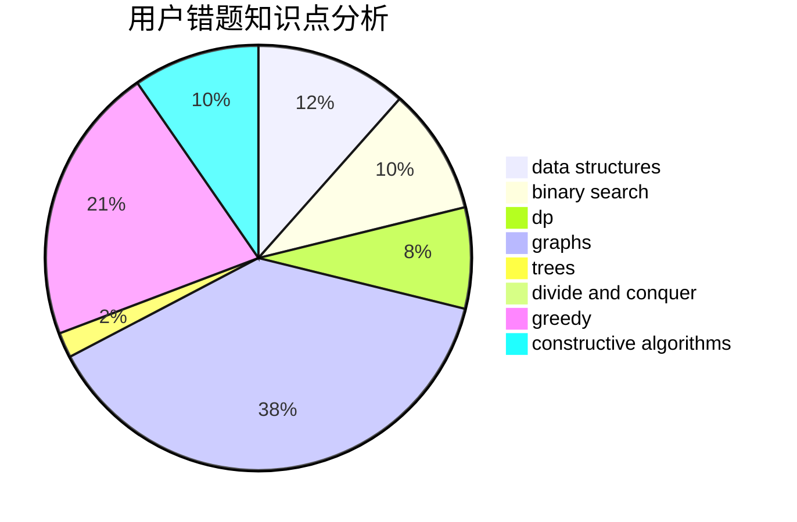

# Yu050919

<!-- tabs:start -->

#### **用户提交结果分析**

#### **用户做题类型偏好分析**

#### **用户错题知识点分析**

<!-- tabs:end -->
# 推荐题目
[78C](https://codeforces.com/contest/78/problem/C)		dp,
                        games,
                        number theory		  
[418E](https://codeforces.com/contest/418/problem/E)		data structures		  
[10921](https://codeforces.com/contest/1092/problem/1)		dsu,graphs,sortings,trees		  
[1366E](https://codeforces.com/contest/1366/problem/E)		binary search,
                        brute force,
                        combinatorics,
                        constructive algorithms,
                        dp,
                        two pointers		  
[356C](https://codeforces.com/contest/356/problem/C)		combinatorics,
                        constructive algorithms,
                        greedy,
                        implementation		  
[1491F](https://codeforces.com/contest/1491/problem/F)		binary search,
                        constructive algorithms,
                        interactive		  
[910B](https://codeforces.com/contest/910/problem/B)		greedy,
                        implementation		  
[506B](https://codeforces.com/contest/506/problem/B)		dsu,graphs,sortings,trees		  
[818D](https://codeforces.com/contest/818/problem/D)		data structures,
                        implementation		  
[1216C](https://codeforces.com/contest/1216/problem/C)		geometry,
                        math		  
