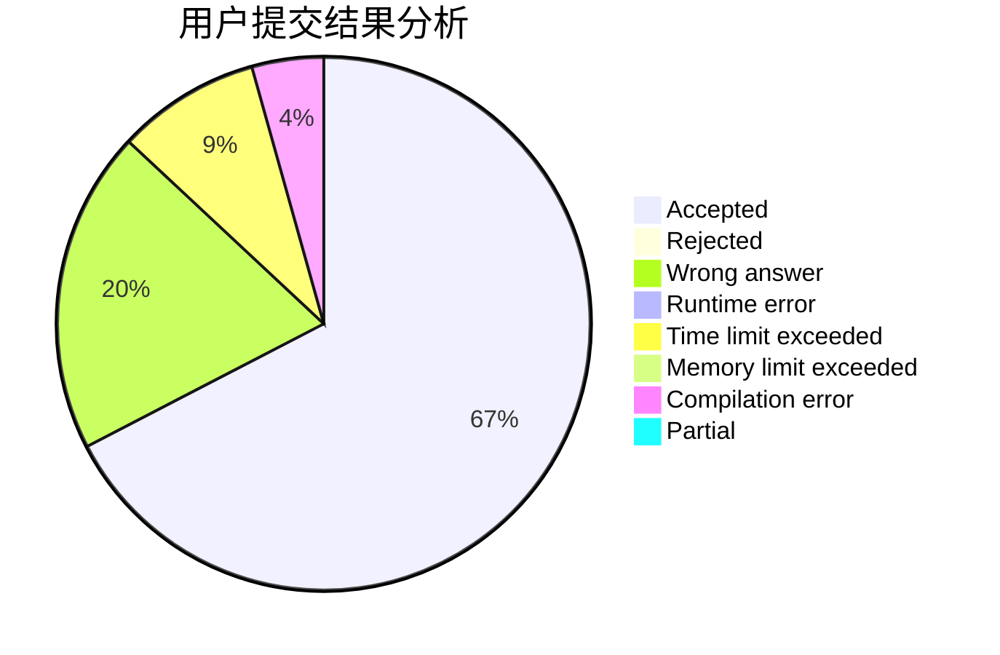
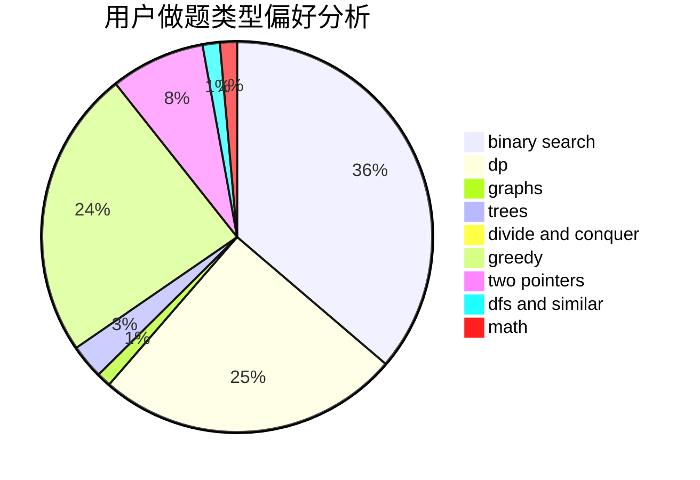

# Yu050919

<!-- tabs:start -->

#### **用户提交结果分析**

#### **用户做题类型偏好分析**

<!-- tabs:end -->
# 推荐题目
[78C](https://codeforces.com/contest/78/problem/C)
[418E](https://codeforces.com/contest/418/problem/E)
[10921](https://codeforces.com/contest/1092/problem/1)
[1366E](https://codeforces.com/contest/1366/problem/E)
[356C](https://codeforces.com/contest/356/problem/C)
[1491F](https://codeforces.com/contest/1491/problem/F)
[910B](https://codeforces.com/contest/910/problem/B)
[506B](https://codeforces.com/contest/506/problem/B)
[818D](https://codeforces.com/contest/818/problem/D)
[1216C](https://codeforces.com/contest/1216/problem/C)
