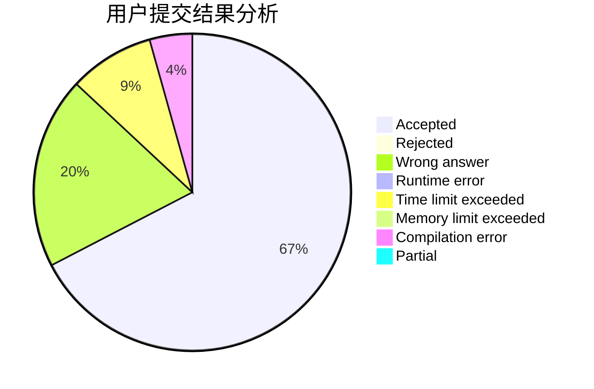
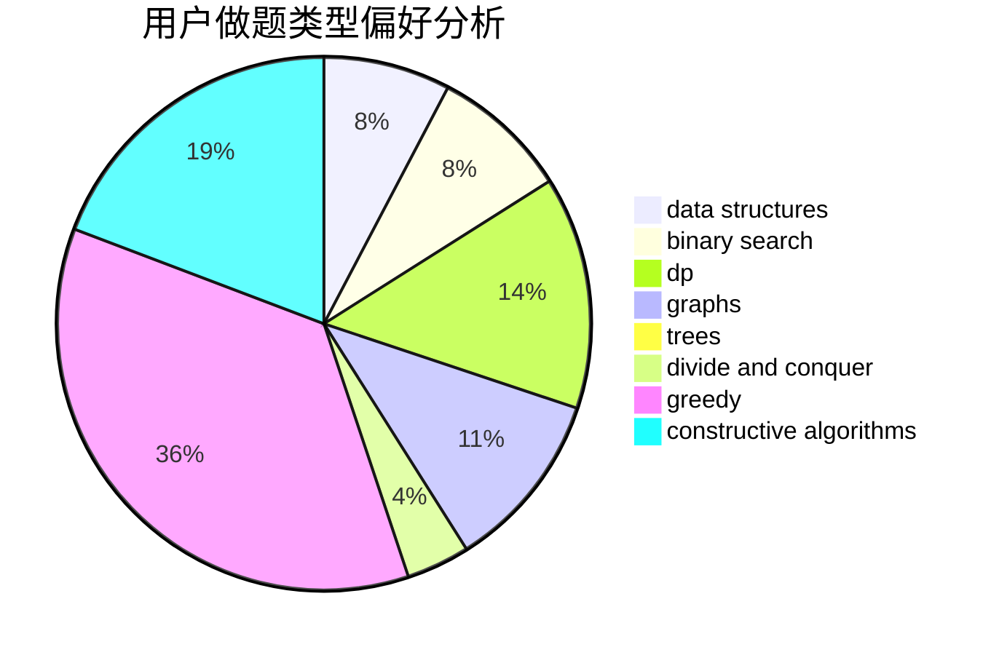
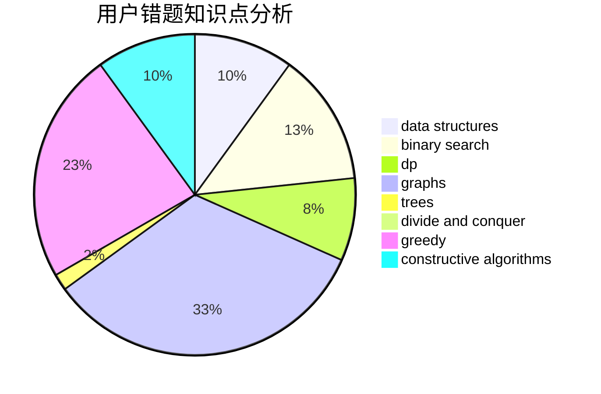

# Yu050919

<!-- tabs:start -->

#### **用户提交结果分析**

#### **用户做题类型偏好分析**

#### **用户错题知识点分析**

<!-- tabs:end -->
# 推荐题目
[76D](https://codeforces.com/contest/76/problem/D)		dp,
                        greedy,
                        math		  
[38A](https://codeforces.com/contest/38/problem/A)		implementation		  
[1091F](https://codeforces.com/contest/1091/problem/F)		constructive algorithms,
                        greedy		  
[1358C](https://codeforces.com/contest/1358/problem/C)		math		  
[327D](https://codeforces.com/contest/327/problem/D)		constructive algorithms,
                        dfs and similar,
                        graphs		  
[1484B](https://codeforces.com/contest/1484/problem/B)		dsu,graphs,sortings,trees		  
[892A](https://codeforces.com/contest/892/problem/A)		greedy,
                        implementation		  
[485A](https://codeforces.com/contest/485/problem/A)		implementation,
                        math,
                        matrices		  
[802N](https://codeforces.com/contest/802/problem/N)		binary search,
                        flows,
                        graphs		  
[1210D](https://codeforces.com/contest/1210/problem/D)		graphs		  
