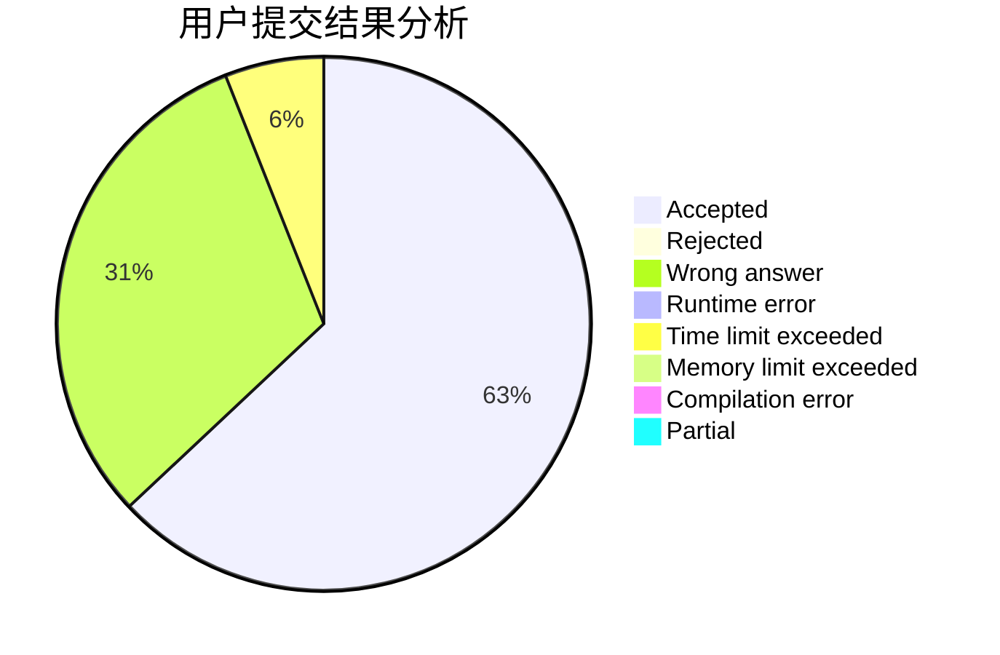
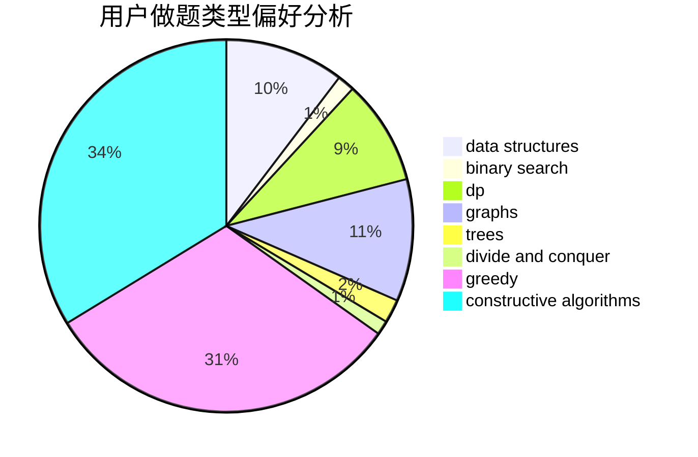
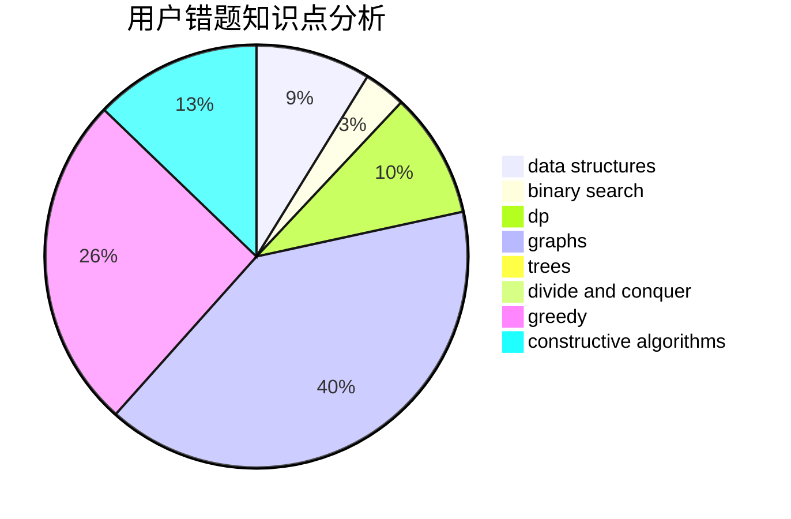

# YuMing_mov

<!-- tabs:start -->

#### **用户提交结果分析**

#### **用户做题类型偏好分析**

#### **用户错题知识点分析**

<!-- tabs:end -->
# 推荐题目
[1375A](https://codeforces.com/contest/1375/problem/A)		constructive algorithms,
                        math		  
[1361D](https://codeforces.com/contest/1361/problem/D)		greedy,
                        implementation,
                        math,
                        trees		  
[1208F](https://codeforces.com/contest/1208/problem/F)		bitmasks,
                        dfs and similar,
                        dp,
                        greedy		  
[815C](https://codeforces.com/contest/815/problem/C)		brute force,
                        dp,
                        trees		  
[1340B](https://codeforces.com/contest/1340/problem/B)		bitmasks,
                        dp,
                        graphs,
                        greedy		  
[1119D](https://codeforces.com/contest/1119/problem/D)		binary search,
                        sortings		  
[1265B](https://codeforces.com/contest/1265/problem/B)		data structures,
                        implementation,
                        math,
                        two pointers		  
[1055A](https://codeforces.com/contest/1055/problem/A)		graphs		  
[22E](https://codeforces.com/contest/22/problem/E)		dfs and similar,
                        graphs,
                        trees		  
[363B](https://codeforces.com/contest/363/problem/B)		brute force,
                        dp		  
