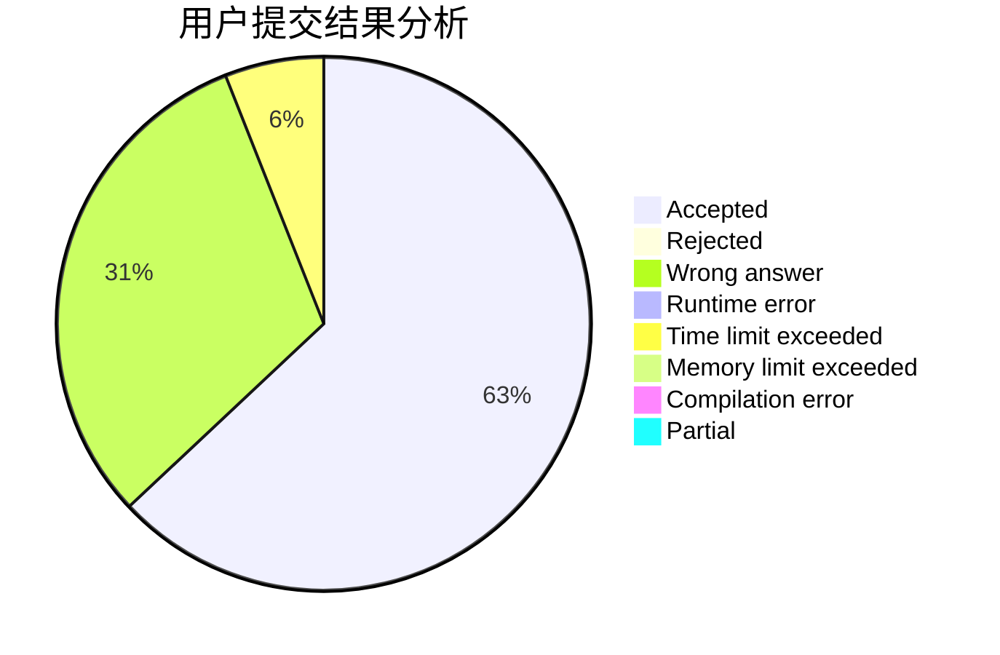
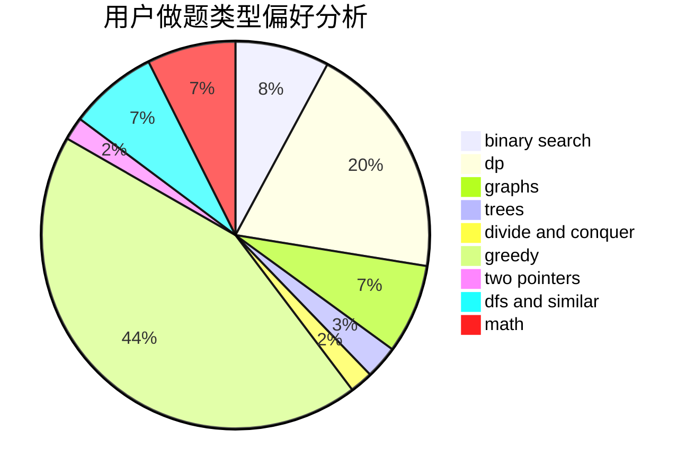

# YuMing_mov

<!-- tabs:start -->

#### **用户提交结果分析**

#### **用户做题类型偏好分析**

<!-- tabs:end -->
# 推荐题目
[1375A](https://codeforces.com/contest/1375/problem/A)
[1361D](https://codeforces.com/contest/1361/problem/D)
[1208F](https://codeforces.com/contest/1208/problem/F)
[815C](https://codeforces.com/contest/815/problem/C)
[1340B](https://codeforces.com/contest/1340/problem/B)
[1119D](https://codeforces.com/contest/1119/problem/D)
[1265B](https://codeforces.com/contest/1265/problem/B)
[1055A](https://codeforces.com/contest/1055/problem/A)
[22E](https://codeforces.com/contest/22/problem/E)
[363B](https://codeforces.com/contest/363/problem/B)
