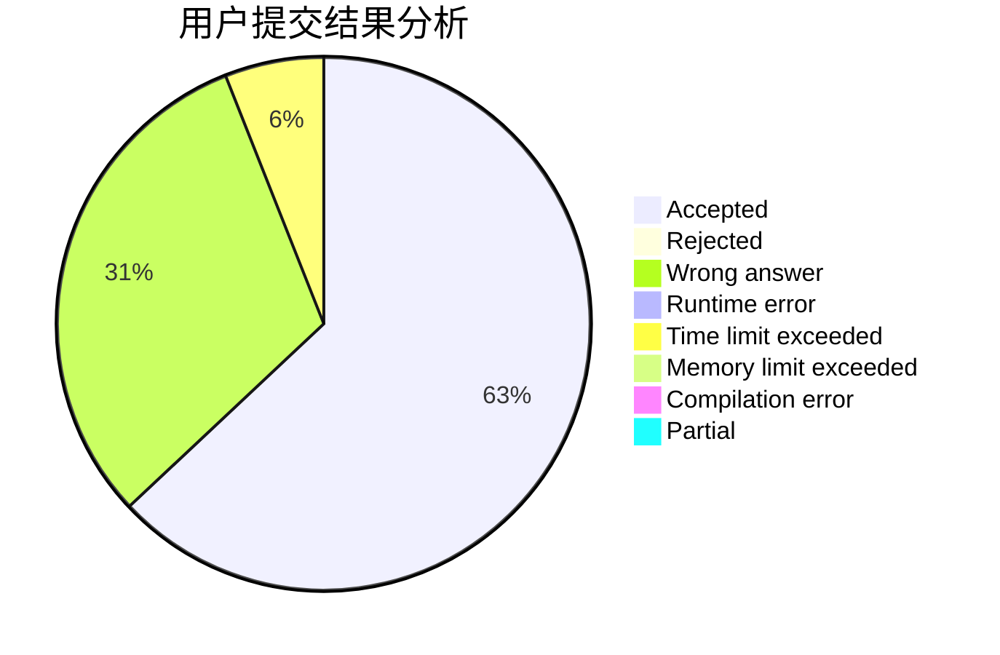
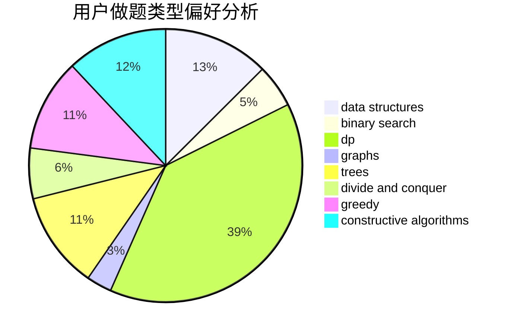
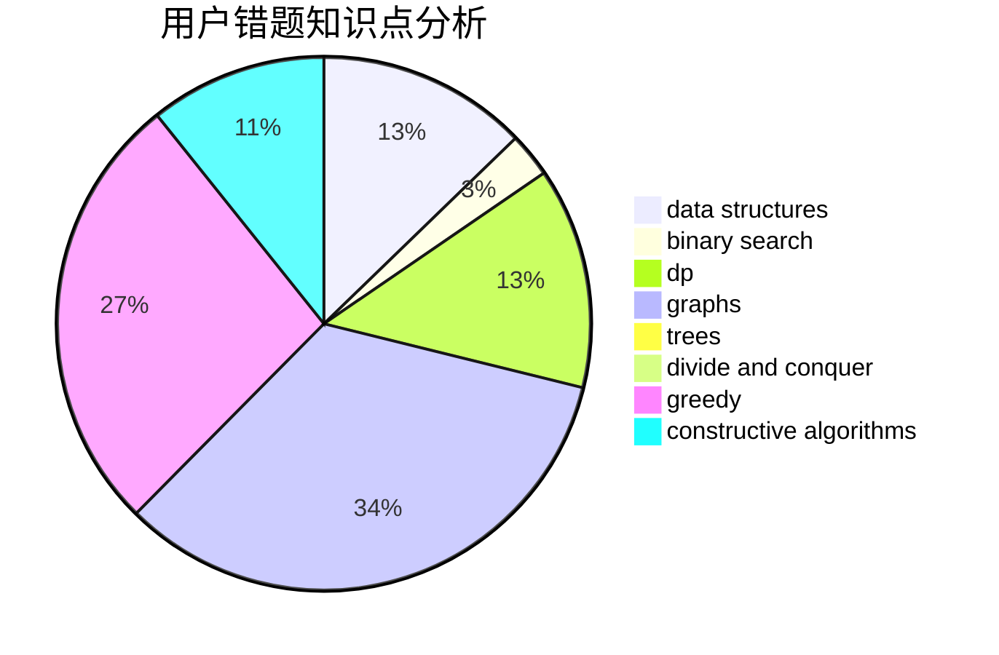

# YuMing_mov

<!-- tabs:start -->

#### **用户提交结果分析**

#### **用户做题类型偏好分析**

#### **用户错题知识点分析**

<!-- tabs:end -->
# 推荐题目
[1368B](https://codeforces.com/contest/1368/problem/B)		brute force,
                        constructive algorithms,
                        greedy,
                        math,
                        strings		  
[1354G](https://codeforces.com/contest/1354/problem/G)		binary search,
                        interactive,
                        probabilities		  
[1204A](https://codeforces.com/contest/1204/problem/A)		math		  
[800B](https://codeforces.com/contest/800/problem/B)		dsu,graphs,sortings,trees		  
[1333C](https://codeforces.com/contest/1333/problem/C)		binary search,
                        data structures,
                        implementation,
                        two pointers		  
[1117F](https://codeforces.com/contest/1117/problem/F)		bitmasks,
                        dp		  
[1257G](https://codeforces.com/contest/1257/problem/G)		divide and conquer,
                        fft,
                        greedy,
                        math,
                        number theory		  
[1054F](https://codeforces.com/contest/1054/problem/F)		flows,
                        graph matchings		  
[208C](https://codeforces.com/contest/208/problem/C)		dp,
                        graphs,
                        shortest paths		  
[335F](https://codeforces.com/contest/335/problem/F)		dp,
                        greedy		  
