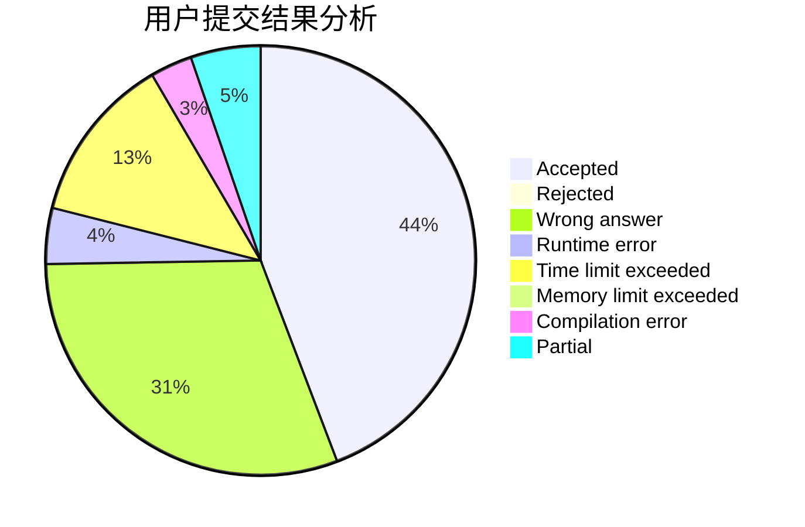
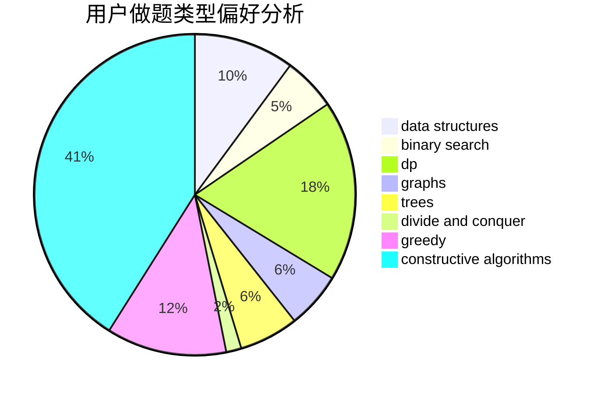
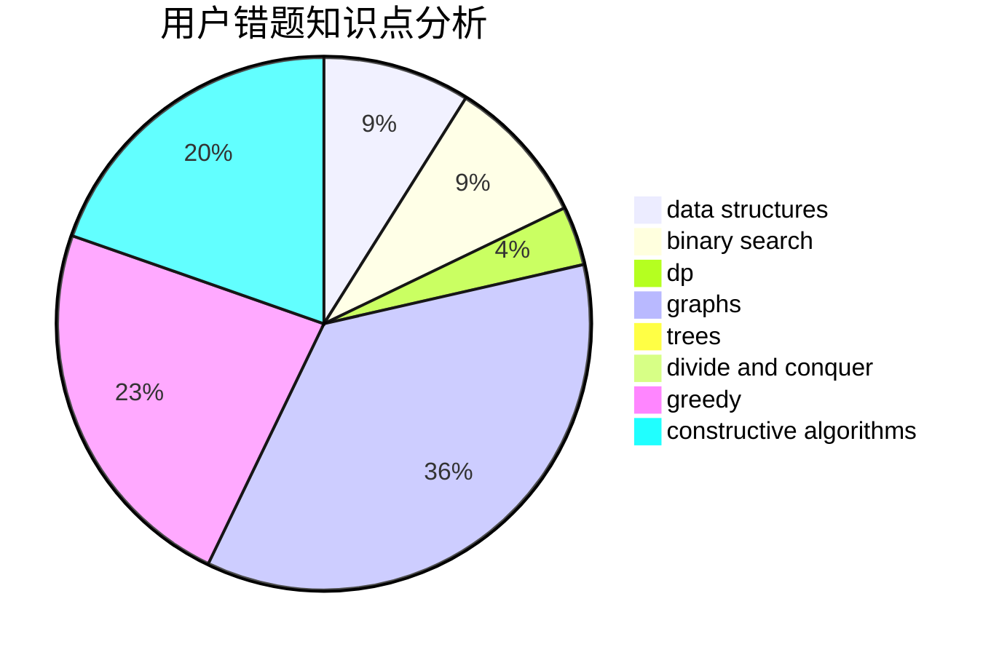

# YuekunWang

<!-- tabs:start -->

#### **用户提交结果分析**

#### **用户做题类型偏好分析**

#### **用户错题知识点分析**

<!-- tabs:end -->
# 推荐题目
[455C](https://codeforces.com/contest/455/problem/C)		dfs and similar,
                        dp,
                        dsu,
                        ternary search,
                        trees		  
[320A](https://codeforces.com/contest/320/problem/A)		brute force,
                        greedy		  
[1139E](https://codeforces.com/contest/1139/problem/E)		flows,
                        graph matchings,
                        graphs		  
[392B](https://codeforces.com/contest/392/problem/B)		dp		  
[1091H](https://codeforces.com/contest/1091/problem/H)		games		  
[1269A](https://codeforces.com/contest/1269/problem/A)		brute force,
                        math		  
[313D](https://codeforces.com/contest/313/problem/D)		dp		  
[1297D](https://codeforces.com/contest/1297/problem/D)		*special problem,
                        binary search,
                        greedy,
                        sortings		  
[1328C](https://codeforces.com/contest/1328/problem/C)		greedy,
                        implementation		  
[803F](https://codeforces.com/contest/803/problem/F)		bitmasks,
                        combinatorics,
                        number theory		  
