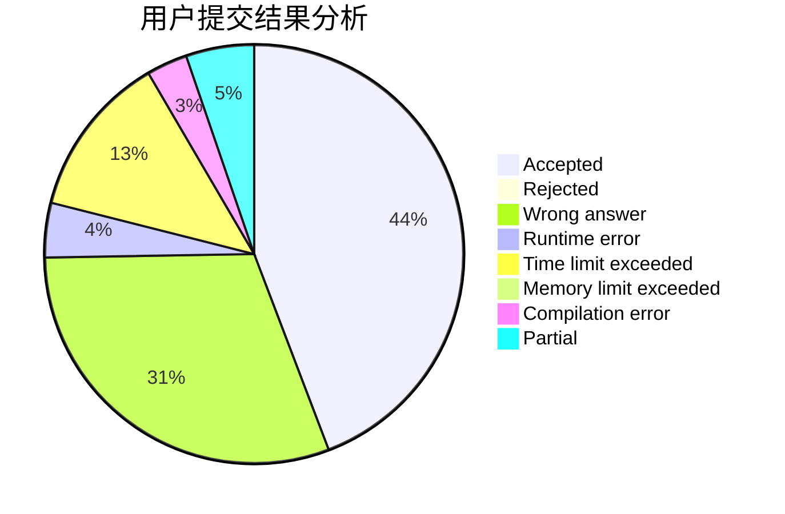
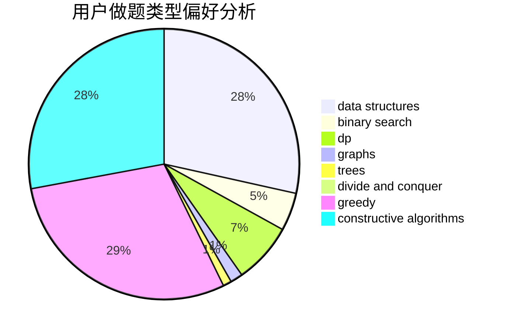
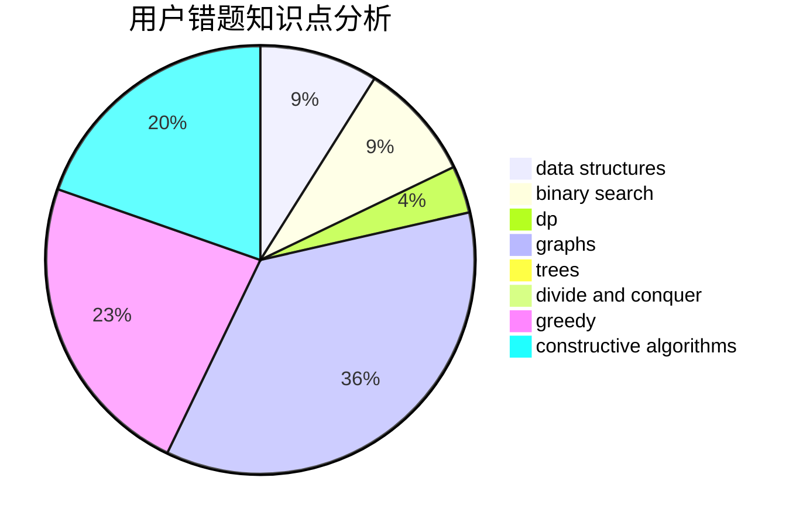

# YuekunWang

<!-- tabs:start -->

#### **用户提交结果分析**

#### **用户做题类型偏好分析**

#### **用户错题知识点分析**

<!-- tabs:end -->
# 推荐题目
[434D](https://codeforces.com/contest/434/problem/D)		flows		  
[301C](https://codeforces.com/contest/301/problem/C)		constructive algorithms		  
[1137D](https://codeforces.com/contest/1137/problem/D)		constructive algorithms,
                        interactive,
                        number theory		  
[364E](https://codeforces.com/contest/364/problem/E)		divide and conquer,
                        two pointers		  
[1091E](https://codeforces.com/contest/1091/problem/E)		binary search,
                        data structures,
                        graphs,
                        greedy,
                        implementation,
                        math,
                        sortings		  
[1263C](https://codeforces.com/contest/1263/problem/C)		binary search,
                        math,
                        meet-in-the-middle,
                        number theory		  
[296D](https://codeforces.com/contest/296/problem/D)		dsu,graphs,sortings,trees		  
[1291A](https://codeforces.com/contest/1291/problem/A)		greedy,
                        math,
                        strings		  
[1321D](https://codeforces.com/contest/1321/problem/D)		dsu,graphs,sortings,trees		  
[788B](https://codeforces.com/contest/788/problem/B)		combinatorics,
                        constructive algorithms,
                        dfs and similar,
                        dsu,
                        graphs		  
