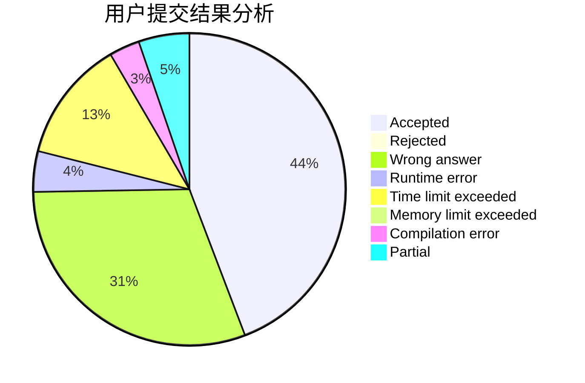
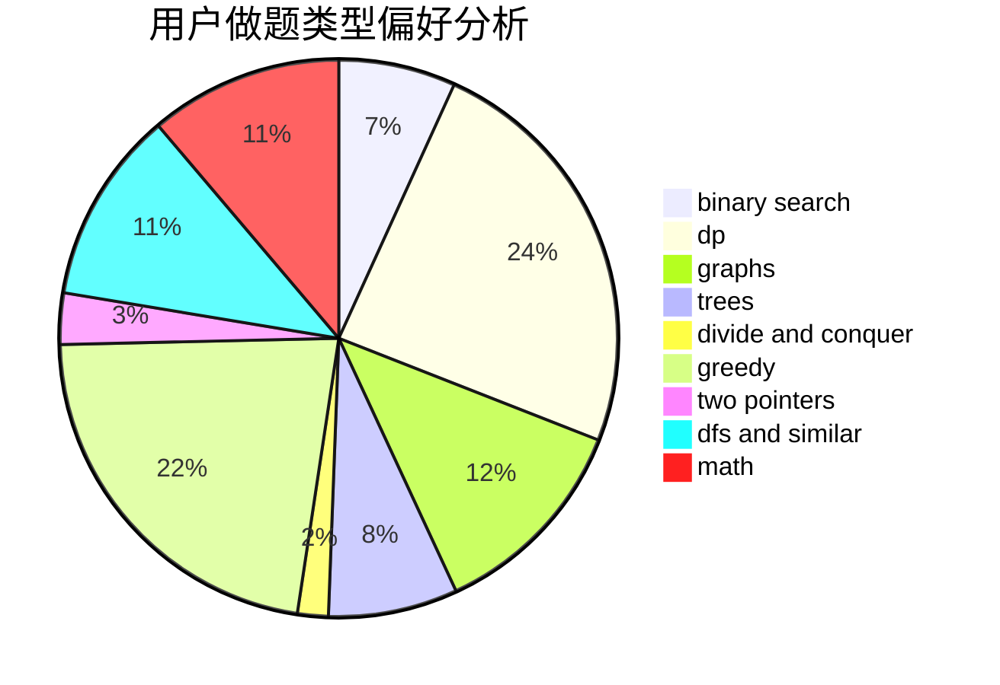

# YuekunWang

<!-- tabs:start -->

#### **用户提交结果分析**

#### **用户做题类型偏好分析**

<!-- tabs:end -->
# 推荐题目
[455C](https://codeforces.com/contest/455/problem/C)
[320A](https://codeforces.com/contest/320/problem/A)
[1139E](https://codeforces.com/contest/1139/problem/E)
[392B](https://codeforces.com/contest/392/problem/B)
[1091H](https://codeforces.com/contest/1091/problem/H)
[1269A](https://codeforces.com/contest/1269/problem/A)
[313D](https://codeforces.com/contest/313/problem/D)
[1297D](https://codeforces.com/contest/1297/problem/D)
[1328C](https://codeforces.com/contest/1328/problem/C)
[803F](https://codeforces.com/contest/803/problem/F)
