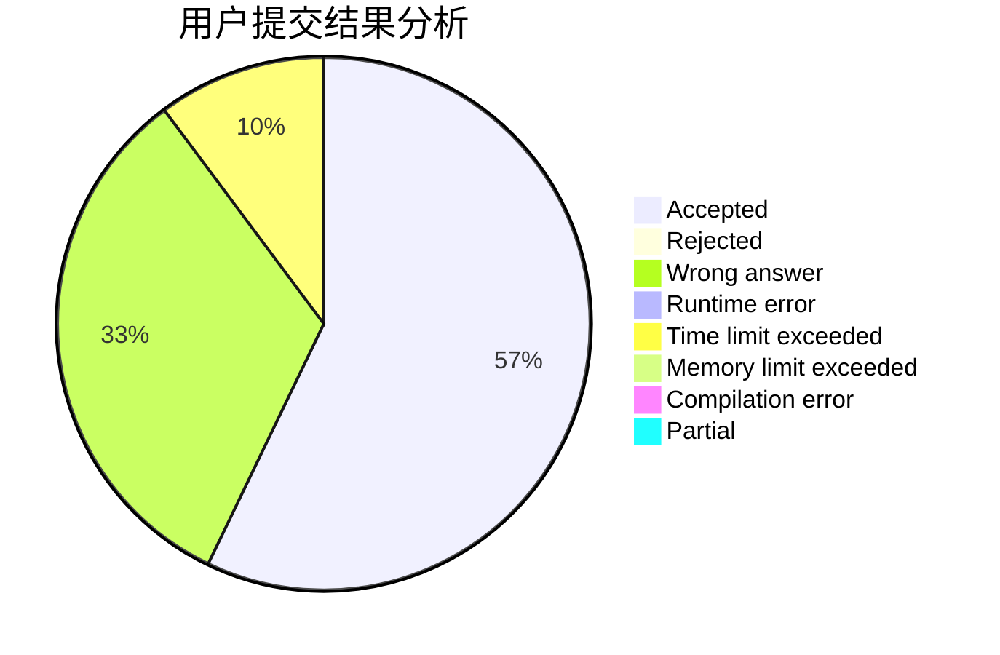
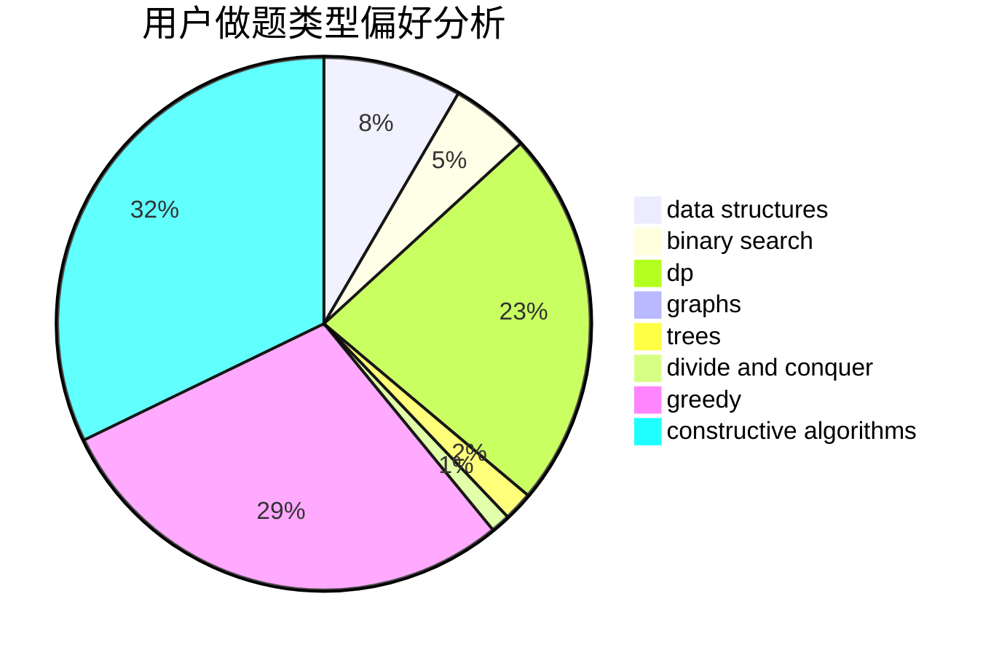
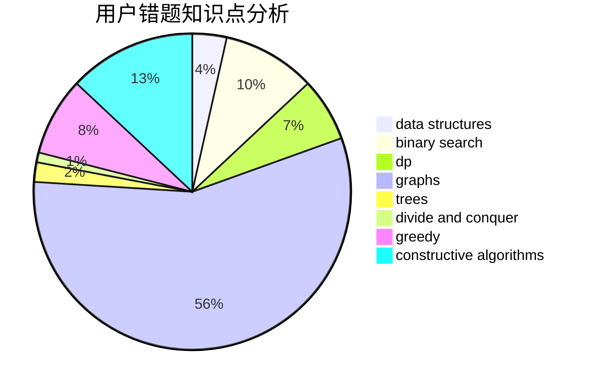

# Yuhixyz
<!-- tabs:start -->
#### **用户提交结果分析**

#### **用户做题类型偏好分析**

#### **用户错题知识点分析**

<!-- tabs:end -->
# 推荐题目
[Royal Questions](http://codeforces.com/problemset/problem/875/F)		dsu,
                        graphs,
                        greedy		  
[Cheap Travel](http://codeforces.com/problemset/problem/466/A)		implementation		  
[Dead Ends](http://codeforces.com/problemset/problem/53/E)		bitmasks,
                        dp		  
[Arrays](http://codeforces.com/problemset/problem/572/A)		sortings		  
[Strongly Connected City](http://codeforces.com/problemset/problem/475/B)		brute force,
                        dfs and similar,
                        graphs,
                        implementation		  
[Hard problem](http://codeforces.com/problemset/problem/706/C)		dp,
                        strings		  
[Cutting a Fence](http://codeforces.com/problemset/problem/212/D)		binary search,
                        data structures,
                        dsu		  
[Infinite Sequence](http://codeforces.com/problemset/problem/622/A)		implementation,
                        math		  
[Is it rated?](http://codeforces.com/problemset/problem/807/A)		implementation,
                        sortings		  
[Palindrome Dance](http://codeforces.com/problemset/problem/1040/A)		greedy		  
<!-- tabs:start -->
#### **data structures**
[Royal Questions](http://codeforces.com/problemset/problem/212/D)		binary search,
                        data structures,
                        dsu		  
[Cheap Travel](https://codeforces.com/contest/1298/problem/E)		binary search,
                        data structures,
                        implementation		  
[Dead Ends](http://codeforces.com/problemset/problem/436/F)		brute force,
                        data structures,
                        dp		  
[Arrays](http://codeforces.com/problemset/problem/666/E)		data structures,
                        string suffix structures		  
[Strongly Connected City](http://codeforces.com/problemset/problem/587/C)		data structures,
                        trees		  
[Hard problem](http://codeforces.com/problemset/problem/1492/C)		binary search,
                        data structures,
                        dp,
                        greedy,
                        two pointers		  
[Cutting a Fence](http://codeforces.com/problemset/problem/1490/G)		binary search,
                        data structures,
                        math		  
[Infinite Sequence](http://codeforces.com/problemset/problem/1479/D)		binary search,
                        bitmasks,
                        brute force,
                        data structures,
                        probabilities,
                        trees		  
[Is it rated?](http://codeforces.com/problemset/problem/1497/A)		brute force,
                        data structures,
                        greedy,
                        sortings		  
[Palindrome Dance](http://codeforces.com/problemset/problem/1491/C)		brute force,
                        data structures,
                        dp,
                        greedy,
                        implementation		  
#### **binary search**
[Royal Questions](http://codeforces.com/problemset/problem/212/D)		binary search,
                        data structures,
                        dsu		  
[Cheap Travel](https://codeforces.com/contest/1298/problem/E)		binary search,
                        data structures,
                        implementation		  
[Dead Ends](http://codeforces.com/problemset/problem/613/A)		binary search,
                        geometry,
                        ternary search		  
[Arrays](http://codeforces.com/problemset/problem/1148/B)		binary search,
                        brute force,
                        two pointers		  
[Strongly Connected City](http://codeforces.com/problemset/problem/1328/B)		binary search,
                        brute force,
                        combinatorics,
                        implementation,
                        math		  
[Hard problem](http://codeforces.com/problemset/problem/570/D)		binary search,
                        bitmasks,
                        constructive algorithms,
                        dfs and similar,
                        graphs,
                        trees		  
[Cutting a Fence](http://codeforces.com/problemset/problem/1492/C)		binary search,
                        data structures,
                        dp,
                        greedy,
                        two pointers		  
[Infinite Sequence](http://codeforces.com/problemset/problem/1463/D)		binary search,
                        constructive algorithms,
                        greedy,
                        two pointers		  
[Is it rated?](http://codeforces.com/problemset/problem/1490/G)		binary search,
                        data structures,
                        math		  
[Palindrome Dance](http://codeforces.com/problemset/problem/1479/D)		binary search,
                        bitmasks,
                        brute force,
                        data structures,
                        probabilities,
                        trees		  
#### **dp**
[Royal Questions](http://codeforces.com/problemset/problem/53/E)		bitmasks,
                        dp		  
[Cheap Travel](http://codeforces.com/problemset/problem/706/C)		dp,
                        strings		  
[Dead Ends](http://codeforces.com/problemset/problem/1322/F)		dp,
                        trees		  
[Arrays](http://codeforces.com/problemset/problem/436/F)		brute force,
                        data structures,
                        dp		  
[Strongly Connected City](https://codeforces.com/contest/1078/problem/C)		dp,
                        trees		  
[Hard problem](http://codeforces.com/problemset/problem/474/D)		dp		  
[Cutting a Fence](http://codeforces.com/problemset/problem/1256/E)		dp,
                        greedy,
                        sortings		  
[Infinite Sequence](http://codeforces.com/problemset/problem/977/F)		dp		  
[Is it rated?](http://codeforces.com/problemset/problem/401/D)		bitmasks,
                        brute force,
                        combinatorics,
                        dp,
                        number theory		  
[Palindrome Dance](http://codeforces.com/problemset/problem/1500/F)		dp		  
#### **graph**
[Royal Questions](http://codeforces.com/problemset/problem/875/F)		dsu,
                        graphs,
                        greedy		  
[Cheap Travel](http://codeforces.com/problemset/problem/475/B)		brute force,
                        dfs and similar,
                        graphs,
                        implementation		  
[Dead Ends](http://codeforces.com/problemset/problem/575/C)		bitmasks,
                        brute force,
                        graph matchings		  
[Arrays](http://codeforces.com/problemset/problem/570/D)		binary search,
                        bitmasks,
                        constructive algorithms,
                        dfs and similar,
                        graphs,
                        trees		  
[Strongly Connected City](http://codeforces.com/problemset/problem/700/B)		dfs and similar,
                        dp,
                        graphs,
                        trees		  
[Hard problem](http://codeforces.com/problemset/problem/1487/C)		brute force,
                        constructive algorithms,
                        dfs and similar,
                        graphs,
                        greedy,
                        implementation,
                        math		  
[Cutting a Fence](http://codeforces.com/problemset/problem/1437/C)		dp,
                        flows,
                        graph matchings,
                        greedy,
                        math,
                        sortings		  
[Infinite Sequence](http://codeforces.com/problemset/problem/1470/D)		constructive algorithms,
                        dfs and similar,
                        graph matchings,
                        graphs,
                        greedy		  
[Is it rated?](http://codeforces.com/problemset/problem/1476/C)		dp,
                        graphs,
                        greedy		  
[Palindrome Dance](http://codeforces.com/problemset/problem/1304/D)		constructive algorithms,
                        graphs,
                        greedy,
                        two pointers		  
#### **trees**
[Royal Questions](http://codeforces.com/problemset/problem/1322/F)		dp,
                        trees		  
[Cheap Travel](https://codeforces.com/contest/1078/problem/C)		dp,
                        trees		  
[Dead Ends](http://codeforces.com/problemset/problem/570/D)		binary search,
                        bitmasks,
                        constructive algorithms,
                        dfs and similar,
                        graphs,
                        trees		  
[Arrays](http://codeforces.com/problemset/problem/587/C)		data structures,
                        trees		  
[Strongly Connected City](http://codeforces.com/problemset/problem/1404/B)		dfs and similar,
                        dp,
                        games,
                        trees		  
[Hard problem](http://codeforces.com/problemset/problem/700/B)		dfs and similar,
                        dp,
                        graphs,
                        trees		  
[Cutting a Fence](https://codeforces.com/contest/1337/problem/C)		dfs and similar,
                        dp,
                        greedy,
                        sortings,
                        trees		  
[Infinite Sequence](http://codeforces.com/problemset/problem/1479/D)		binary search,
                        bitmasks,
                        brute force,
                        data structures,
                        probabilities,
                        trees		  
[Is it rated?](http://codeforces.com/problemset/problem/1511/C)		brute force,
                        data structures,
                        implementation,
                        trees		  
[Palindrome Dance](http://codeforces.com/problemset/problem/1499/F)		combinatorics,
                        dfs and similar,
                        dp,
                        trees		  
#### **divide and conquer**
[Royal Questions](http://codeforces.com/problemset/problem/1461/D)		binary search,
                        brute force,
                        data structures,
                        divide and conquer,
                        implementation,
                        sortings		  
[Cheap Travel](http://codeforces.com/problemset/problem/1466/G)		combinatorics,
                        divide and conquer,
                        hashing,
                        math,
                        string suffix structures,
                        strings		  
[Dead Ends](http://codeforces.com/problemset/problem/1490/D)		dfs and similar,
                        divide and conquer,
                        implementation		  
[Arrays](https://codeforces.com/contest/1483/problem/C)		data structures,
                        divide and conquer,
                        dp		  
[Strongly Connected City](http://codeforces.com/problemset/problem/1491/E)		brute force,
                        dfs and similar,
                        divide and conquer,
                        number theory,
                        trees		  
[Hard problem](http://codeforces.com/problemset/problem/1303/G)		data structures,
                        divide and conquer,
                        geometry,
                        trees		  
[Cutting a Fence](http://codeforces.com/problemset/problem/1494/D)		constructive algorithms,
                        data structures,
                        dfs and similar,
                        divide and conquer,
                        dsu,
                        greedy,
                        sortings,
                        trees		  
[Infinite Sequence](http://codeforces.com/problemset/problem/1482/E)		data structures,
                        divide and conquer,
                        dp		  
[Is it rated?](http://codeforces.com/problemset/problem/566/C)		dfs and similar,
                        divide and conquer,
                        trees		  
[Palindrome Dance](http://codeforces.com/problemset/problem/1428/F)		binary search,
                        data structures,
                        divide and conquer,
                        dp,
                        two pointers		  
#### **greedy**
[Royal Questions](http://codeforces.com/problemset/problem/875/F)		dsu,
                        graphs,
                        greedy		  
[Cheap Travel](http://codeforces.com/problemset/problem/1040/A)		greedy		  
[Dead Ends](http://codeforces.com/problemset/problem/1455/E)		brute force,
                        constructive algorithms,
                        flows,
                        geometry,
                        greedy,
                        implementation,
                        math,
                        ternary search		  
[Arrays](https://codeforces.com/contest/1457/problem/E)		constructive algorithms,
                        greedy,
                        math		  
[Strongly Connected City](http://codeforces.com/problemset/problem/1256/E)		dp,
                        greedy,
                        sortings		  
[Hard problem](http://codeforces.com/problemset/problem/339/E)		constructive algorithms,
                        dfs and similar,
                        greedy		  
[Cutting a Fence](http://codeforces.com/problemset/problem/1151/D)		greedy,
                        math,
                        sortings		  
[Infinite Sequence](https://codeforces.com/contest/1337/problem/C)		dfs and similar,
                        dp,
                        greedy,
                        sortings,
                        trees		  
[Is it rated?](http://codeforces.com/problemset/problem/1492/C)		binary search,
                        data structures,
                        dp,
                        greedy,
                        two pointers		  
[Palindrome Dance](https://codeforces.com/contest/1496/problem/C)		geometry,
                        greedy,
                        math,
                        sortings		  
#### **constructive algorithms**
[Royal Questions](http://codeforces.com/problemset/problem/1455/E)		brute force,
                        constructive algorithms,
                        flows,
                        geometry,
                        greedy,
                        implementation,
                        math,
                        ternary search		  
[Cheap Travel](http://codeforces.com/problemset/problem/254/A)		constructive algorithms,
                        sortings		  
[Dead Ends](https://codeforces.com/contest/1457/problem/E)		constructive algorithms,
                        greedy,
                        math		  
[Arrays](http://codeforces.com/problemset/problem/725/C)		brute force,
                        constructive algorithms,
                        implementation,
                        strings		  
[Strongly Connected City](http://codeforces.com/problemset/problem/570/D)		binary search,
                        bitmasks,
                        constructive algorithms,
                        dfs and similar,
                        graphs,
                        trees		  
[Hard problem](http://codeforces.com/problemset/problem/339/E)		constructive algorithms,
                        dfs and similar,
                        greedy		  
[Cutting a Fence](http://codeforces.com/problemset/problem/949/B)		constructive algorithms,
                        math		  
[Infinite Sequence](http://codeforces.com/problemset/problem/1454/A)		constructive algorithms,
                        probabilities		  
[Is it rated?](http://codeforces.com/problemset/problem/1510/J)		constructive algorithms,
                        math		  
[Palindrome Dance](http://codeforces.com/problemset/problem/1493/A)		constructive algorithms,
                        greedy		  
#### **sortings**
[Royal Questions](http://codeforces.com/problemset/problem/572/A)		sortings		  
[Cheap Travel](http://codeforces.com/problemset/problem/807/A)		implementation,
                        sortings		  
[Dead Ends](http://codeforces.com/problemset/problem/254/A)		constructive algorithms,
                        sortings		  
[Arrays](http://codeforces.com/problemset/problem/593/B)		geometry,
                        sortings		  
[Strongly Connected City](http://codeforces.com/problemset/problem/1256/E)		dp,
                        greedy,
                        sortings		  
[Hard problem](http://codeforces.com/problemset/problem/1151/D)		greedy,
                        math,
                        sortings		  
[Cutting a Fence](https://codeforces.com/contest/1337/problem/C)		dfs and similar,
                        dp,
                        greedy,
                        sortings,
                        trees		  
[Infinite Sequence](https://codeforces.com/contest/1496/problem/C)		geometry,
                        greedy,
                        math,
                        sortings		  
[Is it rated?](http://codeforces.com/problemset/problem/1495/A)		geometry,
                        greedy,
                        math,
                        sortings		  
[Palindrome Dance](http://codeforces.com/problemset/problem/1497/A)		brute force,
                        data structures,
                        greedy,
                        sortings		  
<!-- tabs:end -->
