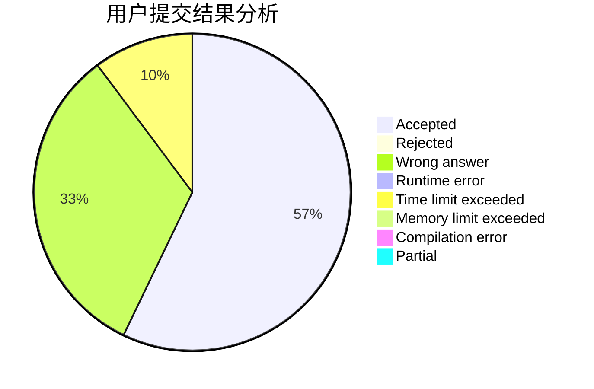
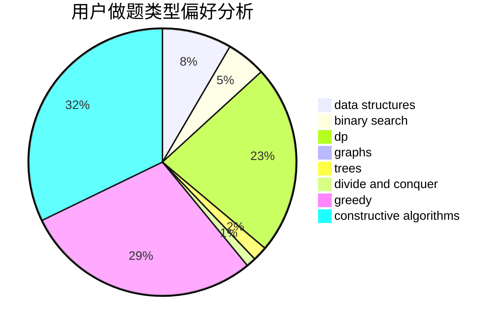
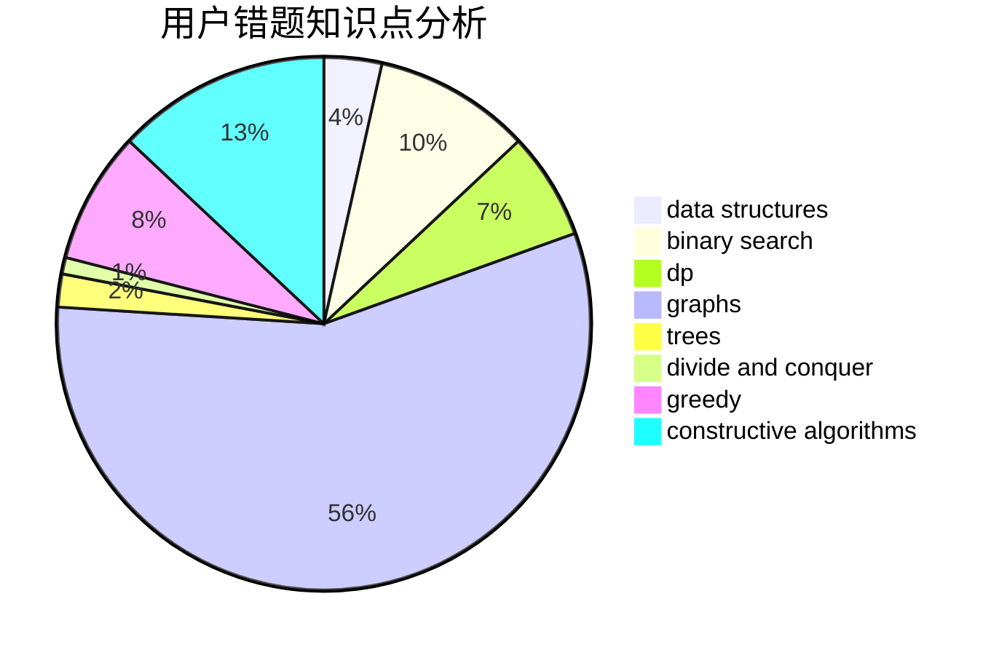

# Yuhixyz

<!-- tabs:start -->

#### **用户提交结果分析**

#### **用户做题类型偏好分析**

#### **用户错题知识点分析**

<!-- tabs:end -->
# 推荐题目
[572A](https://codeforces.com/contest/572/problem/A)		sortings		  
[875F](https://codeforces.com/contest/875/problem/F)		dsu,
                        graphs,
                        greedy		  
[53E](https://codeforces.com/contest/53/problem/E)		bitmasks,
                        dp		  
[466A](https://codeforces.com/contest/466/problem/A)		implementation		  
[475B](https://codeforces.com/contest/475/problem/B)		brute force,
                        dfs and similar,
                        graphs,
                        implementation		  
[1457E](https://codeforces.com/contest/1457/problem/E)		dsu,graphs,sortings,trees		  
[570D](https://codeforces.com/contest/570/problem/D)		binary search,
                        bitmasks,
                        constructive algorithms,
                        dfs and similar,
                        graphs,
                        trees		  
[666E](https://codeforces.com/contest/666/problem/E)		data structures,
                        string suffix structures		  
[575C](https://codeforces.com/contest/575/problem/C)		bitmasks,
                        brute force,
                        graph matchings		  
[436F](https://codeforces.com/contest/436/problem/F)		brute force,
                        data structures,
                        dp		  
