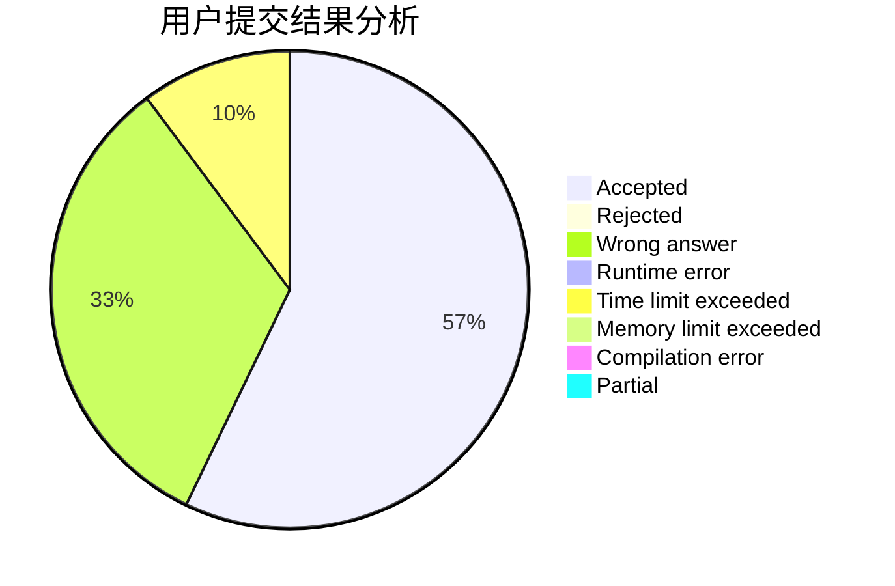
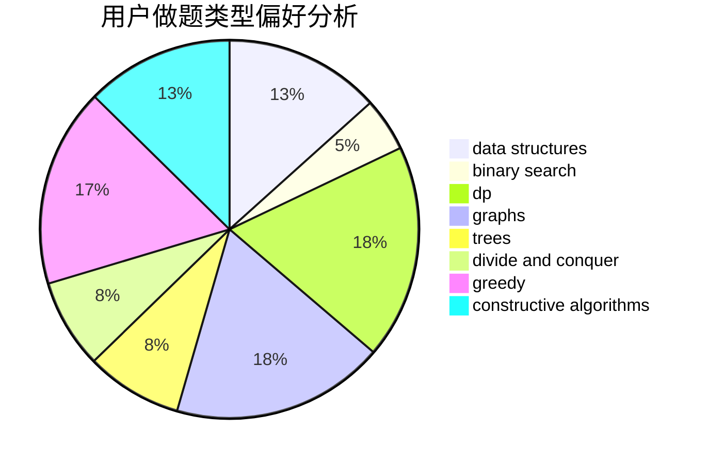
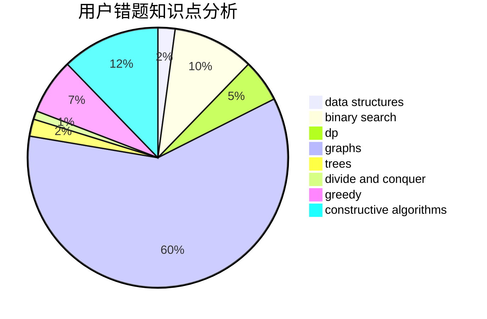

# Yuhixyz

<!-- tabs:start -->

#### **用户提交结果分析**

#### **用户做题类型偏好分析**

#### **用户错题知识点分析**

<!-- tabs:end -->
# 推荐题目
[592C](https://codeforces.com/contest/592/problem/C)		math		  
[896A](https://codeforces.com/contest/896/problem/A)		binary search,
                        dfs and similar		  
[560E](https://codeforces.com/contest/560/problem/E)		dsu,graphs,sortings,trees		  
[485A](https://codeforces.com/contest/485/problem/A)		implementation,
                        math,
                        matrices		  
[494B](https://codeforces.com/contest/494/problem/B)		dp,
                        strings		  
[1466H](https://codeforces.com/contest/1466/problem/H)		combinatorics,
                        dp,
                        graphs,
                        greedy,
                        math		  
[591A](https://codeforces.com/contest/591/problem/A)		implementation,
                        math		  
[688D](https://codeforces.com/contest/688/problem/D)		dsu,graphs,sortings,trees		  
[596D](https://codeforces.com/contest/596/problem/D)		dp,
                        math,
                        probabilities,
                        sortings		  
[459B](https://codeforces.com/contest/459/problem/B)		combinatorics,
                        implementation,
                        sortings		  
