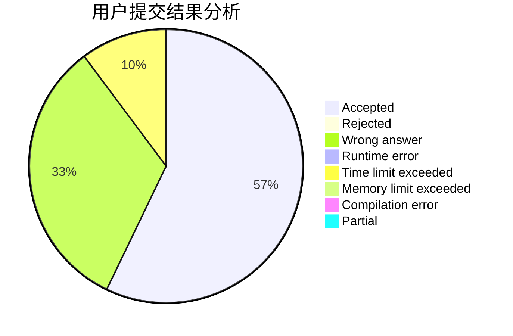
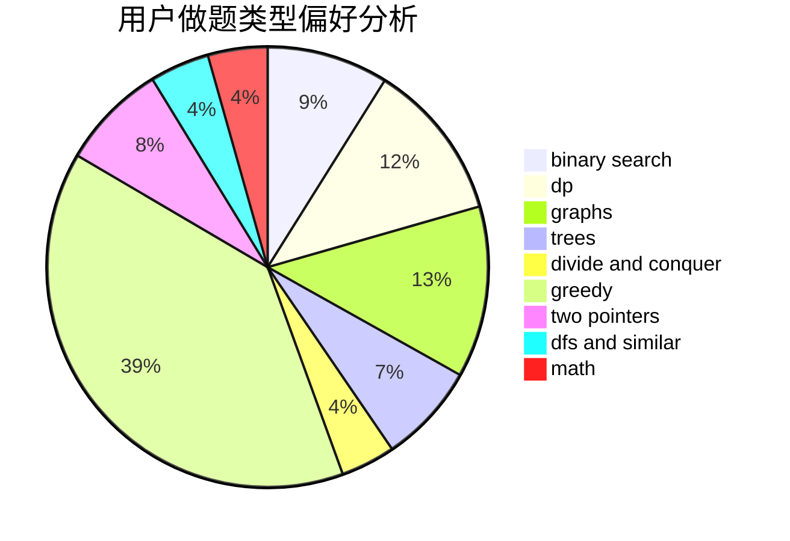

# Yuhixyz

<!-- tabs:start -->

#### **用户提交结果分析**

#### **用户做题类型偏好分析**

<!-- tabs:end -->
# 推荐题目
[592C](https://codeforces.com/contest/592/problem/C)
[896A](https://codeforces.com/contest/896/problem/A)
[560E](https://codeforces.com/contest/560/problem/E)
[485A](https://codeforces.com/contest/485/problem/A)
[494B](https://codeforces.com/contest/494/problem/B)
[1466H](https://codeforces.com/contest/1466/problem/H)
[591A](https://codeforces.com/contest/591/problem/A)
[688D](https://codeforces.com/contest/688/problem/D)
[596D](https://codeforces.com/contest/596/problem/D)
[459B](https://codeforces.com/contest/459/problem/B)
