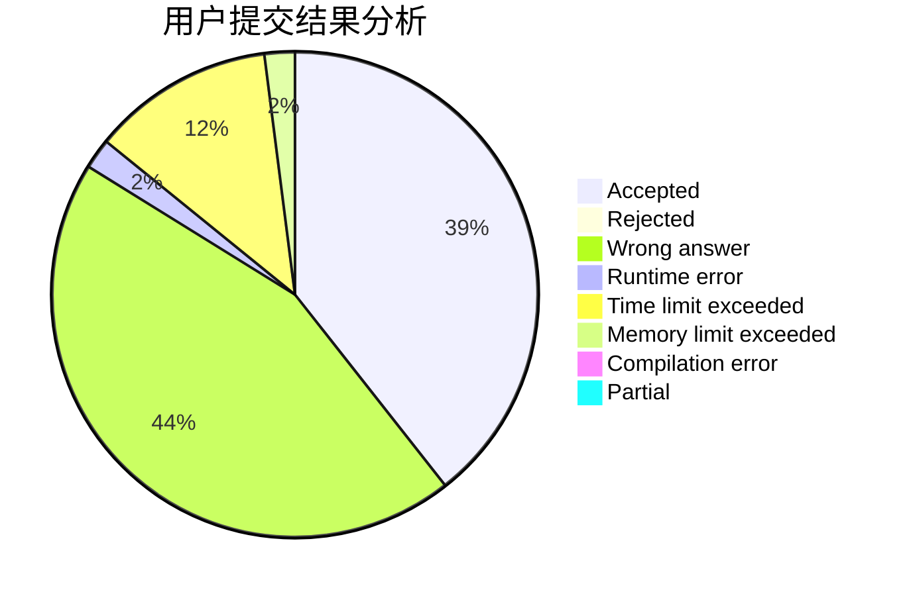
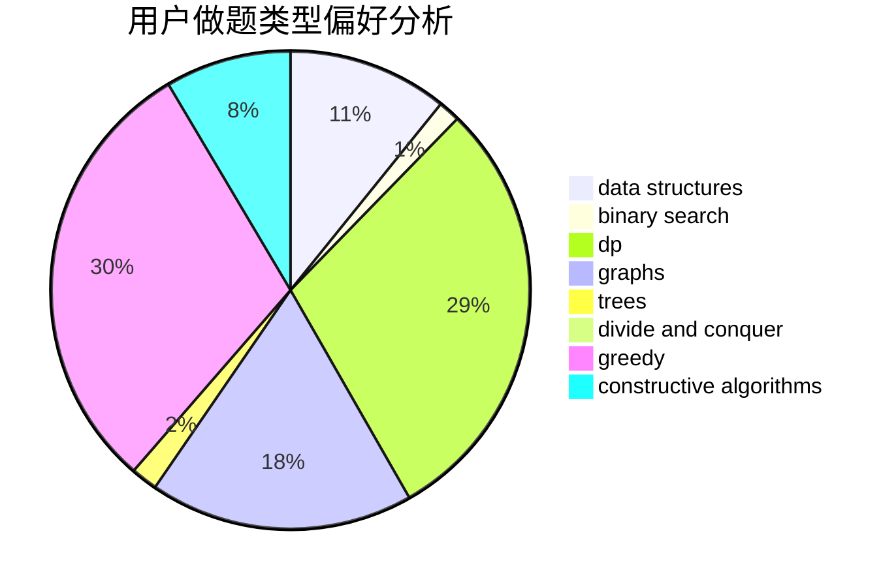

# Yukikaze_

<!-- tabs:start -->

#### **用户提交结果分析**

#### **用户做题类型偏好分析**

#### **用户错题知识点分析**

<!-- tabs:end -->
# 推荐题目
[1167D](https://codeforces.com/contest/1167/problem/D)		constructive algorithms,
                        greedy		  
[241E](https://codeforces.com/contest/241/problem/E)		graphs,
                        shortest paths		  
[81E](https://codeforces.com/contest/81/problem/E)		dfs and similar,
                        dp,
                        dsu,
                        graphs,
                        implementation,
                        trees		  
[1073F](https://codeforces.com/contest/1073/problem/F)		dfs and similar,
                        dp,
                        greedy,
                        trees		  
[1434D](https://codeforces.com/contest/1434/problem/D)		dsu,graphs,sortings,trees		  
[884C](https://codeforces.com/contest/884/problem/C)		dfs and similar,
                        greedy,
                        math		  
[1240C](https://codeforces.com/contest/1240/problem/C)		dsu,graphs,sortings,trees		  
[1036C](https://codeforces.com/contest/1036/problem/C)		combinatorics,
                        dp		  
[841C](https://codeforces.com/contest/841/problem/C)		dsu,graphs,sortings,trees		  
[35C](https://codeforces.com/contest/35/problem/C)		brute force,
                        dfs and similar,
                        shortest paths		  
