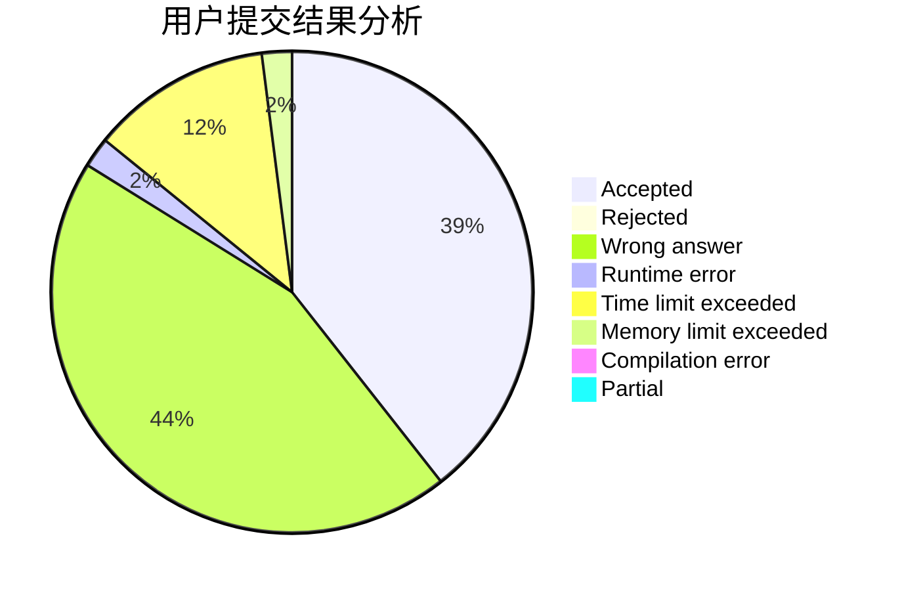
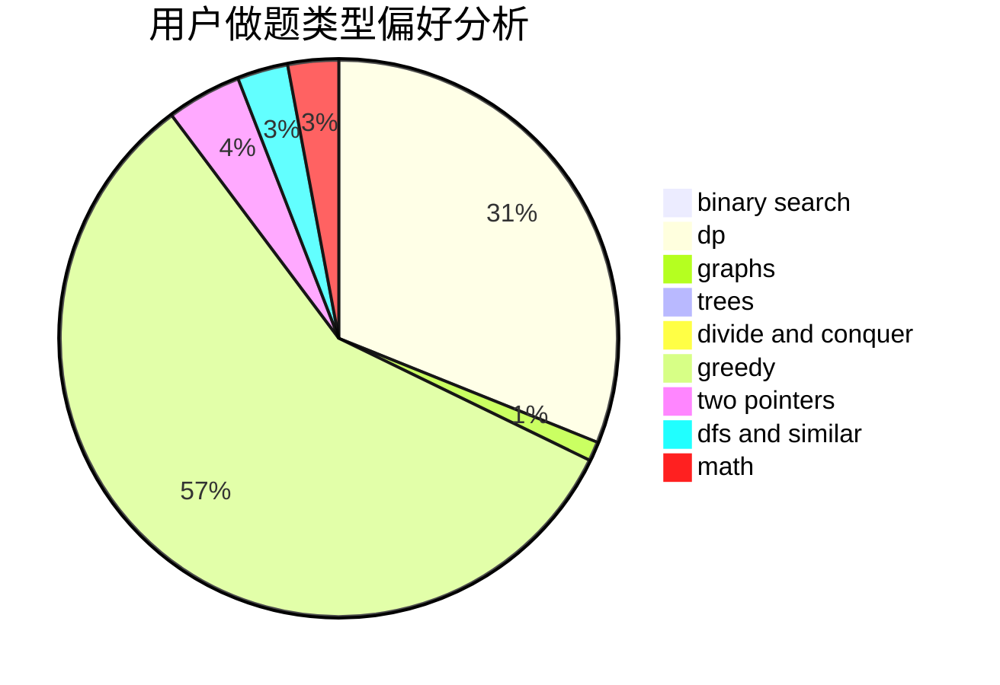

# Yukikaze_

<!-- tabs:start -->

#### **用户提交结果分析**

#### **用户做题类型偏好分析**

<!-- tabs:end -->
# 推荐题目
[1172A](https://codeforces.com/contest/1172/problem/A)
[263C](https://codeforces.com/contest/263/problem/C)
[83B](https://codeforces.com/contest/83/problem/B)
[1074B](https://codeforces.com/contest/1074/problem/B)
[1444D](https://codeforces.com/contest/1444/problem/D)
[902D](https://codeforces.com/contest/902/problem/D)
[1245F](https://codeforces.com/contest/1245/problem/F)
[1036F](https://codeforces.com/contest/1036/problem/F)
[860C](https://codeforces.com/contest/860/problem/C)
[388A](https://codeforces.com/contest/388/problem/A)
