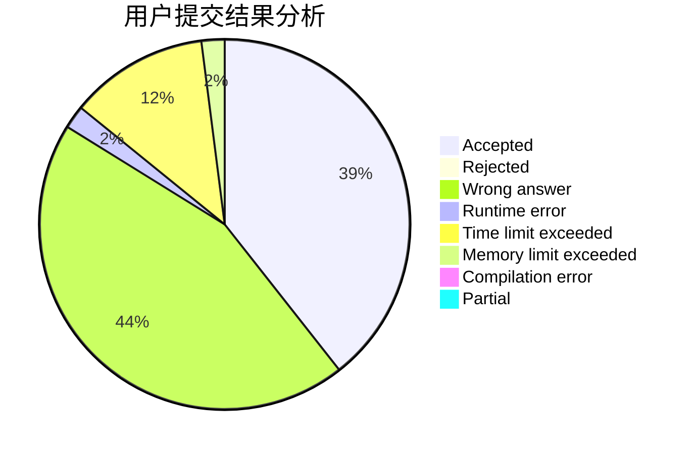
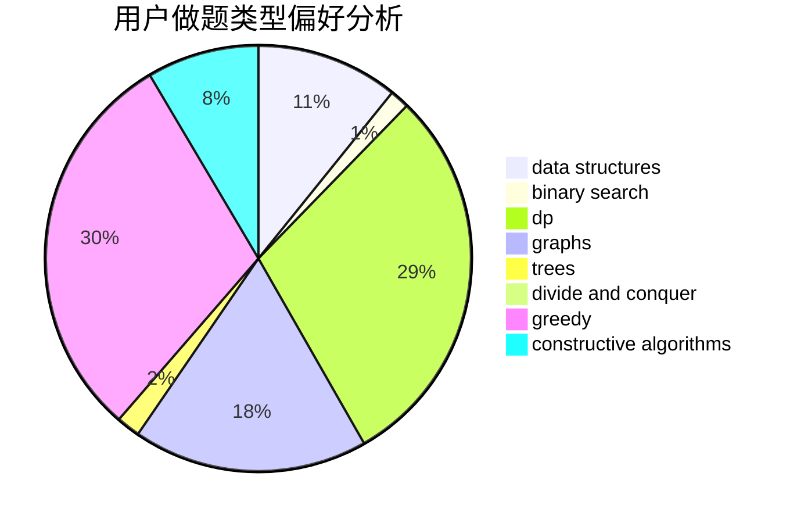

# Yukikaze_
<!-- tabs:start -->
#### **用户提交结果分析**

#### **用户做题类型偏好分析**

#### **用户错题知识点分析**

<!-- tabs:end -->
# 推荐题目
[Flights](http://codeforces.com/problemset/problem/241/E)		graphs,
                        shortest paths		  
[Lightsabers (hard)](http://codeforces.com/problemset/problem/958/F3)		fft		  
[Greedy Subsequences](http://codeforces.com/problemset/problem/1132/G)		data structures,
                        dp,
                        trees		  
[Roads and Ramen](https://codeforces.com/contest/1434/problem/D)		data structures,
                        trees		  
[Fire Again](http://codeforces.com/problemset/problem/35/C)		brute force,
                        dfs and similar,
                        shortest paths		  
[Bicolored RBS](http://codeforces.com/problemset/problem/1167/D)		constructive algorithms,
                        greedy		  
[Painting The Wall](http://codeforces.com/problemset/problem/398/B)		dp,
                        probabilities		  
[Beautiful League](http://codeforces.com/problemset/problem/1264/E)		constructive algorithms,
                        flows,
                        graph matchings		  
[Splits](http://codeforces.com/problemset/problem/964/A)		math		  
[Choosing Two Paths](http://codeforces.com/problemset/problem/1073/F)		dfs and similar,
                        dp,
                        greedy,
                        trees		  
<!-- tabs:start -->
#### **data structures**
[Flights](http://codeforces.com/problemset/problem/1132/G)		data structures,
                        dp,
                        trees		  
[Lightsabers (hard)](https://codeforces.com/contest/1434/problem/D)		data structures,
                        trees		  
[Greedy Subsequences](http://codeforces.com/problemset/problem/786/E)		data structures,
                        flows,
                        graphs,
                        trees		  
[Roads and Ramen](https://codeforces.com/contest/947/problem/B)		binary search,
                        data structures		  
[Fire Again](http://codeforces.com/problemset/problem/1373/G)		data structures,
                        divide and conquer,
                        greedy		  
[Bicolored RBS](https://codeforces.com/contest/1434/problem/B)		data structures,
                        greedy,
                        implementation		  
[Painting The Wall](http://codeforces.com/problemset/problem/1398/C)		data structures,
                        dp,
                        math		  
[Beautiful League](http://codeforces.com/problemset/problem/1492/C)		binary search,
                        data structures,
                        dp,
                        greedy,
                        two pointers		  
[Splits](http://codeforces.com/problemset/problem/1490/G)		binary search,
                        data structures,
                        math		  
[Choosing Two Paths](http://codeforces.com/problemset/problem/1479/D)		binary search,
                        bitmasks,
                        brute force,
                        data structures,
                        probabilities,
                        trees		  
#### **binary search**
[Flights](https://codeforces.com/contest/947/problem/B)		binary search,
                        data structures		  
[Lightsabers (hard)](http://codeforces.com/problemset/problem/1492/C)		binary search,
                        data structures,
                        dp,
                        greedy,
                        two pointers		  
[Greedy Subsequences](http://codeforces.com/problemset/problem/1463/D)		binary search,
                        constructive algorithms,
                        greedy,
                        two pointers		  
[Roads and Ramen](http://codeforces.com/problemset/problem/1490/G)		binary search,
                        data structures,
                        math		  
[Fire Again](http://codeforces.com/problemset/problem/1479/D)		binary search,
                        bitmasks,
                        brute force,
                        data structures,
                        probabilities,
                        trees		  
[Bicolored RBS](http://codeforces.com/problemset/problem/1436/E)		binary search,
                        data structures,
                        two pointers		  
[Painting The Wall](http://codeforces.com/problemset/problem/1461/D)		binary search,
                        brute force,
                        data structures,
                        divide and conquer,
                        implementation,
                        sortings		  
[Beautiful League](http://codeforces.com/problemset/problem/1493/C)		binary search,
                        brute force,
                        constructive algorithms,
                        greedy,
                        strings		  
[Splits](http://codeforces.com/problemset/problem/1487/D)		binary search,
                        brute force,
                        math,
                        number theory		  
[Choosing Two Paths](http://codeforces.com/problemset/problem/1486/B)		binary search,
                        geometry,
                        shortest paths,
                        sortings		  
#### **dp**
[Flights](http://codeforces.com/problemset/problem/1132/G)		data structures,
                        dp,
                        trees		  
[Lightsabers (hard)](http://codeforces.com/problemset/problem/398/B)		dp,
                        probabilities		  
[Greedy Subsequences](http://codeforces.com/problemset/problem/1073/F)		dfs and similar,
                        dp,
                        greedy,
                        trees		  
[Roads and Ramen](https://codeforces.com/contest/1240/problem/C)		brute force,
                        constructive algorithms,
                        dp,
                        graphs,
                        implementation,
                        trees		  
[Fire Again](http://codeforces.com/problemset/problem/1036/C)		combinatorics,
                        dp		  
[Bicolored RBS](http://codeforces.com/problemset/problem/81/E)		dfs and similar,
                        dp,
                        dsu,
                        graphs,
                        implementation,
                        trees		  
[Painting The Wall](http://codeforces.com/problemset/problem/1237/E)		dp,
                        math		  
[Beautiful League](http://codeforces.com/problemset/problem/1398/C)		data structures,
                        dp,
                        math		  
[Splits](http://codeforces.com/problemset/problem/1492/C)		binary search,
                        data structures,
                        dp,
                        greedy,
                        two pointers		  
[Choosing Two Paths](https://codeforces.com/contest/1457/problem/C)		brute force,
                        dp,
                        implementation		  
#### **graph**
[Flights](http://codeforces.com/problemset/problem/241/E)		graphs,
                        shortest paths		  
[Lightsabers (hard)](http://codeforces.com/problemset/problem/1264/E)		constructive algorithms,
                        flows,
                        graph matchings		  
[Greedy Subsequences](https://codeforces.com/contest/1240/problem/C)		brute force,
                        constructive algorithms,
                        dp,
                        graphs,
                        implementation,
                        trees		  
[Roads and Ramen](http://codeforces.com/problemset/problem/786/E)		data structures,
                        flows,
                        graphs,
                        trees		  
[Fire Again](http://codeforces.com/problemset/problem/1392/I)		fft,
                        graphs,
                        math		  
[Bicolored RBS](http://codeforces.com/problemset/problem/81/E)		dfs and similar,
                        dp,
                        dsu,
                        graphs,
                        implementation,
                        trees		  
[Painting The Wall](http://codeforces.com/problemset/problem/437/C)		graphs,
                        greedy,
                        sortings		  
[Beautiful League](http://codeforces.com/problemset/problem/1487/C)		brute force,
                        constructive algorithms,
                        dfs and similar,
                        graphs,
                        greedy,
                        implementation,
                        math		  
[Splits](http://codeforces.com/problemset/problem/1437/C)		dp,
                        flows,
                        graph matchings,
                        greedy,
                        math,
                        sortings		  
[Choosing Two Paths](http://codeforces.com/problemset/problem/1470/D)		constructive algorithms,
                        dfs and similar,
                        graph matchings,
                        graphs,
                        greedy		  
#### **trees**
[Flights](http://codeforces.com/problemset/problem/1132/G)		data structures,
                        dp,
                        trees		  
[Lightsabers (hard)](https://codeforces.com/contest/1434/problem/D)		data structures,
                        trees		  
[Greedy Subsequences](http://codeforces.com/problemset/problem/1073/F)		dfs and similar,
                        dp,
                        greedy,
                        trees		  
[Roads and Ramen](https://codeforces.com/contest/1240/problem/C)		brute force,
                        constructive algorithms,
                        dp,
                        graphs,
                        implementation,
                        trees		  
[Fire Again](http://codeforces.com/problemset/problem/786/E)		data structures,
                        flows,
                        graphs,
                        trees		  
[Bicolored RBS](http://codeforces.com/problemset/problem/81/E)		dfs and similar,
                        dp,
                        dsu,
                        graphs,
                        implementation,
                        trees		  
[Painting The Wall](http://codeforces.com/problemset/problem/1479/D)		binary search,
                        bitmasks,
                        brute force,
                        data structures,
                        probabilities,
                        trees		  
[Beautiful League](http://codeforces.com/problemset/problem/1511/C)		brute force,
                        data structures,
                        implementation,
                        trees		  
[Splits](http://codeforces.com/problemset/problem/1499/F)		combinatorics,
                        dfs and similar,
                        dp,
                        trees		  
[Choosing Two Paths](http://codeforces.com/problemset/problem/1491/E)		brute force,
                        dfs and similar,
                        divide and conquer,
                        number theory,
                        trees		  
#### **divide and conquer**
[Flights](http://codeforces.com/problemset/problem/1373/G)		data structures,
                        divide and conquer,
                        greedy		  
[Lightsabers (hard)](http://codeforces.com/problemset/problem/1461/D)		binary search,
                        brute force,
                        data structures,
                        divide and conquer,
                        implementation,
                        sortings		  
[Greedy Subsequences](http://codeforces.com/problemset/problem/1466/G)		combinatorics,
                        divide and conquer,
                        hashing,
                        math,
                        string suffix structures,
                        strings		  
[Roads and Ramen](http://codeforces.com/problemset/problem/1490/D)		dfs and similar,
                        divide and conquer,
                        implementation		  
[Fire Again](https://codeforces.com/contest/1483/problem/C)		data structures,
                        divide and conquer,
                        dp		  
[Bicolored RBS](http://codeforces.com/problemset/problem/1491/E)		brute force,
                        dfs and similar,
                        divide and conquer,
                        number theory,
                        trees		  
[Painting The Wall](http://codeforces.com/problemset/problem/1303/G)		data structures,
                        divide and conquer,
                        geometry,
                        trees		  
[Beautiful League](http://codeforces.com/problemset/problem/1494/D)		constructive algorithms,
                        data structures,
                        dfs and similar,
                        divide and conquer,
                        dsu,
                        greedy,
                        sortings,
                        trees		  
[Splits](http://codeforces.com/problemset/problem/1482/E)		data structures,
                        divide and conquer,
                        dp		  
[Choosing Two Paths](http://codeforces.com/problemset/problem/566/C)		dfs and similar,
                        divide and conquer,
                        trees		  
#### **greedy**
[Flights](http://codeforces.com/problemset/problem/1167/D)		constructive algorithms,
                        greedy		  
[Lightsabers (hard)](http://codeforces.com/problemset/problem/1073/F)		dfs and similar,
                        dp,
                        greedy,
                        trees		  
[Greedy Subsequences](http://codeforces.com/problemset/problem/884/C)		dfs and similar,
                        greedy,
                        math		  
[Roads and Ramen](https://codeforces.com/contest/841/problem/C)		combinatorics,
                        greedy,
                        math,
                        number theory,
                        sortings		  
[Fire Again](http://codeforces.com/problemset/problem/1373/G)		data structures,
                        divide and conquer,
                        greedy		  
[Bicolored RBS](http://codeforces.com/problemset/problem/1416/B)		constructive algorithms,
                        greedy,
                        math		  
[Painting The Wall](https://codeforces.com/contest/1434/problem/B)		data structures,
                        greedy,
                        implementation		  
[Beautiful League](http://codeforces.com/problemset/problem/1252/H)		greedy,
                        implementation		  
[Splits](http://codeforces.com/problemset/problem/437/C)		graphs,
                        greedy,
                        sortings		  
[Choosing Two Paths](http://codeforces.com/problemset/problem/1492/C)		binary search,
                        data structures,
                        dp,
                        greedy,
                        two pointers		  
#### **constructive algorithms**
[Flights](http://codeforces.com/problemset/problem/1167/D)		constructive algorithms,
                        greedy		  
[Lightsabers (hard)](http://codeforces.com/problemset/problem/1264/E)		constructive algorithms,
                        flows,
                        graph matchings		  
[Greedy Subsequences](https://codeforces.com/contest/1240/problem/C)		brute force,
                        constructive algorithms,
                        dp,
                        graphs,
                        implementation,
                        trees		  
[Roads and Ramen](http://codeforces.com/problemset/problem/42/C)		brute force,
                        constructive algorithms		  
[Fire Again](http://codeforces.com/problemset/problem/1416/B)		constructive algorithms,
                        greedy,
                        math		  
[Bicolored RBS](http://codeforces.com/problemset/problem/1493/A)		constructive algorithms,
                        greedy		  
[Painting The Wall](http://codeforces.com/problemset/problem/1463/D)		binary search,
                        constructive algorithms,
                        greedy,
                        two pointers		  
[Beautiful League](https://codeforces.com/contest/1456/problem/B)		bitmasks,
                        brute force,
                        constructive algorithms		  
[Splits](http://codeforces.com/problemset/problem/1492/D)		bitmasks,
                        constructive algorithms,
                        greedy,
                        math		  
[Choosing Two Paths](https://codeforces.com/contest/1504/problem/D)		constructive algorithms,
                        games,
                        interactive		  
#### **sortings**
[Flights](https://codeforces.com/contest/841/problem/C)		combinatorics,
                        greedy,
                        math,
                        number theory,
                        sortings		  
[Lightsabers (hard)](http://codeforces.com/problemset/problem/437/C)		graphs,
                        greedy,
                        sortings		  
[Greedy Subsequences](https://codeforces.com/contest/1496/problem/C)		geometry,
                        greedy,
                        math,
                        sortings		  
[Roads and Ramen](http://codeforces.com/problemset/problem/1495/A)		geometry,
                        greedy,
                        math,
                        sortings		  
[Fire Again](http://codeforces.com/problemset/problem/1497/A)		brute force,
                        data structures,
                        greedy,
                        sortings		  
[Bicolored RBS](http://codeforces.com/problemset/problem/1427/A)		math,
                        sortings		  
[Painting The Wall](http://codeforces.com/problemset/problem/1461/D)		binary search,
                        brute force,
                        data structures,
                        divide and conquer,
                        implementation,
                        sortings		  
[Beautiful League](http://codeforces.com/problemset/problem/1437/C)		dp,
                        flows,
                        graph matchings,
                        greedy,
                        math,
                        sortings		  
[Splits](http://codeforces.com/problemset/problem/1473/A)		greedy,
                        implementation,
                        math,
                        sortings		  
[Choosing Two Paths](http://codeforces.com/problemset/problem/1486/B)		binary search,
                        geometry,
                        shortest paths,
                        sortings		  
<!-- tabs:end -->
