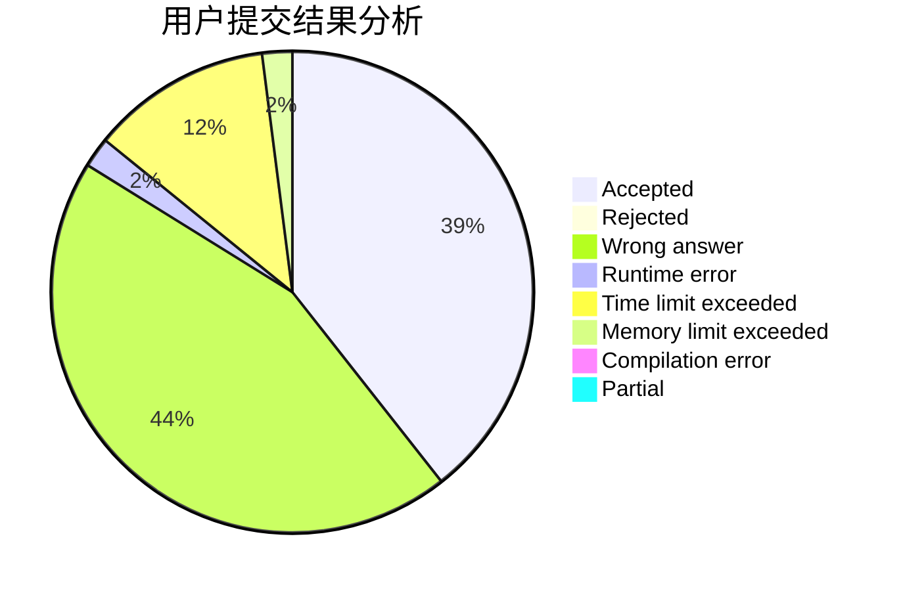
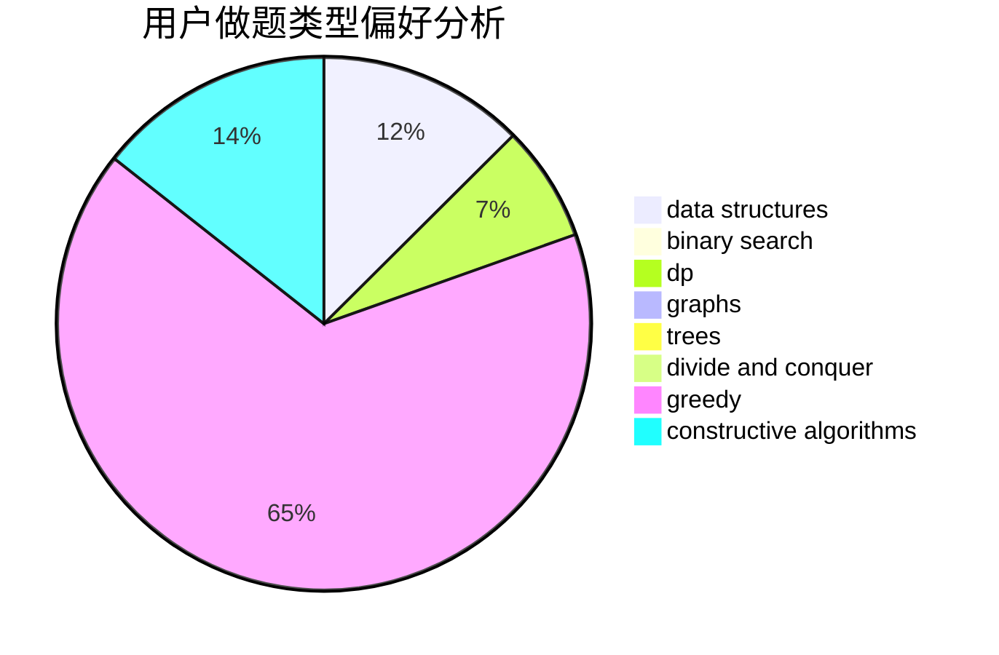

# Yukikaze_

<!-- tabs:start -->

#### **用户提交结果分析**

#### **用户做题类型偏好分析**

#### **用户错题知识点分析**

<!-- tabs:end -->
# 推荐题目
[1172A](https://codeforces.com/contest/1172/problem/A)		greedy,
                        implementation		  
[263C](https://codeforces.com/contest/263/problem/C)		brute force,
                        dfs and similar,
                        implementation		  
[83B](https://codeforces.com/contest/83/problem/B)		binary search,
                        math,
                        sortings		  
[1074B](https://codeforces.com/contest/1074/problem/B)		dsu,graphs,sortings,trees		  
[1444D](https://codeforces.com/contest/1444/problem/D)		constructive algorithms,
                        dp,
                        geometry		  
[902D](https://codeforces.com/contest/902/problem/D)		dsu,graphs,sortings,trees		  
[1245F](https://codeforces.com/contest/1245/problem/F)		bitmasks,
                        brute force,
                        combinatorics,
                        dp		  
[1036F](https://codeforces.com/contest/1036/problem/F)		combinatorics,
                        math,
                        number theory		  
[860C](https://codeforces.com/contest/860/problem/C)		dsu,graphs,sortings,trees		  
[388A](https://codeforces.com/contest/388/problem/A)		greedy,
                        sortings		  
