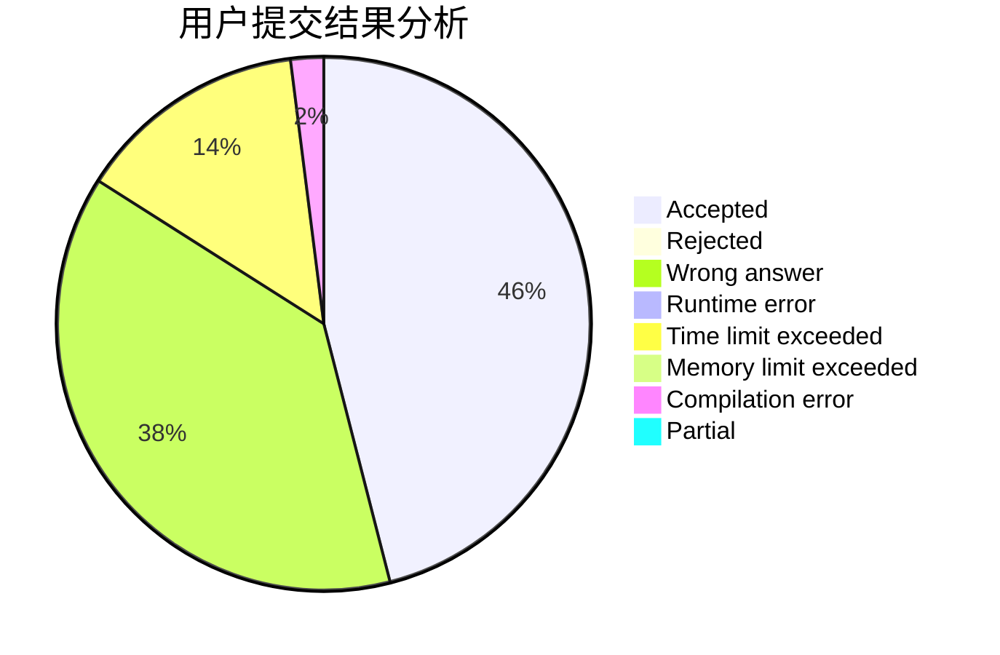
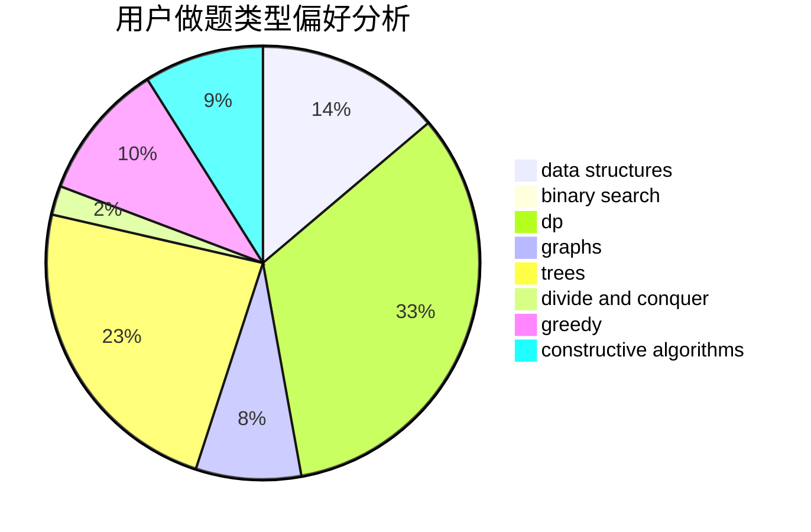
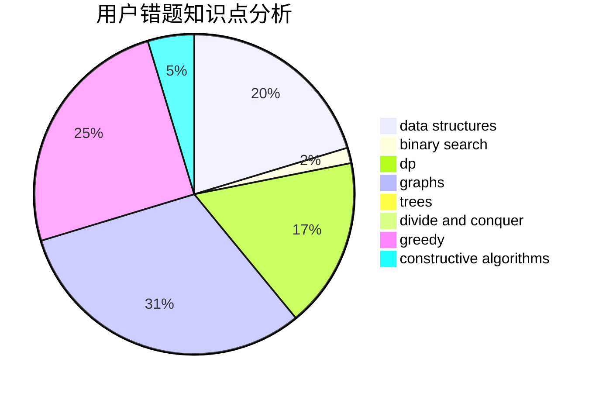

# YunQian

<!-- tabs:start -->

#### **用户提交结果分析**

#### **用户做题类型偏好分析**

#### **用户错题知识点分析**

<!-- tabs:end -->
# 推荐题目
[318C](https://codeforces.com/contest/318/problem/C)		dsu,graphs,sortings,trees		  
[650E](https://codeforces.com/contest/650/problem/E)		data structures,
                        dfs and similar,
                        dsu,
                        greedy,
                        trees		  
[947E](https://codeforces.com/contest/947/problem/E)		dsu,graphs,sortings,trees		  
[710C](https://codeforces.com/contest/710/problem/C)		constructive algorithms,
                        math		  
[1120C](https://codeforces.com/contest/1120/problem/C)		dp,
                        strings		  
[996E](https://codeforces.com/contest/996/problem/E)		dsu,graphs,sortings,trees		  
[327A](https://codeforces.com/contest/327/problem/A)		brute force,
                        dp,
                        implementation		  
[55C](https://codeforces.com/contest/55/problem/C)		games		  
[377D](https://codeforces.com/contest/377/problem/D)		data structures		  
[849A](https://codeforces.com/contest/849/problem/A)		implementation		  
