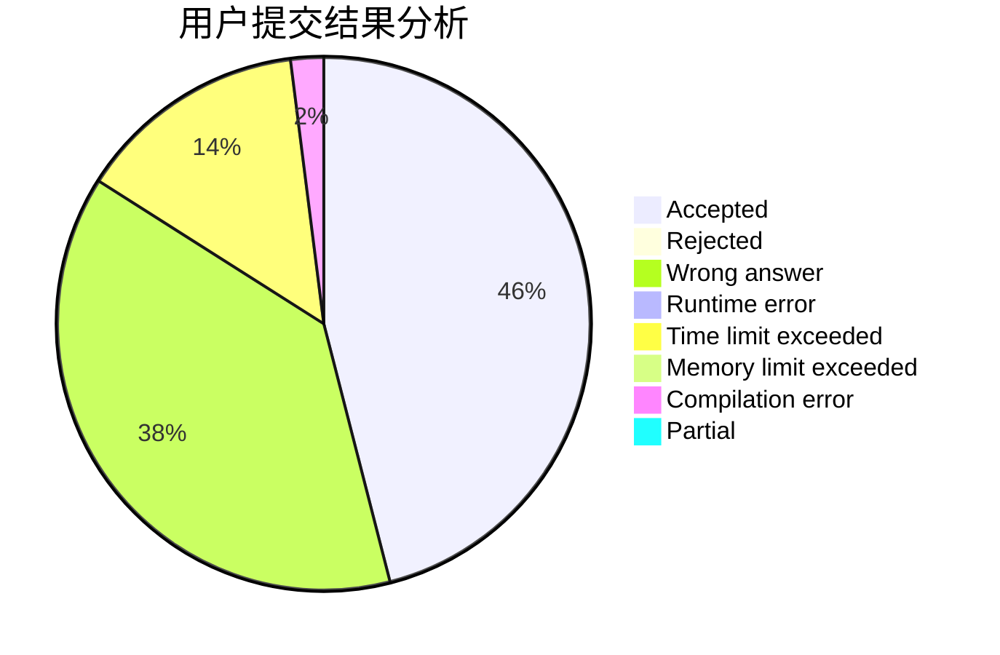
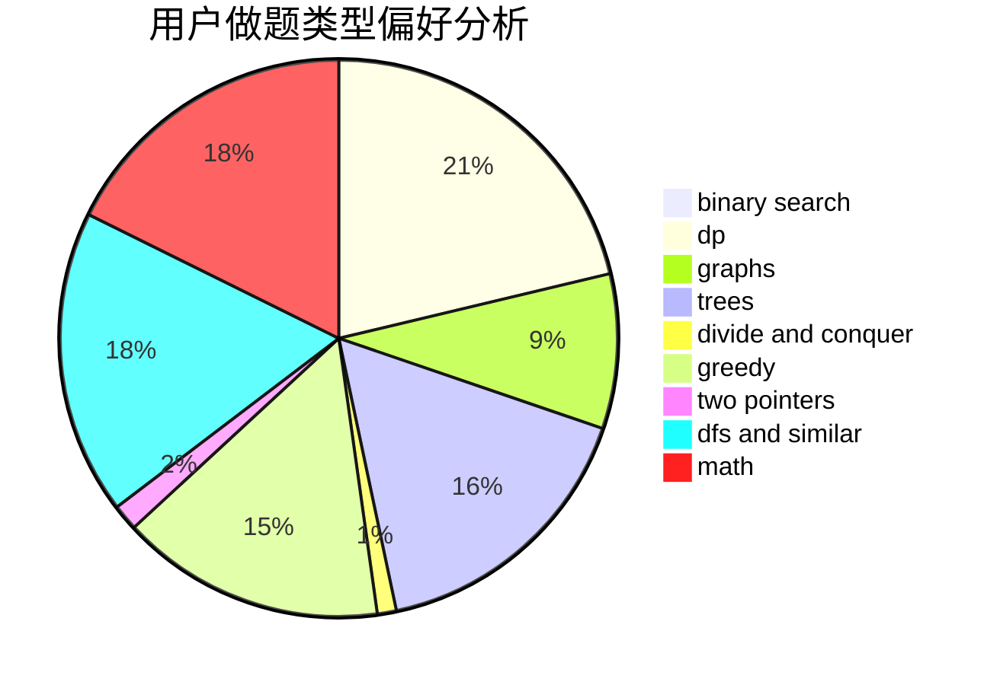

# YunQian

<!-- tabs:start -->

#### **用户提交结果分析**

#### **用户做题类型偏好分析**

<!-- tabs:end -->
# 推荐题目
[318C](https://codeforces.com/contest/318/problem/C)
[650E](https://codeforces.com/contest/650/problem/E)
[947E](https://codeforces.com/contest/947/problem/E)
[710C](https://codeforces.com/contest/710/problem/C)
[1120C](https://codeforces.com/contest/1120/problem/C)
[996E](https://codeforces.com/contest/996/problem/E)
[327A](https://codeforces.com/contest/327/problem/A)
[55C](https://codeforces.com/contest/55/problem/C)
[377D](https://codeforces.com/contest/377/problem/D)
[849A](https://codeforces.com/contest/849/problem/A)
