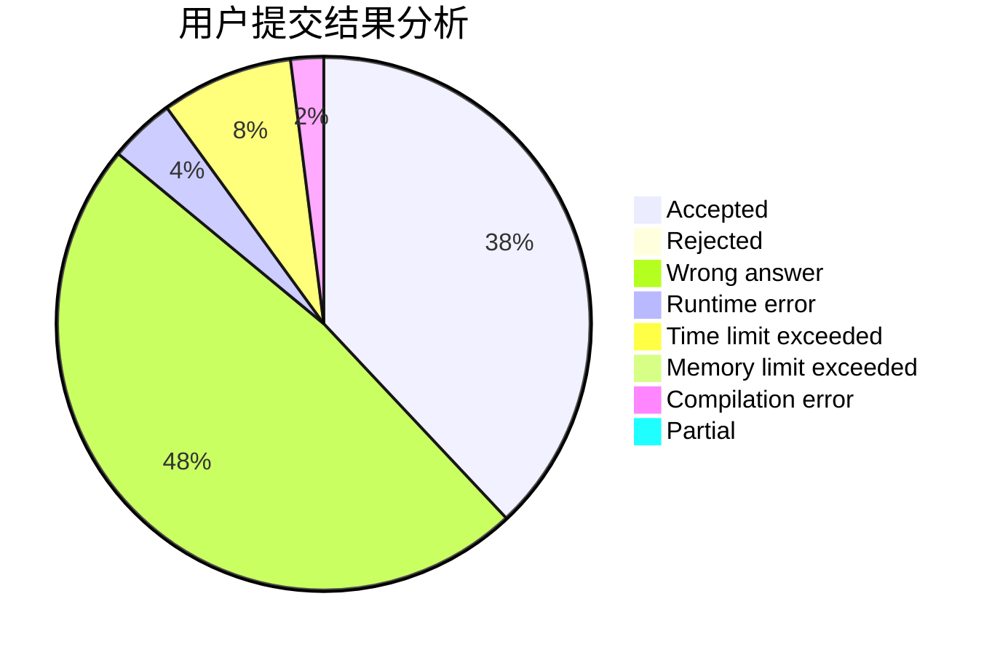
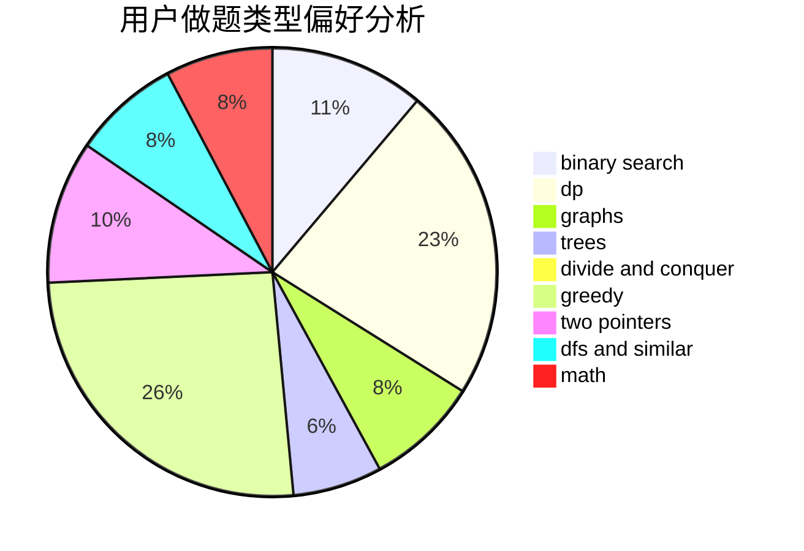

# Yunlong_Li

<!-- tabs:start -->

#### **用户提交结果分析**

#### **用户做题类型偏好分析**

<!-- tabs:end -->
# 推荐题目
[282C](https://codeforces.com/contest/282/problem/C)
[720C](https://codeforces.com/contest/720/problem/C)
[614A](https://codeforces.com/contest/614/problem/A)
[1186C](https://codeforces.com/contest/1186/problem/C)
[582C](https://codeforces.com/contest/582/problem/C)
[393C](https://codeforces.com/contest/393/problem/C)
[998E](https://codeforces.com/contest/998/problem/E)
[743A](https://codeforces.com/contest/743/problem/A)
[1151E](https://codeforces.com/contest/1151/problem/E)
[1471E](https://codeforces.com/contest/1471/problem/E)
