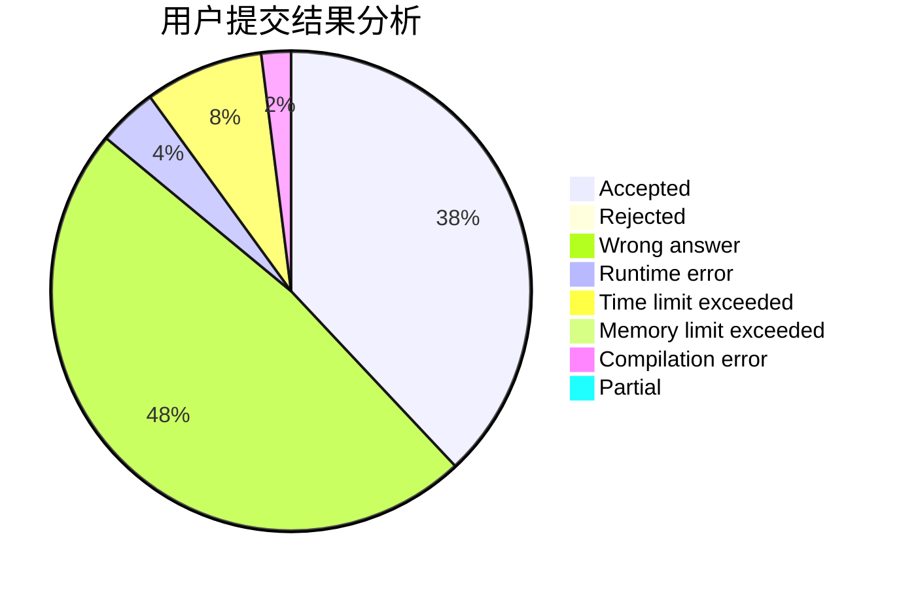
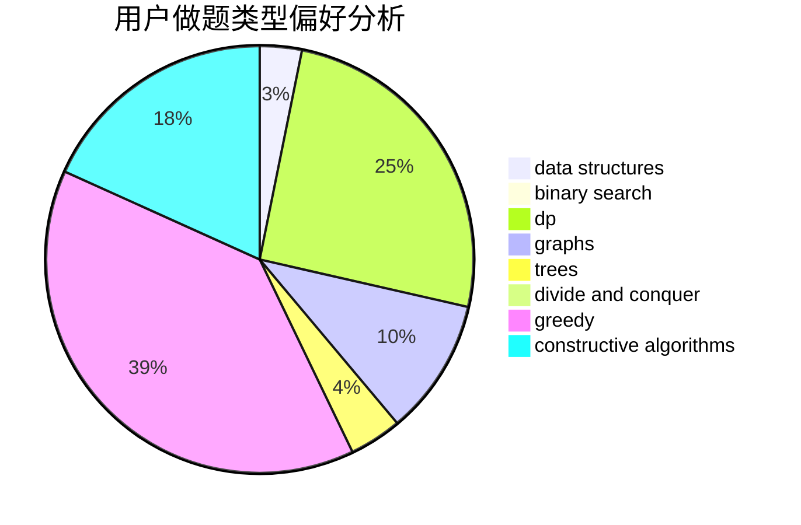
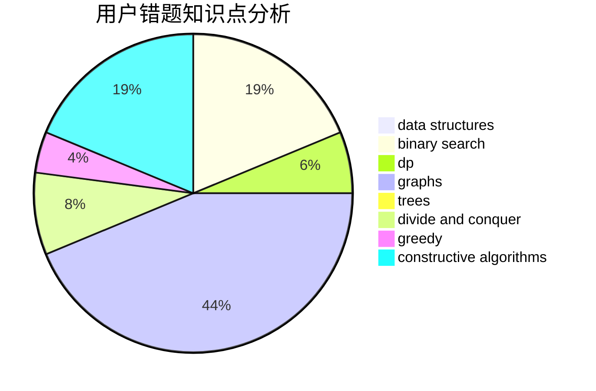

# Yunlong_Li

<!-- tabs:start -->

#### **用户提交结果分析**

#### **用户做题类型偏好分析**

#### **用户错题知识点分析**

<!-- tabs:end -->
# 推荐题目
[266D](https://codeforces.com/contest/266/problem/D)		graphs,
                        math,
                        shortest paths		  
[701F](https://codeforces.com/contest/701/problem/F)		dsu,graphs,sortings,trees		  
[597B](https://codeforces.com/contest/597/problem/B)		dp,
                        greedy,
                        sortings		  
[1183E](https://codeforces.com/contest/1183/problem/E)		dp,
                        graphs,
                        implementation,
                        shortest paths		  
[559E](https://codeforces.com/contest/559/problem/E)		dp,
                        sortings		  
[365A](https://codeforces.com/contest/365/problem/A)		implementation		  
[983A](https://codeforces.com/contest/983/problem/A)		implementation,
                        math		  
[725B](https://codeforces.com/contest/725/problem/B)		implementation,
                        math		  
[114B](https://codeforces.com/contest/114/problem/B)		bitmasks,
                        brute force,
                        graphs		  
[1464D](https://codeforces.com/contest/1464/problem/D)		dsu,graphs,sortings,trees		  
