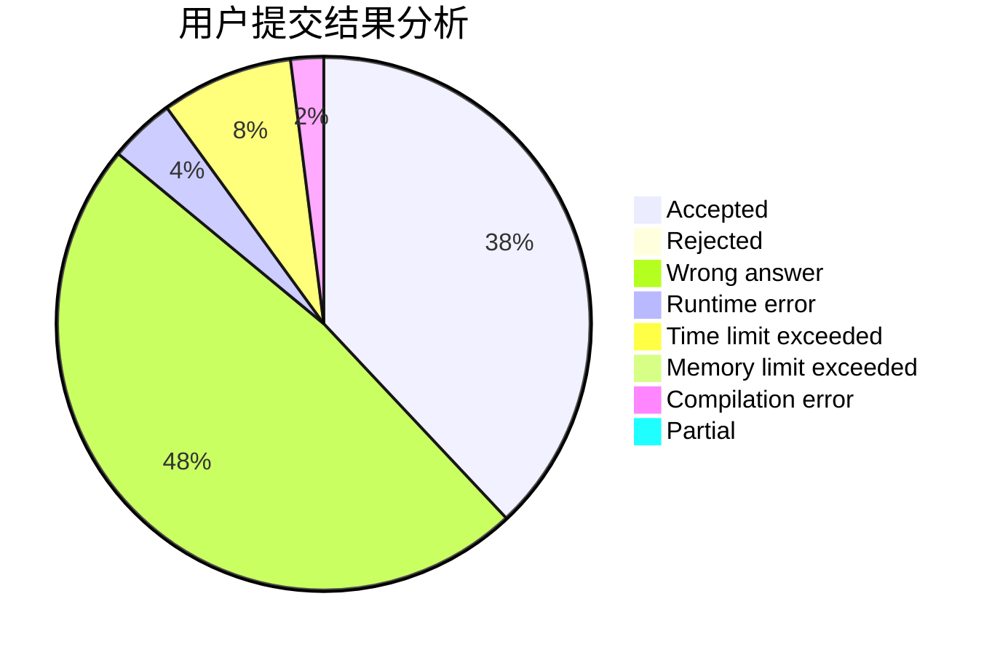
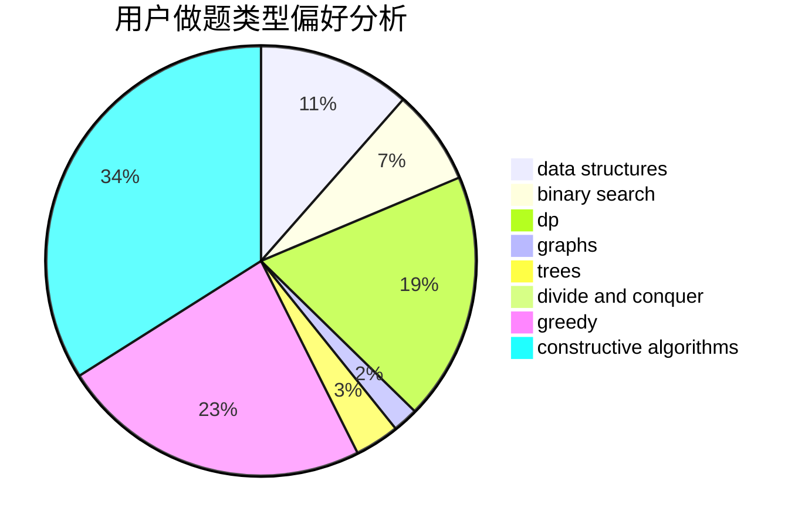
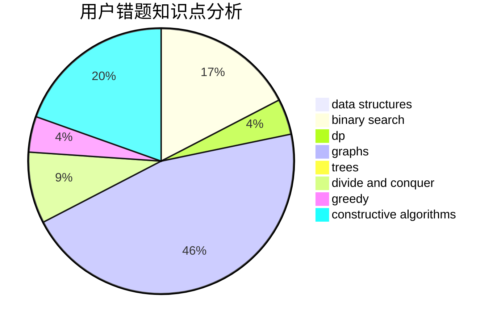

# Yunlong_Li

<!-- tabs:start -->

#### **用户提交结果分析**

#### **用户做题类型偏好分析**

#### **用户错题知识点分析**

<!-- tabs:end -->
# 推荐题目
[282C](https://codeforces.com/contest/282/problem/C)		constructive algorithms,
                        implementation,
                        math		  
[720C](https://codeforces.com/contest/720/problem/C)		constructive algorithms		  
[614A](https://codeforces.com/contest/614/problem/A)		brute force,
                        implementation		  
[1186C](https://codeforces.com/contest/1186/problem/C)		implementation,
                        math		  
[582C](https://codeforces.com/contest/582/problem/C)		number theory		  
[393C](https://codeforces.com/contest/393/problem/C)		dsu,graphs,sortings,trees		  
[998E](https://codeforces.com/contest/998/problem/E)		dsu,graphs,sortings,trees		  
[743A](https://codeforces.com/contest/743/problem/A)		constructive algorithms,
                        greedy,
                        implementation		  
[1151E](https://codeforces.com/contest/1151/problem/E)		combinatorics,
                        data structures,
                        dp,
                        math		  
[1471E](https://codeforces.com/contest/1471/problem/E)		dsu,graphs,sortings,trees		  
