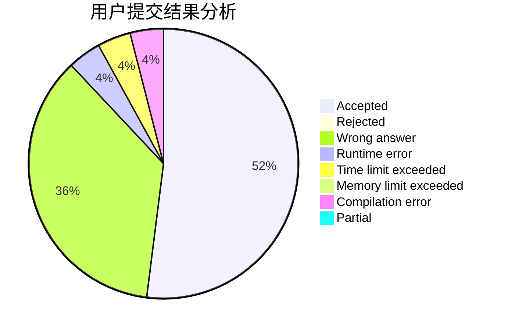
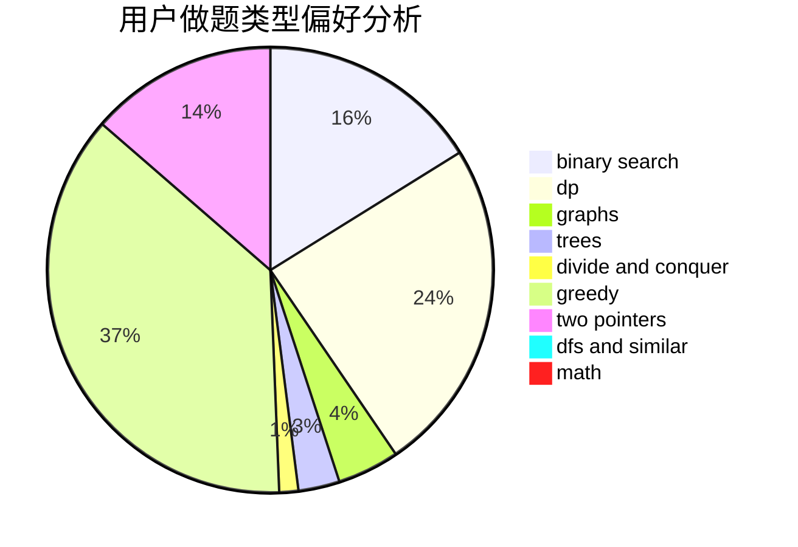

# Yushen.

<!-- tabs:start -->

#### **用户提交结果分析**

#### **用户做题类型偏好分析**

<!-- tabs:end -->
# 推荐题目
[347A](https://codeforces.com/contest/347/problem/A)
[1250I](https://codeforces.com/contest/1250/problem/I)
[1065B](https://codeforces.com/contest/1065/problem/B)
[1162D](https://codeforces.com/contest/1162/problem/D)
[1211B](https://codeforces.com/contest/1211/problem/B)
[567C](https://codeforces.com/contest/567/problem/C)
[452B](https://codeforces.com/contest/452/problem/B)
[233C](https://codeforces.com/contest/233/problem/C)
[897B](https://codeforces.com/contest/897/problem/B)
[1156E](https://codeforces.com/contest/1156/problem/E)
