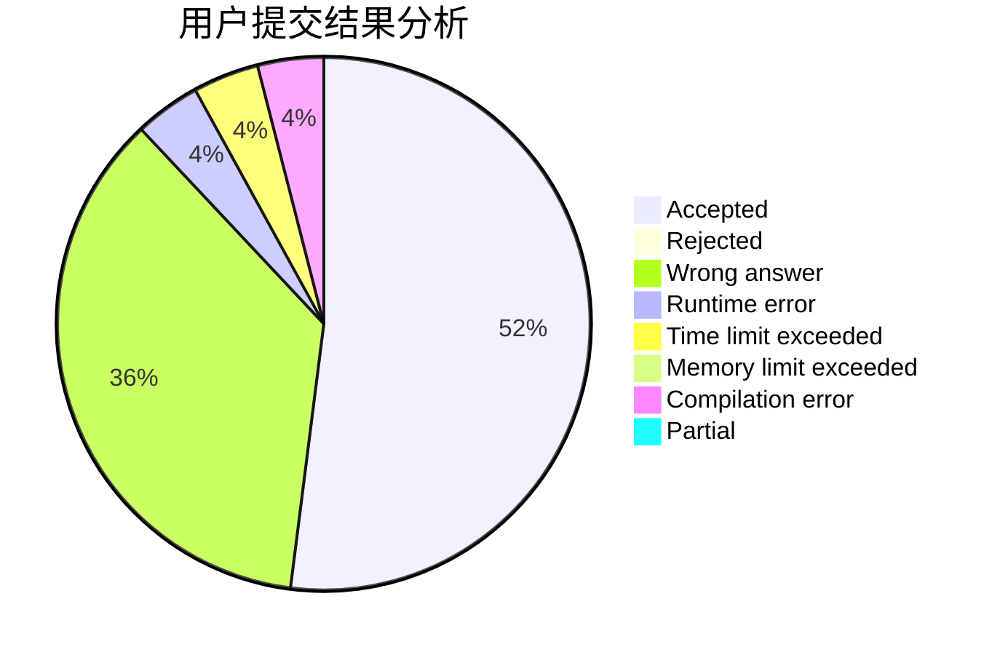
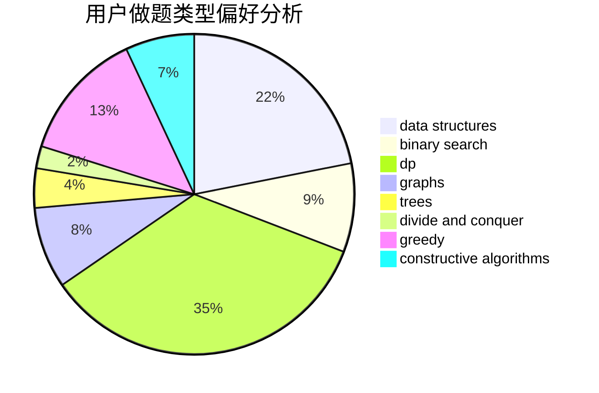

# Yushen.

<!-- tabs:start -->

#### **用户提交结果分析**

#### **用户做题类型偏好分析**

#### **用户错题知识点分析**

<!-- tabs:end -->
# 推荐题目
[347A](https://codeforces.com/contest/347/problem/A)		constructive algorithms,
                        implementation,
                        sortings		  
[1250I](https://codeforces.com/contest/1250/problem/I)		binary search,
                        brute force,
                        greedy,
                        shortest paths		  
[1065B](https://codeforces.com/contest/1065/problem/B)		constructive algorithms,
                        graphs		  
[1162D](https://codeforces.com/contest/1162/problem/D)		dsu,graphs,sortings,trees		  
[1211B](https://codeforces.com/contest/1211/problem/B)		*special problem,
                        implementation		  
[567C](https://codeforces.com/contest/567/problem/C)		binary search,
                        data structures,
                        dp		  
[452B](https://codeforces.com/contest/452/problem/B)		brute force,
                        constructive algorithms,
                        geometry,
                        trees		  
[233C](https://codeforces.com/contest/233/problem/C)		dsu,graphs,sortings,trees		  
[897B](https://codeforces.com/contest/897/problem/B)		brute force		  
[1156E](https://codeforces.com/contest/1156/problem/E)		data structures,
                        divide and conquer,
                        dsu,
                        two pointers		  
