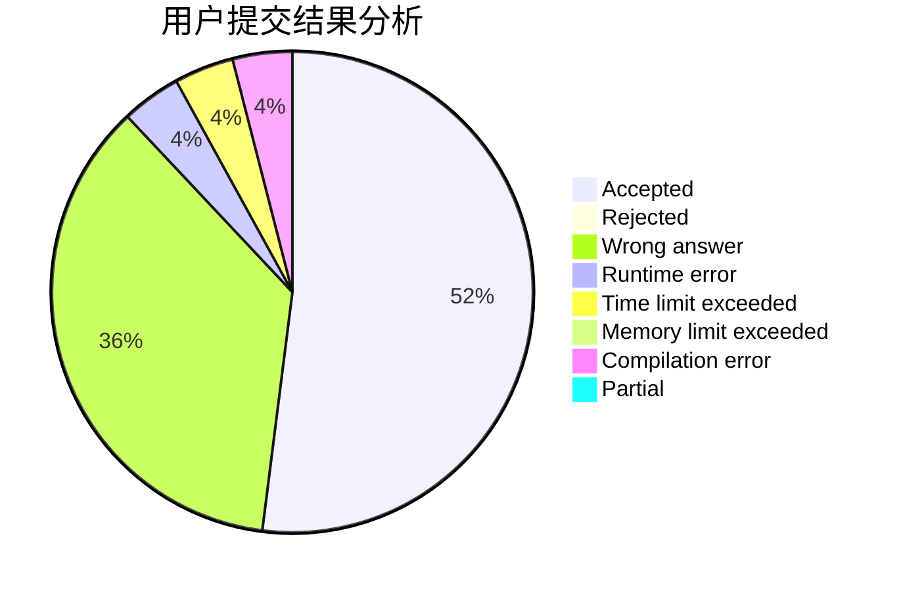
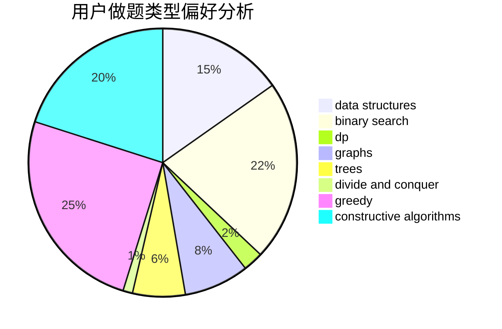

# Yushen.

<!-- tabs:start -->

#### **用户提交结果分析**

#### **用户做题类型偏好分析**

#### **用户错题知识点分析**

<!-- tabs:end -->
# 推荐题目
[317D](https://codeforces.com/contest/317/problem/D)		dp,
                        games		  
[1246A](https://codeforces.com/contest/1246/problem/A)		dsu,graphs,sortings,trees		  
[1064E](https://codeforces.com/contest/1064/problem/E)		dsu,graphs,sortings,trees		  
[1159F](https://codeforces.com/contest/1159/problem/F)		dsu,graphs,sortings,trees		  
[1207B](https://codeforces.com/contest/1207/problem/B)		constructive algorithms,
                        greedy,
                        implementation		  
[543A](https://codeforces.com/contest/543/problem/A)		dp		  
[430A](https://codeforces.com/contest/430/problem/A)		constructive algorithms,
                        sortings		  
[215A](https://codeforces.com/contest/215/problem/A)		brute force,
                        implementation		  
[876F](https://codeforces.com/contest/876/problem/F)		dsu,graphs,sortings,trees		  
[1154E](https://codeforces.com/contest/1154/problem/E)		data structures,
                        implementation,
                        sortings		  
