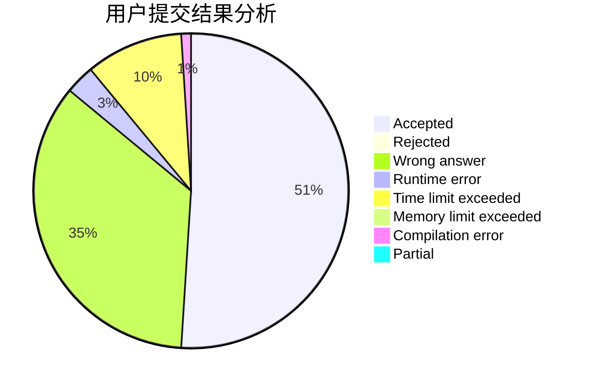
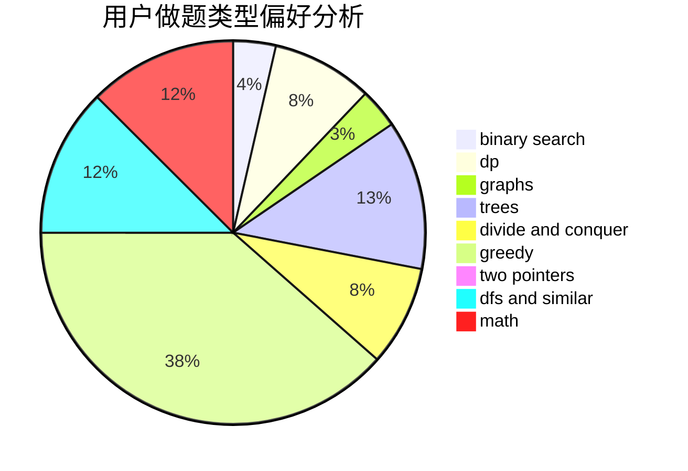

# Yyh.

<!-- tabs:start -->

#### **用户提交结果分析**

#### **用户做题类型偏好分析**

<!-- tabs:end -->
# 推荐题目
[899D](https://codeforces.com/contest/899/problem/D)
[97D](https://codeforces.com/contest/97/problem/D)
[810A](https://codeforces.com/contest/810/problem/A)
[1385G](https://codeforces.com/contest/1385/problem/G)
[1040A](https://codeforces.com/contest/1040/problem/A)
[383D](https://codeforces.com/contest/383/problem/D)
[717E](https://codeforces.com/contest/717/problem/E)
[901C](https://codeforces.com/contest/901/problem/C)
[810C](https://codeforces.com/contest/810/problem/C)
[1293C](https://codeforces.com/contest/1293/problem/C)
