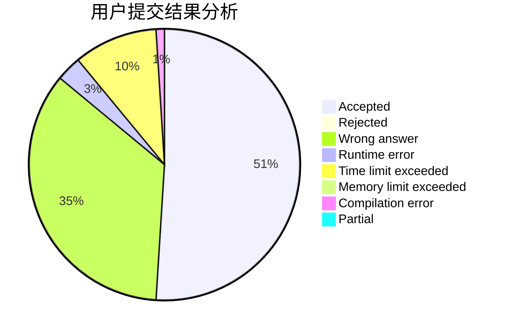
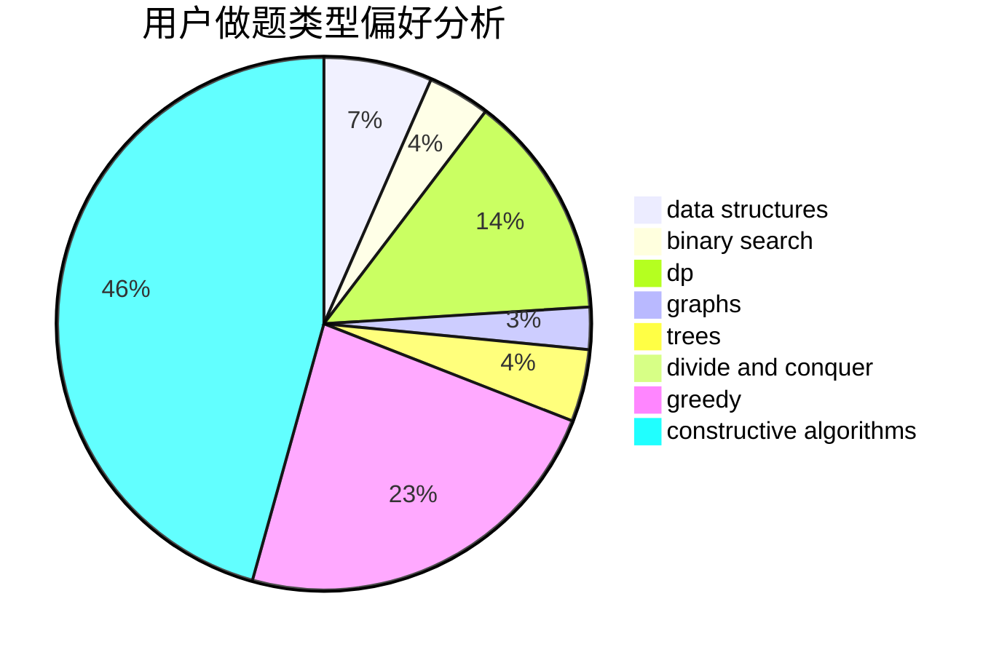

# Yyh.
<!-- tabs:start -->
#### **用户提交结果分析**

#### **用户做题类型偏好分析**

#### **用户错题知识点分析**

<!-- tabs:end -->
# 推荐题目
[Dreamoon and Notepad](http://codeforces.com/problemset/problem/477/E)		data structures		  
[Numbers on the blackboard](http://codeforces.com/problemset/problem/878/E)		combinatorics,
                        dp		  
[Maximal Independent Set](https://codeforces.com/contest/1376/problem/B3)		nan		  
[Stepan and Vowels](https://codeforces.com/contest/795/problem/K)		*special problem,
                        implementation,
                        strings		  
[Hyperspace Jump (easy)](http://codeforces.com/problemset/problem/958/D1)		expression parsing,
                        math		  
[Dima and Text Messages](http://codeforces.com/problemset/problem/358/B)		brute force,
                        strings		  
[Checkpoints](http://codeforces.com/problemset/problem/709/B)		greedy,
                        implementation,
                        sortings		  
[Find The Bone](http://codeforces.com/problemset/problem/796/B)		implementation		  
[The Winds of Winter](http://codeforces.com/problemset/problem/768/G)		binary search,
                        data structures		  
[Han Solo and Lazer Gun](http://codeforces.com/problemset/problem/514/B)		brute force,
                        data structures,
                        geometry,
                        implementation,
                        math		  
<!-- tabs:start -->
#### **data structures**
[Dreamoon and Notepad](http://codeforces.com/problemset/problem/477/E)		data structures		  
[Numbers on the blackboard](http://codeforces.com/problemset/problem/768/G)		binary search,
                        data structures		  
[Maximal Independent Set](http://codeforces.com/problemset/problem/514/B)		brute force,
                        data structures,
                        geometry,
                        implementation,
                        math		  
[Stepan and Vowels](http://codeforces.com/problemset/problem/1286/B)		constructive algorithms,
                        data structures,
                        dfs and similar,
                        graphs,
                        greedy,
                        trees		  
[Hyperspace Jump (easy)](http://codeforces.com/problemset/problem/1264/C)		data structures,
                        probabilities		  
[Dima and Text Messages](http://codeforces.com/problemset/problem/958/B2)		data structures,
                        dfs and similar,
                        graphs,
                        greedy,
                        trees		  
[Checkpoints](http://codeforces.com/problemset/problem/380/C)		data structures,
                        schedules		  
[Find The Bone](http://codeforces.com/problemset/problem/1428/E)		binary search,
                        data structures,
                        greedy,
                        math,
                        sortings		  
[The Winds of Winter](http://codeforces.com/problemset/problem/1380/A)		brute force,
                        data structures		  
[Han Solo and Lazer Gun](http://codeforces.com/problemset/problem/547/E)		data structures,
                        string suffix structures,
                        strings,
                        trees		  
#### **binary search**
[Dreamoon and Notepad](http://codeforces.com/problemset/problem/768/G)		binary search,
                        data structures		  
[Numbers on the blackboard](http://codeforces.com/problemset/problem/883/I)		binary search,
                        dp		  
[Maximal Independent Set](https://codeforces.com/contest/701/problem/D)		binary search,
                        math		  
[Stepan and Vowels](http://codeforces.com/problemset/problem/1428/E)		binary search,
                        data structures,
                        greedy,
                        math,
                        sortings		  
[Hyperspace Jump (easy)](http://codeforces.com/problemset/problem/1201/C)		binary search,
                        greedy,
                        math,
                        sortings		  
[Dima and Text Messages](http://codeforces.com/problemset/problem/1492/C)		binary search,
                        data structures,
                        dp,
                        greedy,
                        two pointers		  
[Checkpoints](http://codeforces.com/problemset/problem/1463/D)		binary search,
                        constructive algorithms,
                        greedy,
                        two pointers		  
[Find The Bone](http://codeforces.com/problemset/problem/1490/G)		binary search,
                        data structures,
                        math		  
[The Winds of Winter](http://codeforces.com/problemset/problem/1479/D)		binary search,
                        bitmasks,
                        brute force,
                        data structures,
                        probabilities,
                        trees		  
[Han Solo and Lazer Gun](http://codeforces.com/problemset/problem/1436/E)		binary search,
                        data structures,
                        two pointers		  
#### **dp**
[Dreamoon and Notepad](http://codeforces.com/problemset/problem/878/E)		combinatorics,
                        dp		  
[Numbers on the blackboard](http://codeforces.com/problemset/problem/1149/B)		dp,
                        implementation,
                        strings		  
[Maximal Independent Set](http://codeforces.com/problemset/problem/883/I)		binary search,
                        dp		  
[Stepan and Vowels](http://codeforces.com/problemset/problem/132/C)		dp		  
[Hyperspace Jump (easy)](http://codeforces.com/problemset/problem/1178/B)		dp,
                        strings		  
[Dima and Text Messages](http://codeforces.com/problemset/problem/1268/E)		dp		  
[Checkpoints](http://codeforces.com/problemset/problem/1091/D)		combinatorics,
                        dp,
                        math		  
[Find The Bone](http://codeforces.com/problemset/problem/1404/B)		dfs and similar,
                        dp,
                        games,
                        trees		  
[The Winds of Winter](http://codeforces.com/problemset/problem/1462/B)		dp,
                        implementation,
                        strings		  
[Han Solo and Lazer Gun](http://codeforces.com/problemset/problem/1492/C)		binary search,
                        data structures,
                        dp,
                        greedy,
                        two pointers		  
#### **graph**
[Dreamoon and Notepad](http://codeforces.com/problemset/problem/1286/B)		constructive algorithms,
                        data structures,
                        dfs and similar,
                        graphs,
                        greedy,
                        trees		  
[Numbers on the blackboard](http://codeforces.com/problemset/problem/958/B2)		data structures,
                        dfs and similar,
                        graphs,
                        greedy,
                        trees		  
[Maximal Independent Set](http://codeforces.com/problemset/problem/1422/D)		graphs,
                        shortest paths,
                        sortings		  
[Stepan and Vowels](http://codeforces.com/problemset/problem/1487/C)		brute force,
                        constructive algorithms,
                        dfs and similar,
                        graphs,
                        greedy,
                        implementation,
                        math		  
[Hyperspace Jump (easy)](http://codeforces.com/problemset/problem/1437/C)		dp,
                        flows,
                        graph matchings,
                        greedy,
                        math,
                        sortings		  
[Dima and Text Messages](http://codeforces.com/problemset/problem/1470/D)		constructive algorithms,
                        dfs and similar,
                        graph matchings,
                        graphs,
                        greedy		  
[Checkpoints](http://codeforces.com/problemset/problem/1476/C)		dp,
                        graphs,
                        greedy		  
[Find The Bone](http://codeforces.com/problemset/problem/1304/D)		constructive algorithms,
                        graphs,
                        greedy,
                        two pointers		  
[The Winds of Winter](http://codeforces.com/problemset/problem/1475/C)		combinatorics,
                        graphs,
                        math		  
[Han Solo and Lazer Gun](http://codeforces.com/problemset/problem/553/E)		dp,
                        fft,
                        graphs,
                        math,
                        probabilities		  
#### **trees**
[Dreamoon and Notepad](http://codeforces.com/problemset/problem/1286/B)		constructive algorithms,
                        data structures,
                        dfs and similar,
                        graphs,
                        greedy,
                        trees		  
[Numbers on the blackboard](http://codeforces.com/problemset/problem/958/B2)		data structures,
                        dfs and similar,
                        graphs,
                        greedy,
                        trees		  
[Maximal Independent Set](http://codeforces.com/problemset/problem/547/E)		data structures,
                        string suffix structures,
                        strings,
                        trees		  
[Stepan and Vowels](http://codeforces.com/problemset/problem/1404/B)		dfs and similar,
                        dp,
                        games,
                        trees		  
[Hyperspace Jump (easy)](http://codeforces.com/problemset/problem/1479/D)		binary search,
                        bitmasks,
                        brute force,
                        data structures,
                        probabilities,
                        trees		  
[Dima and Text Messages](http://codeforces.com/problemset/problem/1511/C)		brute force,
                        data structures,
                        implementation,
                        trees		  
[Checkpoints](http://codeforces.com/problemset/problem/1499/F)		combinatorics,
                        dfs and similar,
                        dp,
                        trees		  
[Find The Bone](http://codeforces.com/problemset/problem/1491/E)		brute force,
                        dfs and similar,
                        divide and conquer,
                        number theory,
                        trees		  
[The Winds of Winter](http://codeforces.com/problemset/problem/1466/D)		data structures,
                        greedy,
                        sortings,
                        trees		  
[Han Solo and Lazer Gun](http://codeforces.com/problemset/problem/1495/D)		combinatorics,
                        dfs and similar,
                        graphs,
                        math,
                        shortest paths,
                        trees		  
#### **divide and conquer**
[Dreamoon and Notepad](http://codeforces.com/problemset/problem/1461/D)		binary search,
                        brute force,
                        data structures,
                        divide and conquer,
                        implementation,
                        sortings		  
[Numbers on the blackboard](http://codeforces.com/problemset/problem/1466/G)		combinatorics,
                        divide and conquer,
                        hashing,
                        math,
                        string suffix structures,
                        strings		  
[Maximal Independent Set](http://codeforces.com/problemset/problem/1490/D)		dfs and similar,
                        divide and conquer,
                        implementation		  
[Stepan and Vowels](https://codeforces.com/contest/1483/problem/C)		data structures,
                        divide and conquer,
                        dp		  
[Hyperspace Jump (easy)](http://codeforces.com/problemset/problem/1491/E)		brute force,
                        dfs and similar,
                        divide and conquer,
                        number theory,
                        trees		  
[Dima and Text Messages](http://codeforces.com/problemset/problem/1303/G)		data structures,
                        divide and conquer,
                        geometry,
                        trees		  
[Checkpoints](http://codeforces.com/problemset/problem/1494/D)		constructive algorithms,
                        data structures,
                        dfs and similar,
                        divide and conquer,
                        dsu,
                        greedy,
                        sortings,
                        trees		  
[Find The Bone](http://codeforces.com/problemset/problem/1482/E)		data structures,
                        divide and conquer,
                        dp		  
[The Winds of Winter](http://codeforces.com/problemset/problem/566/C)		dfs and similar,
                        divide and conquer,
                        trees		  
[Han Solo and Lazer Gun](http://codeforces.com/problemset/problem/1428/F)		binary search,
                        data structures,
                        divide and conquer,
                        dp,
                        two pointers		  
#### **greedy**
[Dreamoon and Notepad](http://codeforces.com/problemset/problem/709/B)		greedy,
                        implementation,
                        sortings		  
[Numbers on the blackboard](http://codeforces.com/problemset/problem/910/B)		greedy,
                        implementation		  
[Maximal Independent Set](http://codeforces.com/problemset/problem/103/C)		constructive algorithms,
                        greedy		  
[Stepan and Vowels](http://codeforces.com/problemset/problem/1286/B)		constructive algorithms,
                        data structures,
                        dfs and similar,
                        graphs,
                        greedy,
                        trees		  
[Hyperspace Jump (easy)](http://codeforces.com/problemset/problem/6/C)		greedy,
                        two pointers		  
[Dima and Text Messages](http://codeforces.com/problemset/problem/1431/D)		*special problem,
                        greedy		  
[Checkpoints](https://codeforces.com/contest/1086/problem/C)		greedy,
                        implementation,
                        strings		  
[Find The Bone](http://codeforces.com/problemset/problem/958/B2)		data structures,
                        dfs and similar,
                        graphs,
                        greedy,
                        trees		  
[The Winds of Winter](http://codeforces.com/problemset/problem/437/B)		bitmasks,
                        greedy,
                        implementation,
                        sortings		  
[Han Solo and Lazer Gun](http://codeforces.com/problemset/problem/1091/B)		brute force,
                        constructive algorithms,
                        greedy,
                        implementation		  
#### **constructive algorithms**
[Dreamoon and Notepad](http://codeforces.com/problemset/problem/103/C)		constructive algorithms,
                        greedy		  
[Numbers on the blackboard](http://codeforces.com/problemset/problem/1286/B)		constructive algorithms,
                        data structures,
                        dfs and similar,
                        graphs,
                        greedy,
                        trees		  
[Maximal Independent Set](http://codeforces.com/problemset/problem/1091/B)		brute force,
                        constructive algorithms,
                        greedy,
                        implementation		  
[Stepan and Vowels](http://codeforces.com/problemset/problem/1110/E)		constructive algorithms,
                        math,
                        sortings		  
[Hyperspace Jump (easy)](http://codeforces.com/problemset/problem/1088/A)		brute force,
                        constructive algorithms		  
[Dima and Text Messages](http://codeforces.com/problemset/problem/1178/D)		constructive algorithms,
                        greedy,
                        math,
                        number theory		  
[Checkpoints](http://codeforces.com/problemset/problem/1493/A)		constructive algorithms,
                        greedy		  
[Find The Bone](http://codeforces.com/problemset/problem/1463/D)		binary search,
                        constructive algorithms,
                        greedy,
                        two pointers		  
[The Winds of Winter](https://codeforces.com/contest/1456/problem/B)		bitmasks,
                        brute force,
                        constructive algorithms		  
[Han Solo and Lazer Gun](http://codeforces.com/problemset/problem/1492/D)		bitmasks,
                        constructive algorithms,
                        greedy,
                        math		  
#### **sortings**
[Dreamoon and Notepad](http://codeforces.com/problemset/problem/709/B)		greedy,
                        implementation,
                        sortings		  
[Numbers on the blackboard](http://codeforces.com/problemset/problem/437/B)		bitmasks,
                        greedy,
                        implementation,
                        sortings		  
[Maximal Independent Set](http://codeforces.com/problemset/problem/1428/E)		binary search,
                        data structures,
                        greedy,
                        math,
                        sortings		  
[Stepan and Vowels](http://codeforces.com/problemset/problem/1110/E)		constructive algorithms,
                        math,
                        sortings		  
[Hyperspace Jump (easy)](http://codeforces.com/problemset/problem/1374/E1)		data structures,
                        greedy,
                        sortings		  
[Dima and Text Messages](http://codeforces.com/problemset/problem/1201/C)		binary search,
                        greedy,
                        math,
                        sortings		  
[Checkpoints](http://codeforces.com/problemset/problem/1422/D)		graphs,
                        shortest paths,
                        sortings		  
[Find The Bone](https://codeforces.com/contest/1496/problem/C)		geometry,
                        greedy,
                        math,
                        sortings		  
[The Winds of Winter](http://codeforces.com/problemset/problem/1495/A)		geometry,
                        greedy,
                        math,
                        sortings		  
[Han Solo and Lazer Gun](http://codeforces.com/problemset/problem/1497/A)		brute force,
                        data structures,
                        greedy,
                        sortings		  
<!-- tabs:end -->
