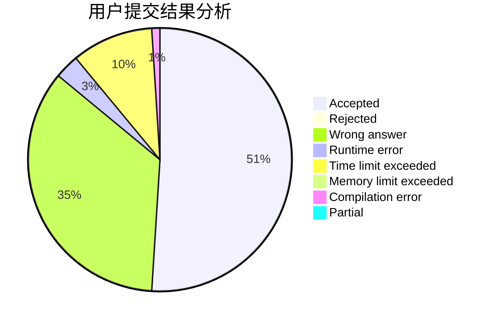
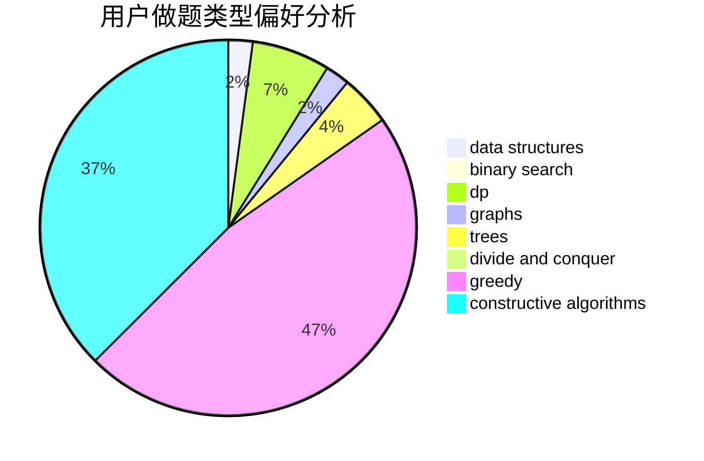

# Yyh.

<!-- tabs:start -->

#### **用户提交结果分析**

#### **用户做题类型偏好分析**

#### **用户错题知识点分析**

<!-- tabs:end -->
# 推荐题目
[899D](https://codeforces.com/contest/899/problem/D)		constructive algorithms,
                        math		  
[97D](https://codeforces.com/contest/97/problem/D)		bitmasks,
                        brute force,
                        implementation		  
[810A](https://codeforces.com/contest/810/problem/A)		implementation,
                        math		  
[1385G](https://codeforces.com/contest/1385/problem/G)		2-sat,
                        dfs and similar,
                        dsu,
                        graphs,
                        implementation		  
[1040A](https://codeforces.com/contest/1040/problem/A)		greedy		  
[383D](https://codeforces.com/contest/383/problem/D)		dp		  
[717E](https://codeforces.com/contest/717/problem/E)		dfs and similar		  
[901C](https://codeforces.com/contest/901/problem/C)		binary search,
                        data structures,
                        dfs and similar,
                        dsu,
                        graphs,
                        two pointers		  
[810C](https://codeforces.com/contest/810/problem/C)		dsu,graphs,sortings,trees		  
[1293C](https://codeforces.com/contest/1293/problem/C)		dsu,graphs,sortings,trees		  
