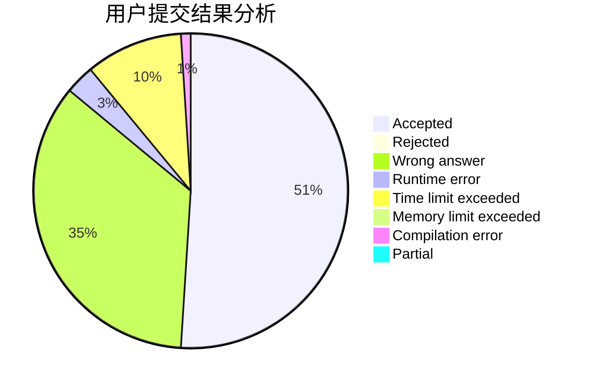
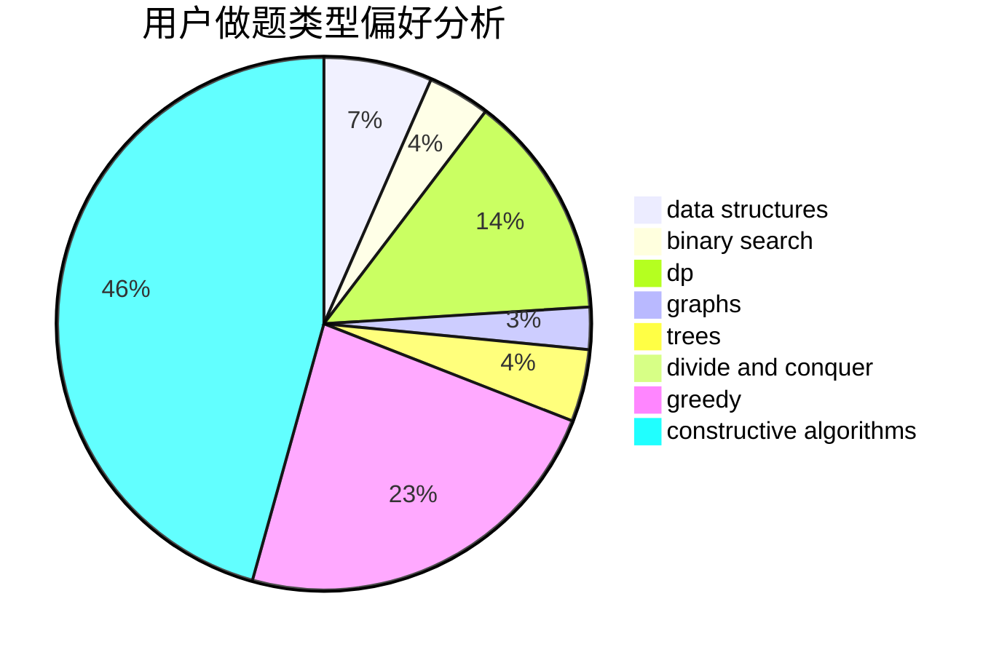

# Yyh.

<!-- tabs:start -->

#### **用户提交结果分析**

#### **用户做题类型偏好分析**

#### **用户错题知识点分析**

<!-- tabs:end -->
# 推荐题目
[878E](https://codeforces.com/contest/878/problem/E)		combinatorics,
                        dp		  
[958D1](https://codeforces.com/contest/958D/problem/1)		expression parsing,
                        math		  
[795K](https://codeforces.com/contest/795/problem/K)		dsu,graphs,sortings,trees		  
[1376B3](https://codeforces.com/contest/1376B/problem/3)		dsu,graphs,sortings,trees		  
[103C](https://codeforces.com/contest/103/problem/C)		constructive algorithms,
                        greedy		  
[358B](https://codeforces.com/contest/358/problem/B)		brute force,
                        strings		  
[6C](https://codeforces.com/contest/6/problem/C)		greedy,
                        two pointers		  
[883I](https://codeforces.com/contest/883/problem/I)		binary search,
                        dp		  
[796B](https://codeforces.com/contest/796/problem/B)		implementation		  
[1286B](https://codeforces.com/contest/1286/problem/B)		constructive algorithms,
                        data structures,
                        dfs and similar,
                        graphs,
                        greedy,
                        trees		  
