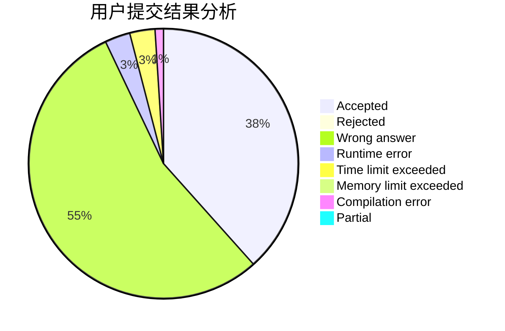
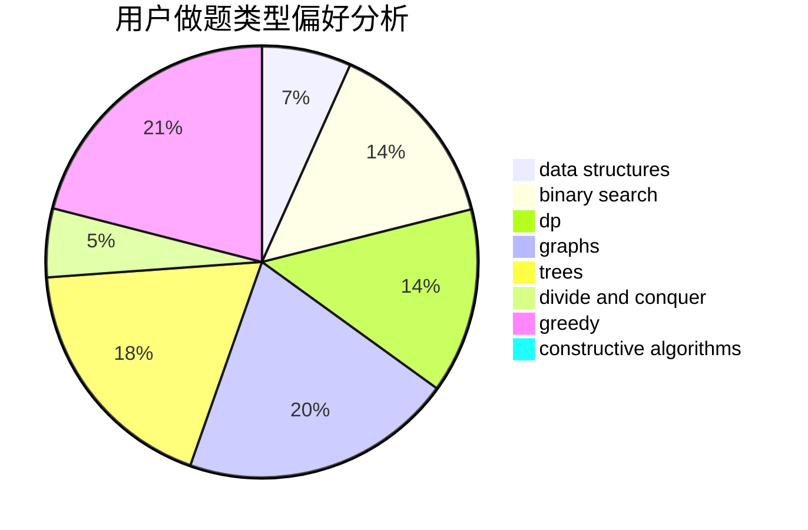

# Algorithm_Art

<!-- tabs:start -->

#### **用户提交结果分析**

#### **用户做题类型偏好分析**

#### **用户错题知识点分析**

<!-- tabs:end -->
# 推荐题目
[279B](https://codeforces.com/contest/279/problem/B)		binary search,
                        brute force,
                        implementation,
                        two pointers		  
[279A](https://codeforces.com/contest/279/problem/A)		brute force,
                        geometry,
                        implementation		  
[1162E](https://codeforces.com/contest/1162/problem/E)		dsu,graphs,sortings,trees		  
[1105D](https://codeforces.com/contest/1105/problem/D)		dfs and similar,
                        graphs,
                        implementation,
                        shortest paths		  
[1205A](https://codeforces.com/contest/1205/problem/A)		constructive algorithms,
                        greedy,
                        math		  
[279D](https://codeforces.com/contest/279/problem/D)		bitmasks,
                        dp		  
[266E](https://codeforces.com/contest/266/problem/E)		data structures,
                        math		  
[279E](https://codeforces.com/contest/279/problem/E)		dp,
                        games,
                        greedy,
                        number theory		  
[1081F](https://codeforces.com/contest/1081/problem/F)		constructive algorithms,
                        implementation,
                        interactive		  
[235C](https://codeforces.com/contest/235/problem/C)		data structures,
                        string suffix structures,
                        strings		  
