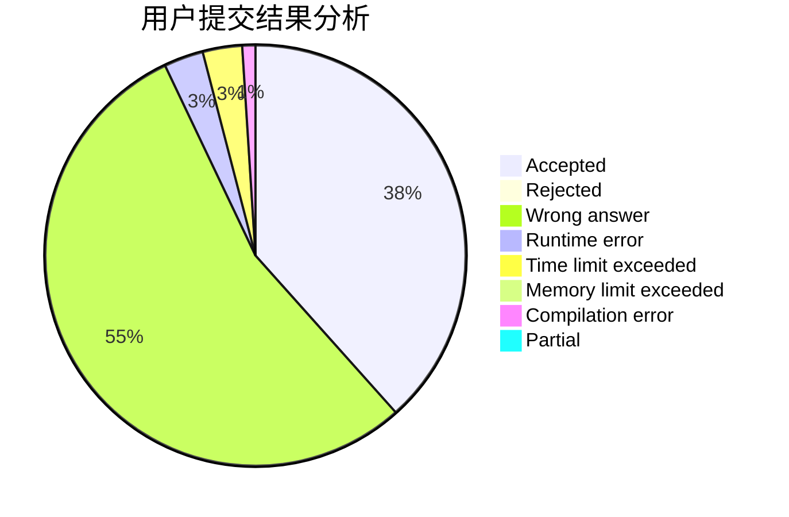
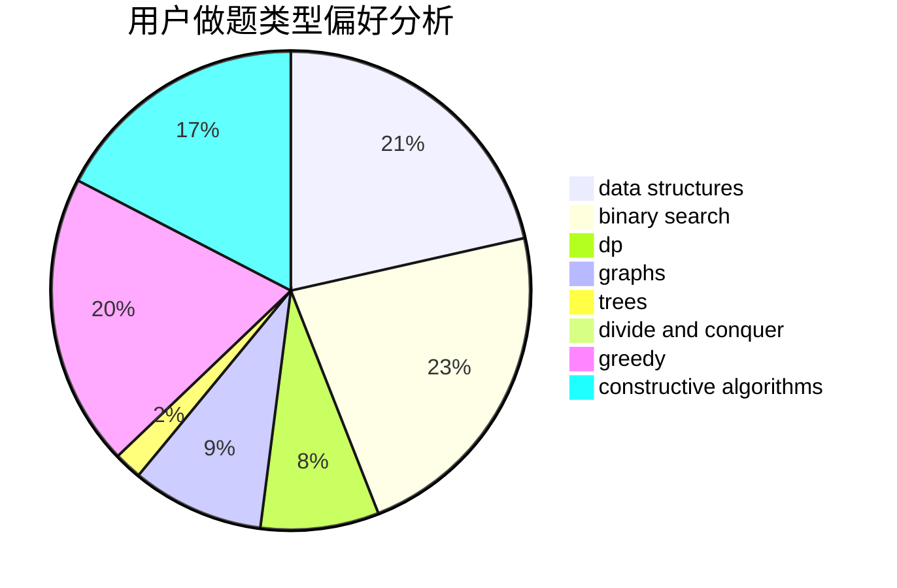

# Algorithm_Art

<!-- tabs:start -->

#### **用户提交结果分析**

#### **用户做题类型偏好分析**

#### **用户错题知识点分析**

<!-- tabs:end -->
# 推荐题目
[260D](https://codeforces.com/contest/260/problem/D)		constructive algorithms,
                        dsu,
                        graphs,
                        greedy,
                        trees		  
[260C](https://codeforces.com/contest/260/problem/C)		constructive algorithms,
                        greedy,
                        implementation		  
[115A](https://codeforces.com/contest/115/problem/A)		dfs and similar,
                        graphs,
                        trees		  
[1105A](https://codeforces.com/contest/1105/problem/A)		brute force,
                        implementation		  
[1200B](https://codeforces.com/contest/1200/problem/B)		dp,
                        greedy		  
[260E](https://codeforces.com/contest/260/problem/E)		binary search,
                        brute force,
                        data structures		  
[246C](https://codeforces.com/contest/246/problem/C)		brute force,
                        constructive algorithms,
                        greedy		  
[261B](https://codeforces.com/contest/261/problem/B)		dp,
                        math,
                        probabilities		  
[1081C](https://codeforces.com/contest/1081/problem/C)		combinatorics,
                        dp,
                        math		  
[216A](https://codeforces.com/contest/216/problem/A)		implementation,
                        math		  
