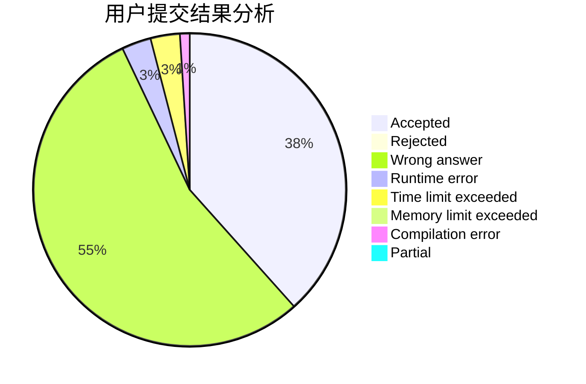
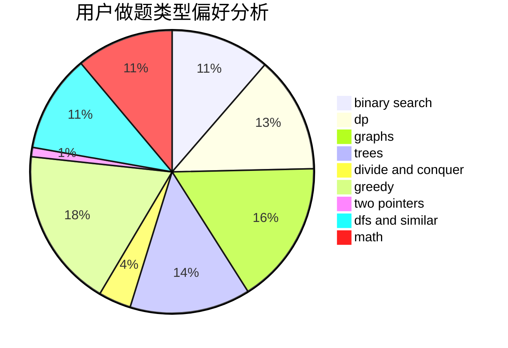

# Algorithm_Art

<!-- tabs:start -->

#### **用户提交结果分析**

#### **用户做题类型偏好分析**

<!-- tabs:end -->
# 推荐题目
[279B](https://codeforces.com/contest/279/problem/B)
[279A](https://codeforces.com/contest/279/problem/A)
[1162E](https://codeforces.com/contest/1162/problem/E)
[1105D](https://codeforces.com/contest/1105/problem/D)
[1205A](https://codeforces.com/contest/1205/problem/A)
[279D](https://codeforces.com/contest/279/problem/D)
[266E](https://codeforces.com/contest/266/problem/E)
[279E](https://codeforces.com/contest/279/problem/E)
[1081F](https://codeforces.com/contest/1081/problem/F)
[235C](https://codeforces.com/contest/235/problem/C)
